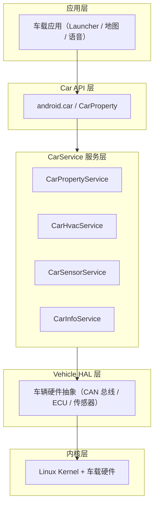

# 车载 Android 全景：AAOS 到底是什么

> 系列：AAOS-Guide · 00-overview
> 难度：⭐ 入门
> 更新：2026-08-15
> 前置知识：手机 Android 基础（四大组件、系统启动流程）

---

## 一、先纠正一个常见误区

很多人以为「车载 Android」就是「在车机屏幕上装个 Android 平板」。这个理解**错得很彻底**。

车载 Android 的正式名称是 **Android Automotive OS（AAOS）**，它和手机上的 Android 共享同一个 AOSP 内核与框架，但在**系统架构、硬件约束、安全模型、应用生态**上，几乎是为汽车重新设计了一遍。

一句话记住区别：

> **Android Auto** 是手机投屏到车机；**AAOS** 是车机本身跑的就是 Android 系统。

| | Android Auto | AAOS（Android Automotive OS） |
|---|---|---|
| 系统运行在哪 | 手机上 | 车机上（原生运行） |
| 车机上的角色 | 投屏协议 | 完整操作系统 |
| 能否直接控车 | 不能（受限） | 能（通过 CarService） |
| 典型代表 | 手机连车投屏 | 极星、沃尔沃、部分新势力座舱 |

## 二、AAOS 的架构分层

AAOS 在 AOSP 基础上，**新增了汽车专属的一整套服务栈**，这才是它的核心价值。



**关键理解**：AAOS 多出来的这一层 `CarService`，作用就是把「车辆硬件能力」抽象成「Android 服务」，让 App 能像调用普通系统服务一样，调用车辆功能（空调、车速、续航、门窗等）。

## 三、AAOS 与手机 Android 的 5 个本质区别

### 1. 有车辆硬件抽象层（Vehicle HAL）

手机 Android 没有 Vehicle HAL；AAOS 通过它对接 CAN 总线，读取/控制车辆硬件。这是最大的区别。

### 2. 应用需要「汽车应用属性」声明

AAOS 的 App 要在 `AndroidManifest.xml` 里声明自己是「汽车应用」，否则系统不认（详见 `automotive_app_desc.xml`）。

```xml
<uses-feature
    android:name="android.hardware.type.automotive"
    android:required="true" />
```

### 3. 安全与权限模型不同

- 行车中**禁止干扰驾驶**：系统会限制视频播放、键盘输入等。
- 有 `Car.PERMISSION_*` 汽车专属权限（控制空调、读车速等）。
- 分「驾驶模式」和「停车模式」两种 UX 约束。

### 4. 显示与交互面向驾驶场景

- 多屏（仪表盘 + 中控 + 副驾屏），需要 `Multi-Display` 适配。
- 更大的点击热区、语音优先、减少文字阅读。
- 对**启动速度、稳定性、响应延迟**要求远高于手机。

### 5. 应用分发与生态不同

- AAOS 应用通过 Google Automotive Services（GAS）分发，需车企/认证。
- 生态比手机小得多，**定制化开发是常态**，这也是机会所在。

## 四、你会在 AAOS 里高频接触的概念

| 概念 | 说明 |
|------|------|
| `CarService` | 汽车专属系统服务总入口，位于 `packages/services/Car` |
| `CarPropertyManager` | App 读写车辆属性（车速、续航）的 API |
| `Vehicle HAL` | 硬件抽象层，AIDL 定义在 `hardware/interfaces/automotive` |
| `VHAL` | Vehicle HAL 的简称 |
| `CarPowerManager` | 车辆电源状态管理 |
| `Cluster` | 仪表盘屏 |
| `Driver Distraction` | 驾驶分心限制机制 |

## 五、学习 AAOS 的正确路径

不要一上来就啃源码，按这个顺序更高效：

1. **建立全景**（本文）—— 知道 AAOS 是什么、和手机的区别
2. **跑一个 AAOS 模拟器** —— 下载系统镜像，亲手体验
3. **读 CarService 架构** —— 理解服务如何分层、如何启动
4. **动手调 CarPropertyManager** —— 读写一个车辆属性
5. **做实战 Demo** —— 比如车机 Launcher（见 `Car-Launcher-Demo`）
6. **深入性能与 AI 上车** —— 进阶方向

## 六、总结

| 要点 | 结论 |
|------|------|
| AAOS 是什么 | 车机原生运行的 Android 系统，非手机投屏 |
| 核心差异 | 多出 CarService + Vehicle HAL 汽车专属栈 |
| 关键能力 | App 通过 Car API 读写车辆硬件 |
| 学习入口 | 先全景，再架构，再实战 |

---

**下一篇预告**：《CarService 架构：从 SystemServer 到车辆服务》

> 配套仓库：[AAOS-Guide](https://github.com/jason5200/AAOS-Guide) · 实战 Demo：[Car-Launcher-Demo](https://github.com/jason5200/Car-Launcher-Demo)
