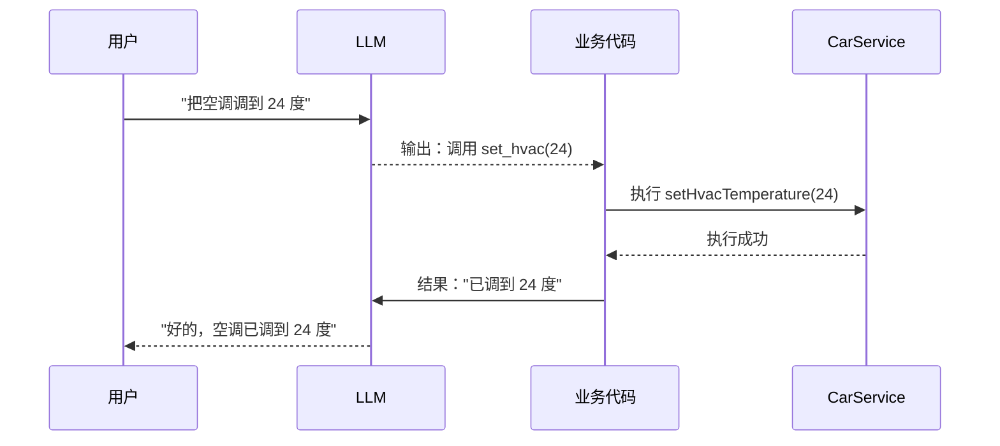
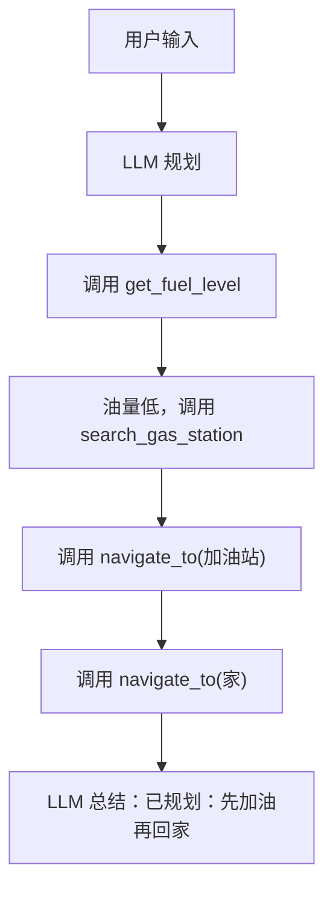

# Agent 框架：Function Calling 实战

> 系列：AAOS-Guide · 11-agent
> 难度：⭐⭐⭐⭐ 进阶
> 更新：2026-08-26
> 前置知识：《Agent 在车机场景的应用》

---

## 一、从「会聊天」到「会办事」

上一篇《Agent 在车机场景的应用》讲了 Agent 的概念。这一篇落到工程实现，讲清楚最核心的机制——**Function Calling（函数调用）**。

**核心区别**：
- 普通聊天：用户问「明天天气」，模型答「晴天」。
- Function Calling：用户说「把空调调到 24 度」，模型**输出一个函数调用请求**，由业务代码执行。

## 二、Function Calling 的工作流程



**关键理解**：LLM 不直接操作空调，它只是「决定要调用哪个函数、传什么参数」，真正干活的是业务代码。

## 三、定义工具（函数）

先告诉模型「你能调用哪些函数」，这就是工具定义：

```kotlin
val tools = listOf(
    Tool(
        type = "function",
        function = FunctionDef(
            name = "set_hvac_temperature",
            description = "设置空调温度",
            parameters = """
                {
                  "type": "object",
                  "properties": {
                    "temperature": {"type": "number", "description": "目标温度（摄氏度）"}
                  },
                  "required": ["temperature"]
                }
            """
        )
    ),
    Tool(
        type = "function",
        function = FunctionDef(
            name = "navigate_to",
            description = "导航到目的地",
            parameters = """
                {
                  "type": "object",
                  "properties": {
                    "destination": {"type": "string", "description": "目的地名称"}
                  },
                  "required": ["destination"]
                }
            """
        )
    )
)
```

## 四、完整的 Function Calling 循环

Agent 的核心是「**多轮调用，直到完成任务**」：

```kotlin
suspend fun runAgent(userInput: String): String {
    val messages = mutableListOf(
        Message(role = "user", content = userInput)
    )

    // 最多循环 5 轮，防止死循环
    repeat(5) {
        val response = llm.chat(messages, tools)

        // 1. 如果模型直接回复文本，结束
        if (response.hasText()) {
            return response.text
        }

        // 2. 如果模型要求调用函数，执行它
        if (response.hasToolCall()) {
            val call = response.toolCall
            val result = executeTool(call)  // 执行业务

            // 把函数结果追加到对话，继续下一轮
            messages.add(Message(role = "assistant", toolCall = call))
            messages.add(Message(role = "tool", content = result))
        }
    }
    return "抱歉，任务未能完成"
}

fun executeTool(call: ToolCall): String {
    return when (call.name) {
        "set_hvac_temperature" -> {
            val temp = call.arguments["temperature"] as Double
            carHvacManager.setIntProperty(HVAC_TEMPERATURE_SET, 0, temp.toInt())
            "空调已设置为 $temp 度"
        }
        "navigate_to" -> {
            val dest = call.arguments["destination"] as String
            startNavigation(dest)
            "已开始导航到 $dest"
        }
        else -> "未知函数"
    }
}
```

## 五、一个多步 Agent 的例子

用户：「下班回家，顺便加个油」



这就是 Agent 的 **Plan-Execute-Reflect** 循环：每执行一步，把结果喂回给模型，模型决定下一步。

## 六、车载 Agent 的工程要点

### 1. 工具设计

| 原则 | 说明 |
|------|------|
| 单一职责 | 一个函数做一件事 |
| 描述清晰 | description 写清楚，模型才调用得对 |
| 参数明确 | 类型、含义、是否必填 |

### 2. 安全控制

- **危险操作需确认**：如开窗、锁车，让用户二次确认。
- **参数校验**：温度范围（16-30 度）、目的地合法性。

### 3. 超时与降级

- Agent 多轮调用可能耗时，设置超时。
- 模型失败时降级为普通对话。

## 七、Function Calling vs 传统规则引擎

| 维度 | 传统规则引擎 | Function Calling |
|------|-------------|------------------|
| 意图理解 | 固定规则/正则 | 模型语义理解 |
| 扩展性 | 加规则 | 加工具定义 |
| 容错 | 差（说错就失败） | 强（语义理解） |
| 维护 | 规则爆炸 | 工具清晰 |

## 八、总结

| 要点 | 结论 |
|------|------|
| Function Calling | LLM 输出函数调用，业务执行 |
| 核心循环 | 多轮调用，直到完成 |
| 工具设计 | 单一职责、描述清晰 |
| 车机要点 | 安全确认、参数校验、超时降级 |

---

**本系列完**。至此「AI 上车」方向形成完整体系：端侧推理 → 语音 → Agent 概念 → 工程化 → RAG → 多模态 → Function Calling 实战。

> 配套仓库：[AAOS-Guide](https://github.com/jason5200/AAOS-Guide) · [AI-Android-Demo](https://github.com/jason5200/AI-Android-Demo)
