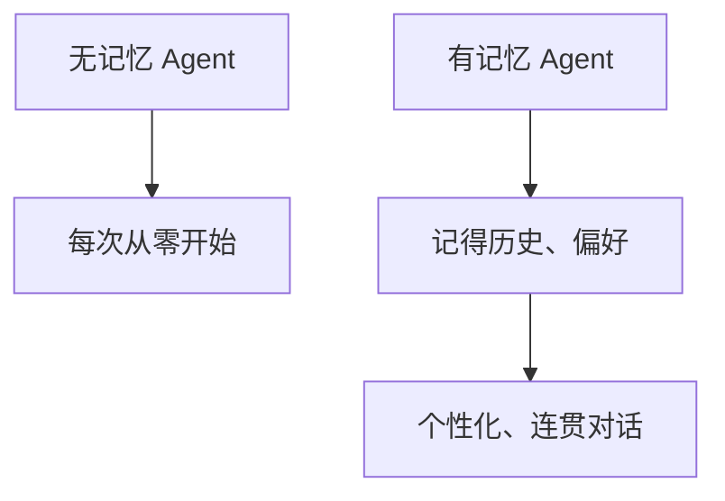
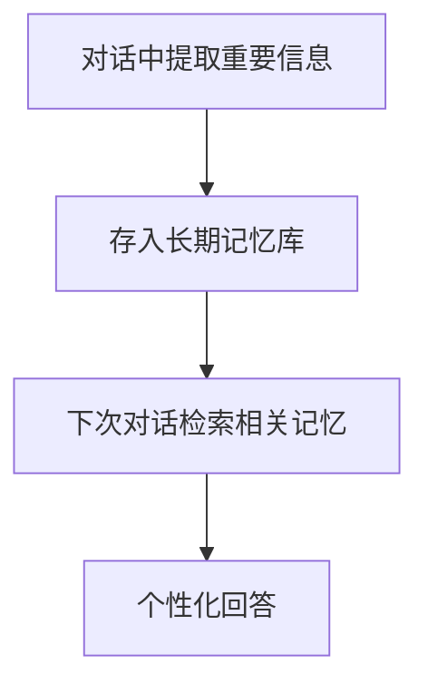

# Agent 的记忆系统

> 系列：AAOS-Guide · 39-agent-memory
> 难度：⭐⭐⭐⭐ 深入
> 更新：2026-08-27
> 前置知识：《Agent 的规划：ReAct》

---

## 一、Agent 为什么需要记忆

没有记忆的 Agent，每次对话都是「失忆」的：不记得你说过什么、不记得你的偏好。



## 二、记忆的三种层次

| 层次 | 内容 | 生命周期 |
|------|------|----------|
| 短期记忆 | 当前对话上下文 | 单次会话 |
| 长期记忆 | 跨会话的事实/偏好 | 持久 |
| 工作记忆 | 当前任务的中间状态 | 单次任务 |

## 三、短期记忆：对话上下文

短期记忆就是「把对话历史塞进 prompt」：

```python
messages = [
    {"role": "user", "content": "帮我导航回家"},
    {"role": "assistant", "content": "好的，开始导航回家"},
    {"role": "user", "content": "顺便避开拥堵"},  # 需要上文才知道"回家"指什么
]
```

**局限**：上下文窗口有限，历史太长会截断。

## 四、长期记忆：持久化存储

长期记忆把重要信息存下来，跨会话使用：



| 存储方式 | 说明 |
|----------|------|
| 向量数据库 | 语义检索历史 |
| 键值存储 | 存用户偏好 |
| 图数据库 | 存实体关系 |

## 五、车载场景的记忆

车载 Agent 需要记住：

| 记忆 | 用途 |
|------|------|
| 常用目的地 | 快速导航 |
| 音乐偏好 | 个性化推荐 |
| 座椅/空调习惯 | 自动调节 |
| 历史对话 | 连贯交互 |

## 六、记忆的工程实现

```python
class AgentMemory:
    def __init__(self):
        self.short_term = []      # 短期：对话列表
        self.long_term = {}       # 长期：键值存储

    def remember(self, key, value):
        """存长期记忆"""
        self.long_term[key] = value

    def recall(self, key):
        """取长期记忆"""
        return self.long_term.get(key)

    def add_to_context(self, message):
        """加短期记忆"""
        self.short_term.append(message)
        # 超长则截断最早的
        if len(self.short_term) > 20:
            self.short_term = self.short_term[-20:]
```

## 七、记忆的挑战

| 挑战 | 说明 |
|------|------|
| 记忆爆炸 | 记忆太多，检索变慢 |
| 记忆冲突 | 新旧记忆矛盾 |
| 隐私 | 记忆含敏感信息 |
| 遗忘机制 | 过时记忆要淘汰 |

## 八、总结

| 要点 | 结论 |
|------|------|
| 三种记忆 | 短期/长期/工作 |
| 短期 | 对话上下文 |
| 长期 | 持久化偏好/事实 |
| 车载场景 | 目的地/偏好/习惯 |

---

**下一篇预告**：《LangChain / LlamaIndex 在 Android 的应用》

> 配套仓库：[AAOS-Guide](https://github.com/jason5200/AAOS-Guide)
