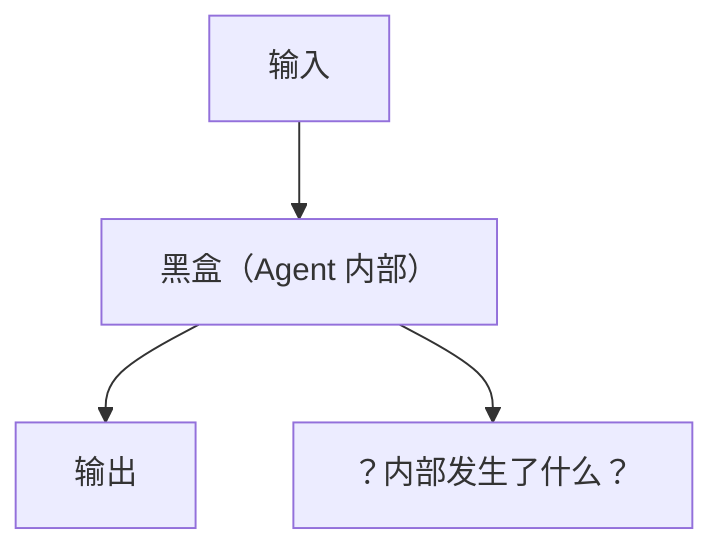
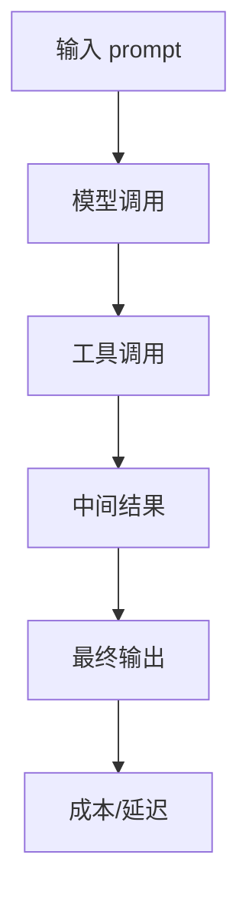
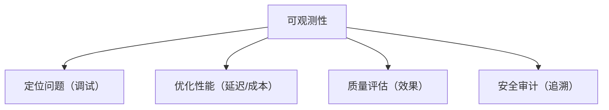

# Agent 的可观测性

> 系列：AAOS-Guide · 42-agent-observability
> 难度：⭐⭐⭐⭐ 深入
> 更新：2026-08-27
> 前置知识：《Agent 框架：Function Calling 实战》

---

## 一、为什么 Agent 需要可观测性

Agent 是「黑盒」：输入一句话，输出一个结果，中间发生了什么很难知道。



**可观测性**：让黑盒变透明，能看清 Agent 的每一步。

## 二、可观测性的三个支柱

| 支柱 | 问题 |
|------|------|
| 日志（Logging） | 发生了什么？ |
| 指标（Metrics） | 表现如何？ |
| 追踪（Tracing） | 一步步怎么走的？ |

## 三、Agent 需要观测的关键信息



| 观测项 | 说明 |
|--------|------|
| 输入/输出 | 每次的 prompt 和结果 |
| 工具调用 | 调用了哪些工具、参数 |
| 中间步骤 | ReAct 的每一步思考 |
| 延迟 | 每一步耗时 |
| Token 消耗 | 成本 |
| 错误 | 失败原因 |

## 四、追踪工具

| 工具 | 说明 |
|------|------|
| LangSmith | LangChain 官方 |
| Langfuse | 开源可观测 |
| W&B Weave | 权重与偏差 |
| OpenTelemetry | 通用标准 |

## 五、Agent 追踪的实现

```python
from langfuse import Langfuse

langfuse = Langfuse()

def trace_agent_run(question, steps, answer):
    trace = langfuse.trace(name="agent_run")
    
    for i, step in enumerate(steps):
        trace.span(
            name=f"step_{i}",
            input=step["thought"],
            output=step["action"],
        )
    
    trace.span(name="final_answer", output=answer)
```

## 六、关键指标

| 指标 | 说明 |
|------|------|
| 首 token 延迟 | 用户体验 |
| 总延迟 | 端到端耗时 |
| Token 消耗 | 成本 |
| 成功率 | 任务完成率 |
| 工具调用次数 | 复杂度 |
| 错误率 | 稳定性 |

## 七、车载 Agent 的可观测重点

车载场景特别关注：

| 重点 | 原因 |
|------|------|
| 延迟 | 驾驶中要快响应 |
| 成功率 | 不能频繁失败 |
| 安全事件 | 危险操作要记录 |
| 离线降级 | 无网时的表现 |

## 八、可观测性的价值



## 九、总结

| 要点 | 结论 |
|------|------|
| 三支柱 | 日志/指标/追踪 |
| 关键信息 | 输入/工具/中间步骤/延迟 |
| 工具 | LangSmith/Langfuse |
| 车载重点 | 延迟、成功率、安全 |

---

**下一篇预告**：《LoRA 微调实战》

> 配套仓库：[AAOS-Guide](https://github.com/jason5200/AAOS-Guide)
