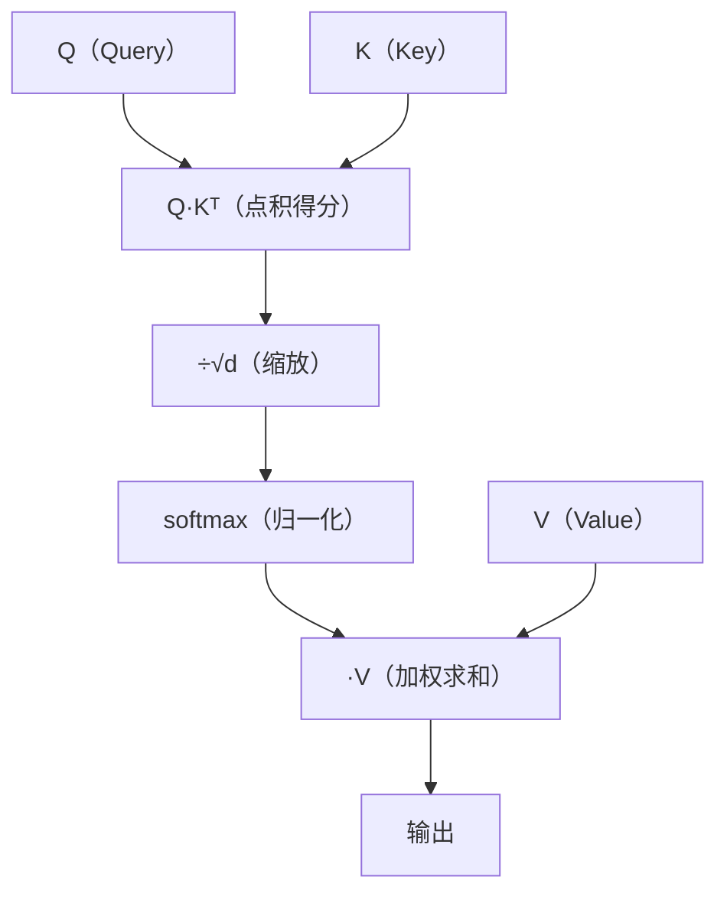

# 注意力机制的数学推导

> 系列：AAOS-Guide · 25-transformer
> 难度：⭐⭐⭐⭐⭐ 深入
> 更新：2026-08-27
> 前置知识：《Transformer 原理：注意力机制》

---

## 一、本文目标

上一篇《Transformer 原理》用类比讲了注意力机制，这一篇**用数学**彻底讲清楚：注意力到底是怎么算出来的。

## 二、从向量开始

Transformer 里，每个词都被表示成一个向量（Embedding）：

```
"猫" → x₁ = [0.1, 0.2, 0.3, ...]  （d 维向量）
"狗" → x₂ = [0.15, 0.18, 0.25, ...]
```

## 三、Q / K / V 的由来

每个词的向量，分别乘以三个权重矩阵，得到 Query、Key、Value：

```
Q = X · W_Q    （Query：我要找什么）
K = X · W_K    （Key：我有什么）
V = X · W_V    （Value：我提供什么信息）
```

```
q₁ = x₁ · W_Q   （"猫"的 Query）
k₁ = x₁ · W_K   （"猫"的 Key）
v₁ = x₁ · W_V   （"猫"的 Value）
```

## 四、注意力分数：点积

「猫」要关注「狗」多少，用「猫的 Query」和「狗的 Key」做**点积**：

```
score(猫→狗) = q₁ · k₂ = Σ q₁[i] × k₂[i]
```

点积越大，说明「猫」越应该关注「狗」。

## 五、缩放与 Softmax

点积结果要经过缩放和 Softmax，变成「概率分布」：

### 1. 缩放（除以 √d）

```
score_scaled = score / √d
```

**为什么除以 √d**：向量维度 d 很大时，点积值会很大，导致 Softmax 梯度消失。除以 √d 让数值稳定。

### 2. Softmax 归一化

```
αᵢⱼ = softmax(scoreᵢⱼ) = exp(scoreᵢⱼ) / Σⱼ exp(scoreᵢⱼ)
```

Softmax 把分数变成「权重」，所有权重和为 1：

```
α(猫→猫) = 0.6
α(猫→狗) = 0.3
α(猫→车) = 0.1
```

## 六、加权求和得到输出

用注意力权重，对 Value 加权求和：

```
output₁ = Σⱼ αᵢⱼ · vⱼ
        = 0.6·v₁ + 0.3·v₂ + 0.1·v₃
```

这就是「猫」这个位置经过注意力后的新表示。

## 七、完整的公式

注意力机制的完整数学公式：

```
Attention(Q, K, V) = softmax(Q·Kᵀ / √d) · V
```



## 八、一个具体算例

假设 d=2（为了演示简化），三个词：

```
x₁ = [1, 0]（猫）
x₂ = [0, 1]（狗）
x₃ = [1, 1]（车）
```

（简化：假设 W_Q = W_K = W_V = I 单位矩阵，则 Q=K=V=X）

```
「猫」的注意力：
score(猫→猫) = q₁·k₁ = 1×1 + 0×0 = 1
score(猫→狗) = q₁·k₂ = 1×0 + 0×1 = 0
score(猫→车) = q₁·k₃ = 1×1 + 0×1 = 1

softmax 后（简化，√d≈1.41）：
α(猫→猫) ≈ 0.42
α(猫→狗) ≈ 0.21
α(猫→车) ≈ 0.37

输出：
output₁ = 0.42·[1,0] + 0.21·[0,1] + 0.37·[1,1]
        = [0.79, 0.58]
```

**关键理解**：这个算例展示了注意力如何「综合所有词的信息」，得到一个融合后的表示。

## 九、多头注意力的数学

多头注意力就是把 Q、K、V 分成多个「头」，每个头独立算注意力，最后拼接：

```
MultiHead(Q,K,V) = Concat(head₁, ..., headₕ) · W_O

其中 headᵢ = Attention(Q·Wᵢ^Q, K·Wᵢ^K, V·Wᵢ^V)
```

## 十、总结

| 要点 | 公式 |
|------|------|
| 注意力得分 | Q·Kᵀ |
| 缩放 | ÷√d |
| 归一化 | softmax |
| 输出 | softmax(Q·Kᵀ/√d)·V |
| 多头 | 多个头并行再拼接 |

---

**下一篇预告**：《RecyclerView 缓存复用的完整源码》

> 配套仓库：[AAOS-Guide](https://github.com/jason5200/AAOS-Guide)
