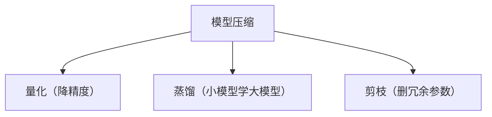
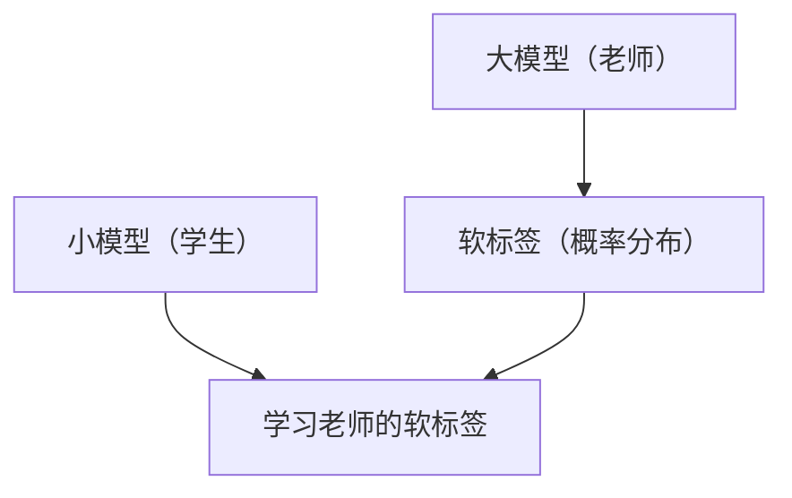
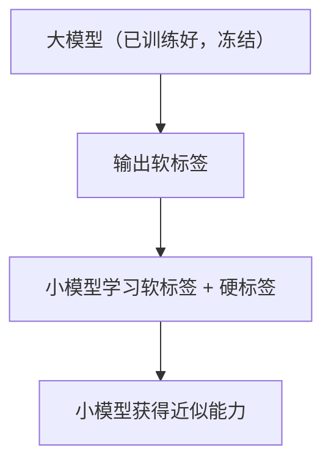
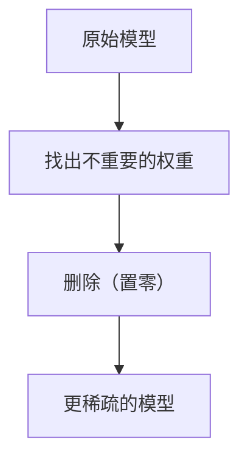
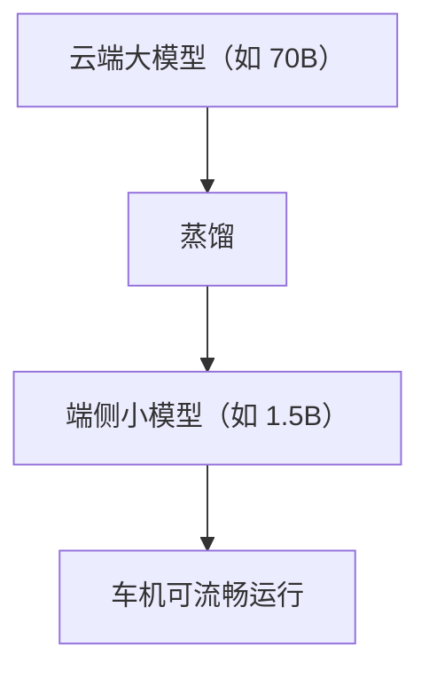

# 模型蒸馏与剪枝

> 系列：AAOS-Guide · 28-distill
> 难度：⭐⭐⭐⭐ 深入
> 更新：2026-08-27
> 前置知识：《模型量化》

---

## 一、模型压缩的三条路

量化之外，还有两种模型压缩方法：



**三种方法可以组合使用**，获得更大的压缩比。

## 二、知识蒸馏：小模型学大模型

蒸馏的核心思想：让**小模型（学生）**模仿**大模型（老师）**的输出。



**关键理解**：不只是学「正确答案」，而是学老师的「完整概率分布」（比如「猫」的概率 0.7，「狗」0.2，「豹」0.1），这包含更多知识。

## 三、为什么软标签比硬标签好

| 标签类型 | 内容 | 信息量 |
|----------|------|--------|
| 硬标签 | 只有正确答案（猫=1） | 少 |
| 软标签 | 完整概率（猫0.7狗0.2豹0.1） | 多 |

**软标签包含了「猫和豹相似」这样的暗知识**，这是小模型单靠硬标签学不到的。

## 四、蒸馏的训练流程



```python
# 蒸馏损失（简化）
loss = 0.7 * 蒸馏损失(软标签) + 0.3 * 交叉熵(硬标签)
```

## 五、剪枝：删除冗余参数

剪枝是「删除不重要的连接」：



| 剪枝类型 | 粒度 |
|----------|------|
| 非结构化剪枝 | 单个权重 |
| 结构化剪枝 | 整行/整列/整层 |

**关键理解**：结构化剪枝更容易在硬件上加速（非结构化剪枝虽然更灵活，但难加速）。

## 六、蒸馏 vs 剪枝 vs 量化

| 方法 | 压缩原理 | 精度损失 | 速度提升 |
|------|----------|----------|----------|
| 量化 | 降精度 | 小 | 大 |
| 剪枝 | 删参数 | 中 | 中 |
| 蒸馏 | 换小模型 | 中 | 大 |

## 七、车载场景的应用

车载端侧需要小模型，蒸馏是重要手段：



## 八、总结

| 要点 | 结论 |
|------|------|
| 三条路 | 量化/蒸馏/剪枝 |
| 蒸馏 | 小模型学大模型软标签 |
| 剪枝 | 删除冗余参数 |
| 可组合 | 三种方法叠加 |

---

**下一篇预告**：《端侧推理框架对比：MNN / NCNN / llama.cpp》

> 配套仓库：[AAOS-Guide](https://github.com/jason5200/AAOS-Guide)
