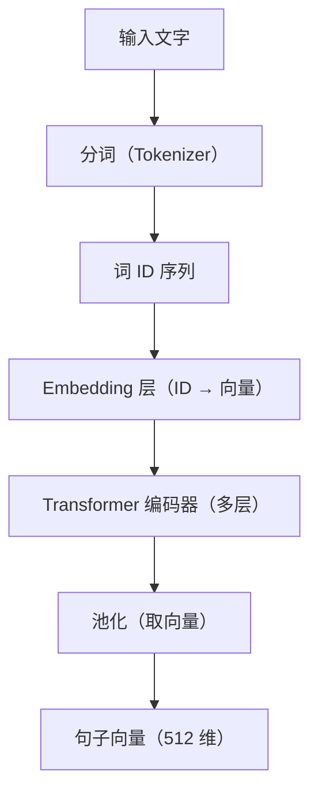
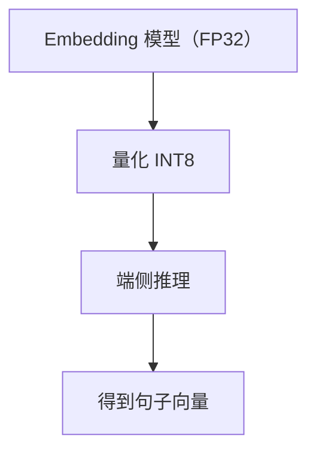

# Embedding 模型的完整源码解读

> 系列：AAOS-Guide · 32-embedding
> 难度：⭐⭐⭐⭐⭐ 深入
> 更新：2026-08-27
> 前置知识：《Embedding 与向量化》《Transformer 原理》

---

## 一、本文目标

上一篇《Embedding 与向量化》讲了「Embedding 是什么」，这一篇深入到**模型源码**，看一个 Embedding 模型（如 BERT 系）到底怎么把文字变成向量。

## 二、Embedding 模型的架构

Embedding 模型通常是「Transformer 编码器」：



## 三、第一步：分词

```python
from transformers import AutoTokenizer

tokenizer = AutoTokenizer.from_pretrained("BAAI/bge-small-zh")

text = "车载座舱"
tokens = tokenizer(text)
# tokens = [101, 1234, 5678, 102]  # [CLS] 车载 座舱 [SEP]
```

**关键理解**：Tokenizer 把文字拆成「子词」（subword），每个子词对应一个 ID。

## 四、第二步：Embedding 层

每个词 ID 查表得到初始向量：

```python
# 模型内部的 Embedding 层
class Embedding(nn.Module):
    def __init__(self, vocab_size, hidden_dim):
        # 词表大小 × 向量维度 的查找表
        self.embedding = nn.Embedding(vocab_size, hidden_dim)

    def forward(self, input_ids):
        # input_ids: [batch, seq_len]
        # 输出: [batch, seq_len, hidden_dim]
        return self.embedding(input_ids)
```

## 五、第三步：Transformer 编码器

多层 Transformer 编码器处理词向量：

```python
class TransformerEncoder(nn.Module):
    def __init__(self, num_layers, hidden_dim):
        self.layers = nn.ModuleList([
            TransformerLayer(hidden_dim) for _ in range(num_layers)
        ])

    def forward(self, x):
        for layer in self.layers:
            # 每层：自注意力 + 前馈
            x = layer(x)
        return x
```

## 六、第四步：池化

编码器输出多个 token 的向量，需要「池化」成一个句子向量：

```python
def pooling(last_hidden_state, attention_mask):
    """三种池化方式"""
    # 1. CLS 池化：取 [CLS] token 的向量
    cls_embedding = last_hidden_state[:, 0]

    # 2. 平均池化：所有 token 向量的平均
    mean_embedding = (last_hidden_state * attention_mask.unsqueeze(-1)).sum(1) / attention_mask.sum(1, keepdim=True)

    # 3. 最大池化：取每维最大值
    max_embedding = last_hidden_state.max(1).values

    return mean_embedding  # BGE 用平均池化
```

## 七、完整的 forward 流程

```python
class EmbeddingModel(nn.Module):
    def forward(self, input_ids, attention_mask):
        # 1. Embedding 层
        x = self.embedding(input_ids)

        # 2. Transformer 编码器
        x = self.encoder(x)

        # 3. 池化
        sentence_embedding = self.pooling(x, attention_mask)

        # 4. 归一化（可选，让向量长度为 1）
        sentence_embedding = F.normalize(sentence_embedding, p=2, dim=-1)

        return sentence_embedding  # 512 维句子向量
```

## 八、归一化的作用

Embedding 通常做 L2 归一化，让所有向量长度为 1：

```python
# L2 归一化
x_normalized = x / torch.norm(x, p=2, dim=-1, keepdim=True)
```

**关键理解**：归一化后，「内积」就等于「余弦相似度」，检索时可以直接用内积加速。

## 九、端侧 Embedding 的优化

端侧部署 Embedding 模型要量化：



## 十、总结

| 要点 | 结论 |
|------|------|
| 架构 | Tokenizer → Embedding → Encoder → Pooling |
| 池化 | CLS / 平均 / 最大 |
| 归一化 | L2，使内积=余弦 |
| 端侧 | 量化部署 |

---

**下一篇预告**：《Service 启动与绑定的完整源码》

> 配套仓库：[AAOS-Guide](https://github.com/jason5200/AAOS-Guide)
