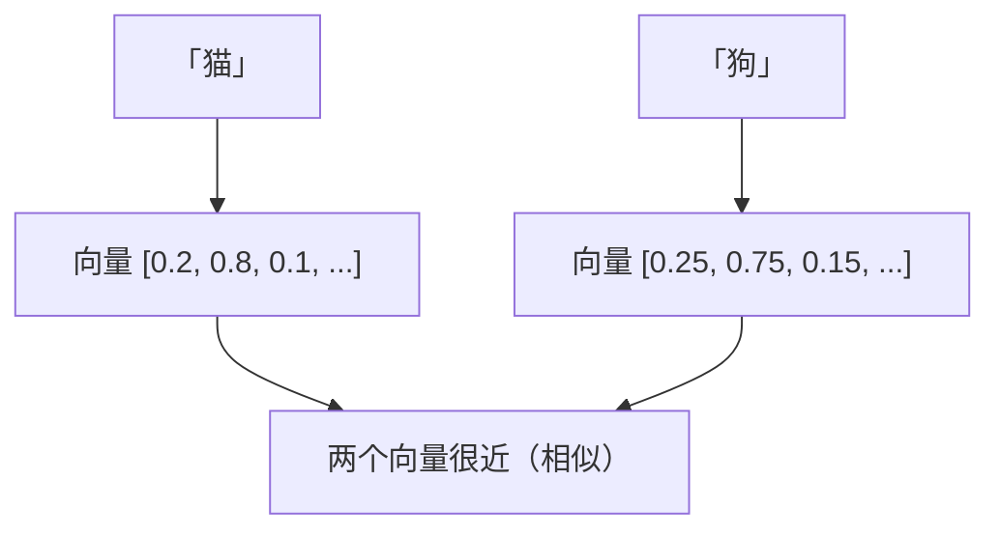
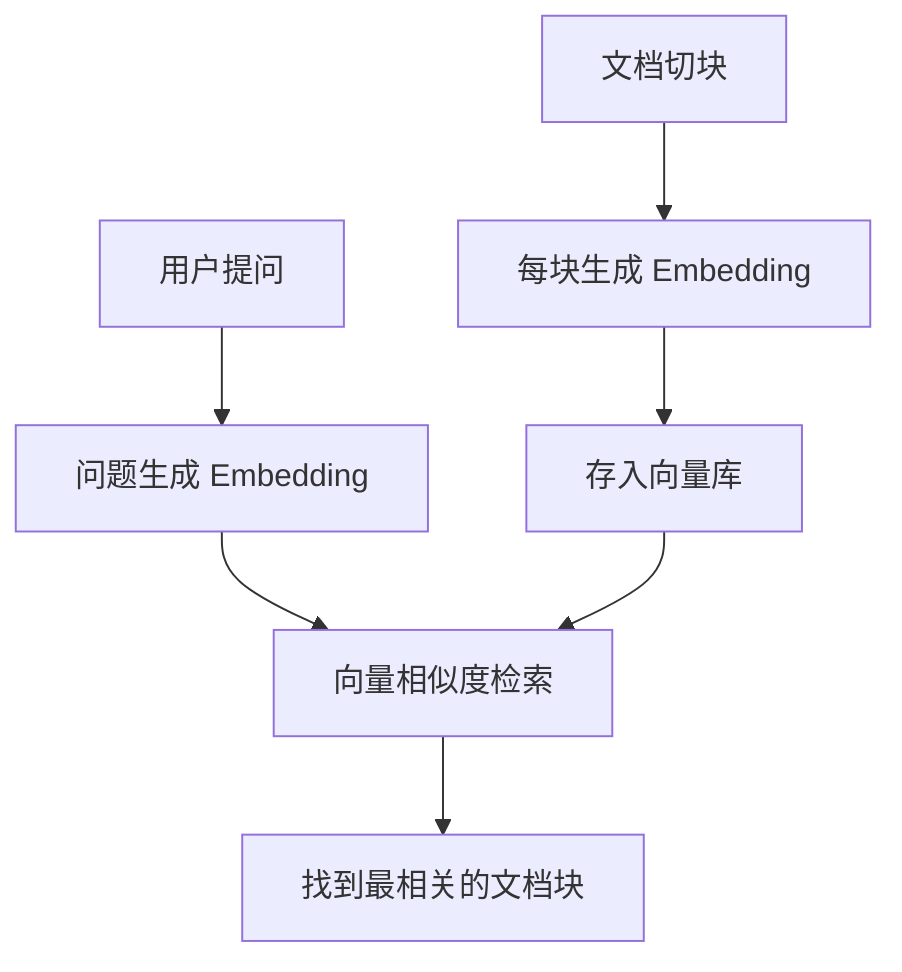

# Embedding 与向量化

> 系列：AAOS-Guide · 32-embedding
> 难度：⭐⭐⭐ 进阶
> 更新：2026-08-27
> 前置知识：《车载 RAG 实战》

---

## 一、Embedding 是什么

**Embedding（向量化）**：把文字、图片等转换成「向量」（一串数字），让计算机能计算「相似度」。



**核心理解**：语义相近的内容，向量也相近。这是 RAG、搜索、推荐的基础。

## 二、为什么需要向量化

计算机不能直接理解文字「猫」和「狗」相似，但能计算两个向量的距离：

```python
import numpy as np

cat = np.array([0.2, 0.8, 0.1])
dog = np.array([0.25, 0.75, 0.15])
car = np.array([0.9, 0.05, 0.05])

# 余弦相似度
def cosine(a, b):
    return np.dot(a, b) / (np.linalg.norm(a) * np.linalg.norm(b))

print(cosine(cat, dog))  # 0.99（猫狗相似）
print(cosine(cat, car))  # 0.1（猫车不相似）
```

## 三、Embedding 模型

Embedding 由专门的模型生成：

| 模型 | 特点 |
|------|------|
| BGE 系列 | 中文好，开源 |
| m3e | 中文小而美 |
| OpenAI text-embedding | 云端 API |
| sentence-transformers | 通用框架 |

## 四、用 sentence-transformers 生成 Embedding

```python
from sentence_transformers import SentenceTransformer

# 加载模型
model = SentenceTransformer('BAAI/bge-small-zh')

# 生成向量
sentences = ["猫很可爱", "狗很忠诚", "汽车很快"]
embeddings = model.encode(sentences)

# 每个句子变成一个 512 维向量
print(embeddings.shape)  # (3, 512)
```

## 五、Embedding 在 RAG 中的作用

RAG 的「检索」全靠 Embedding：



## 六、端侧 Embedding

车载端侧 RAG 需要端侧 Embedding 模型：

| 模型 | 大小 | 适合端侧 |
|------|------|----------|
| bge-small-zh | 约 100MB | 量化后可行 |
| m3e-small | 约 100MB | 可行 |

```kotlin
// 端侧 Embedding（简化）
val embedding = onnxSession.run(text)
val vector = embedding.floatBuffer  // 拿到向量
```

## 七、Embedding 的质量评估

| 指标 | 说明 |
|------|------|
| 语义相似度 | 相近内容向量接近 |
| 检索准确率 | 检索相关文档的比例 |
| 维度 | 越高信息越多，但越慢 |

## 八、总结

| 要点 | 结论 |
|------|------|
| Embedding | 文字→向量 |
| 用途 | 相似度计算、RAG 检索 |
| 模型 | BGE、m3e |
| 端侧 | 量化后的小模型 |

---

**下一篇预告**：《向量数据库选型：Milvus / FAISS》

> 配套仓库：[AAOS-Guide](https://github.com/jason5200/AAOS-Guide)
