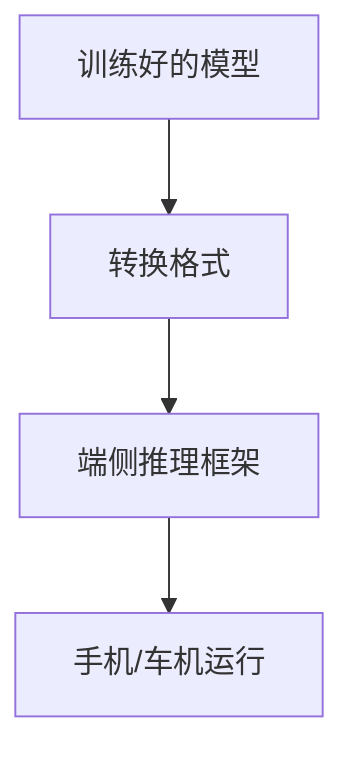
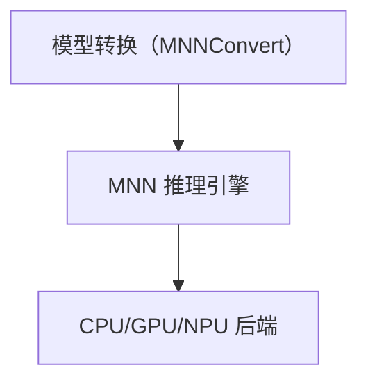
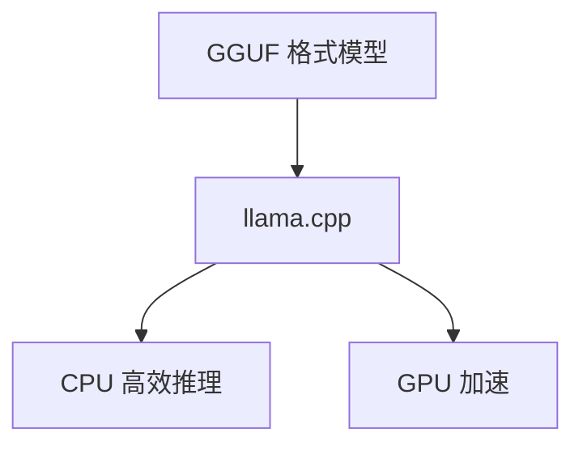
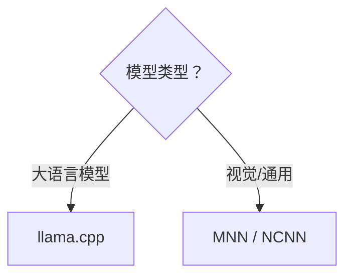

# 端侧推理框架对比：MNN / NCNN / llama.cpp

> 系列：AAOS-Guide · 29-inference
> 难度：⭐⭐⭐⭐ 深入
> 更新：2026-08-27
> 前置知识：《模型量化》《大模型上车：端侧推理》

---

## 一、为什么需要端侧推理框架

端侧跑模型，不能直接用训练框架（PyTorch 等），因为它们太笨重。需要**专为端侧优化**的推理框架：



## 二、主流框架对比

| 框架 | 厂商 | 特点 | 适合 |
|------|------|------|------|
| MNN | 阿里 | 通用、性能好 | 通用推理 |
| NCNN | 腾讯 | 轻量、快 | 视觉模型 |
| llama.cpp | 社区 | 专注 LLM | 大语言模型 |
| ONNX Runtime | 微软 | 跨平台 | 格式统一 |

## 三、MNN：阿里的通用框架

MNN 是阿里的端侧推理引擎，性能强、覆盖广：



**特点**：
- 通用性强，支持多种模型
- 性能优化好
- 支持 NPU 加速

## 四、NCNN：腾讯的轻量框架

NCNN 以「无第三方依赖、轻量」著称：

```cpp
// NCNN 推理示例
ncnn::Net net;
net.load_param("model.param");
net.load_model("model.bin");

ncnn::Mat input = ...;
ncnn::Mat output;
net.extract("output", output);
```

**特点**：
- 极轻量，无依赖
- 视觉模型优化好
- 移动端部署方便

## 五、llama.cpp：专注大模型

llama.cpp 是跑大语言模型的事实标准：



**特点**：
- 专门优化 LLM
- 量化支持好（GGUF）
- 纯 C/C++，跨平台

## 六、选型建议

| 场景 | 推荐框架 |
|------|----------|
| 跑大语言模型 | llama.cpp |
| 跑视觉模型 | NCNN / MNN |
| 通用推理 | MNN / ONNX Runtime |
| 追求极致性能 | 按模型基准测试 |



## 七、框架对比的关键维度

| 维度 | 说明 |
|------|------|
| 性能 | 推理速度（tokens/s 或 ms/帧） |
| 兼容性 | 支持哪些模型格式 |
| 硬件加速 | CPU/GPU/NPU 支持 |
| 包体积 | 集成后增加多少 |
| 维护活跃度 | 社区是否活跃 |

## 八、车载端侧的选型

车载场景的特殊考虑：

| 因素 | 影响 |
|------|------|
| 算力受限 | 选高效框架 |
| 稳定性 | 选成熟框架 |
| 多模型 | 选通用框架 |
| LLM 场景 | 选 llama.cpp |

## 九、总结

| 要点 | 结论 |
|------|------|
| 主流框架 | MNN/NCNN/llama.cpp/ONNX |
| LLM 场景 | llama.cpp |
| 视觉场景 | NCNN/MNN |
| 选型 | 按模型类型和硬件 |

---

**下一篇预告**：《MediaPipe LLM Inference 实战》

> 配套仓库：[AAOS-Guide](https://github.com/jason5200/AAOS-Guide)
