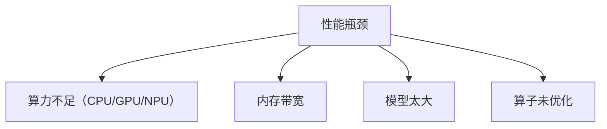
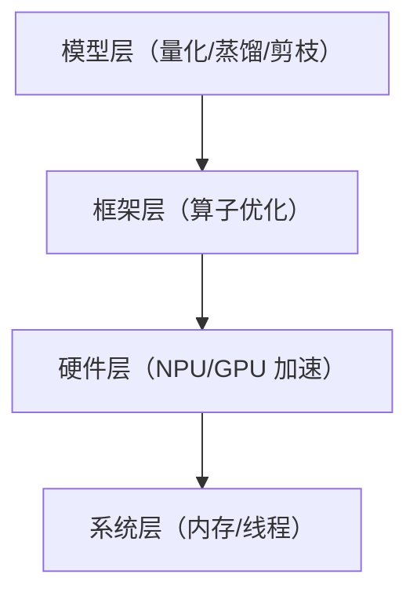
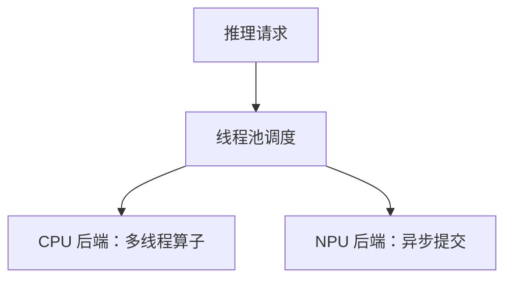

# 端侧推理性能优化的完整实践

> 系列：AAOS-Guide · 29-inference
> 难度：⭐⭐⭐⭐⭐ 深入
> 更新：2026-08-27
> 前置知识：《端侧推理框架对比》《模型量化》

---

## 一、端侧推理的性能瓶颈

端侧跑模型慢，瓶颈通常在：



## 二、性能优化的层次



## 三、模型层优化

| 手段 | 提升 |
|------|------|
| 量化 INT8/INT4 | 2-4 倍加速 |
| 蒸馏小模型 | 数倍加速 |
| 剪枝 | 1.5-2 倍 |

## 四、硬件加速：多后端回退

端侧推理要「能用哪个用哪个」，按优先级回退：

```python
def create_session(model_path):
    backends = ["NPU", "GPU", "CPU"]  # 优先级从高到低
    for backend in backends:
        try:
            session = create_backend_session(model_path, backend)
            return session
        except Exception:
            continue  # 这个后端不可用，尝试下一个
    raise RuntimeError("无可用推理后端")
```

## 五、内存优化

| 手段 | 说明 |
|------|------|
| 模型常驻内存 | 避免反复加载 |
| 内存池复用 | 减少分配 |
| 共享权重 | 多模型共享 |

```cpp
// 内存池复用输入输出 buffer
class InferencePool {
    std::vector<float*> input_pool;
    float* acquire_input() {
        if (input_pool.empty()) return new float[input_size];
        float* buf = input_pool.back();
        input_pool.pop_back();
        return buf;
    }
    void release_input(float* buf) {
        input_pool.push_back(buf);  // 复用
    }
};
```

## 六、线程与并发优化



```cpp
// 设置线程数
session.setIntraOpNumThreads(4);  // 算子内 4 线程
session.setInterOpNumThreads(2);  // 算子间 2 线程
```

## 七、算子级优化

框架会对算子做针对性优化：

| 优化 | 说明 |
|------|------|
| 算子融合 | 减少中间结果读写 |
| Winograd 卷积 | 减少乘法 |
| SIMD/NEON | 向量化 |
| 内存对齐 | 加速访问 |

## 八、性能测量与基准

优化前必须测量：

```python
import time

def benchmark(session, input_data, runs=100):
    # 预热
    for _ in range(10):
        session.run(input_data)

    # 计时
    start = time.time()
    for _ in range(runs):
        session.run(input_data)
    elapsed = time.time() - start

    avg_ms = elapsed / runs * 1000
    return avg_ms  # 平均每次推理耗时
```

**关键指标**：
- 推理延迟（ms）
- 吞吐量（次/秒）
- 内存占用
- 首 token 延迟（LLM）

## 九、端侧优化清单

- [ ] 模型量化（INT8/INT4）
- [ ] 蒸馏/剪枝
- [ ] 多后端回退（NPU→GPU→CPU）
- [ ] 内存池复用
- [ ] 线程数调优
- [ ] 算子融合
- [ ] 性能基准测试

## 十、总结

| 层次 | 优化手段 |
|------|----------|
| 模型 | 量化、蒸馏、剪枝 |
| 框架 | 算子融合、SIMD |
| 硬件 | NPU/GPU 加速 |
| 系统 | 内存池、线程 |

---

**下一篇预告**：《Binder 驱动 binder_proc 与 binder_thread 结构源码》

> 配套仓库：[AAOS-Guide](https://github.com/jason5200/AAOS-Guide)
