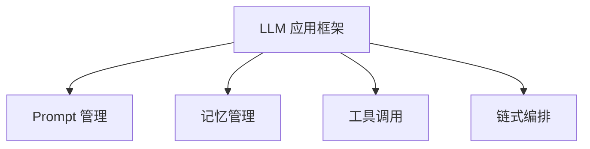
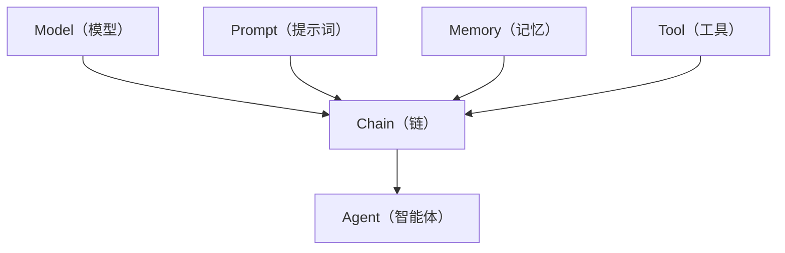
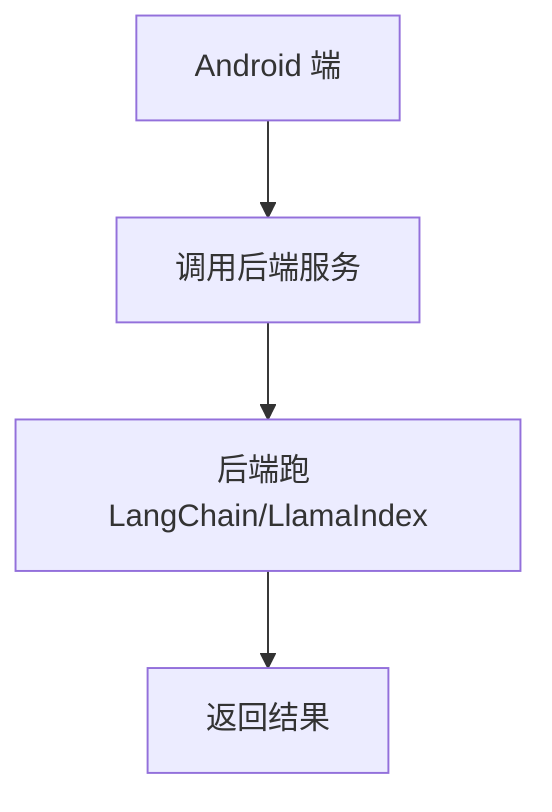
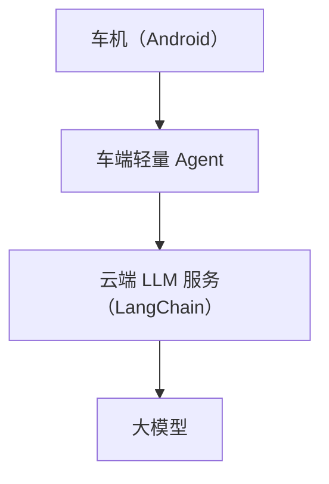

# LangChain / LlamaIndex 在 Android 的应用

> 系列：AAOS-Guide · 40-agent-framework
> 难度：⭐⭐⭐⭐ 深入
> 更新：2026-08-27
> 前置知识：《Agent 框架：Function Calling 实战》

---

## 一、LLM 应用框架是什么

直接用 LLM API 做复杂应用很繁琐（要自己管 prompt、记忆、工具调用）。**LLM 应用框架**帮你封装这些：



## 二、两大框架

| 框架 | 定位 | 语言 |
|------|------|------|
| LangChain | 通用 LLM 编排 | Python/JS |
| LlamaIndex | 专注 RAG/数据 | Python |

## 三、LangChain 的核心概念



### LangChain 示例

```python
from langchain.chains import LLMChain
from langchain.prompts import PromptTemplate
from langchain.llms import OpenAI

# 定义 prompt 模板
prompt = PromptTemplate(
    input_variables=["destination"],
    template="帮我规划去 {destination} 的路线"
)

# 定义链
chain = LLMChain(llm=OpenAI(), prompt=prompt)

# 运行
result = chain.run(destination="上海")
```

## 四、LlamaIndex 的核心

LlamaIndex 专注「数据 + LLM」，特别是 RAG：

```python
from llama_index import VectorStoreIndex, SimpleDirectoryReader

# 加载文档
documents = SimpleDirectoryReader("docs").load_data()

# 建立索引
index = VectorStoreIndex.from_documents(documents)

# 查询
query_engine = index.as_query_engine()
response = query_engine.query("怎么设置自适应巡航？")
```

## 五、Android 端的挑战

这些框架主要是 Python/JS，Android 端不能直接用：

| 挑战 | 对策 |
|------|------|
| 语言不匹配 | 用框架的 REST 服务，或自实现 |
| 体积大 | 端侧轻量化 |
| 依赖重 | 精简依赖 |



**典型架构**：Android 端调用后端 LLM 服务，框架跑在服务端。

## 六、Android 端的选择

| 方案 | 说明 |
|------|------|
| 后端服务 | LangChain 跑服务端，Android 调 API |
| 自实现 | 端侧自己封装（如 AI-Android-Demo） |
| 轻量库 | 用更轻的替代 |

## 七、车载场景的架构

车载 Agent 通常这样分层：



**核心理解**：复杂的编排在云端做，车端只做轻量交互和结果展示。

## 八、总结

| 要点 | 结论 |
|------|------|
| 框架作用 | 封装 prompt/记忆/工具 |
| LangChain | 通用编排 |
| LlamaIndex | 专注 RAG |
| Android 应用 | 调后端服务为主 |

---

**下一篇预告**：《车载 Agent 的安全框架》

> 配套仓库：[AAOS-Guide](https://github.com/jason5200/AAOS-Guide)
