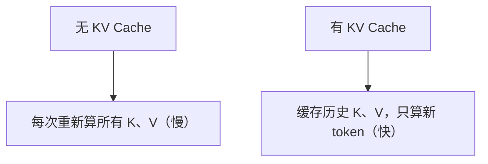
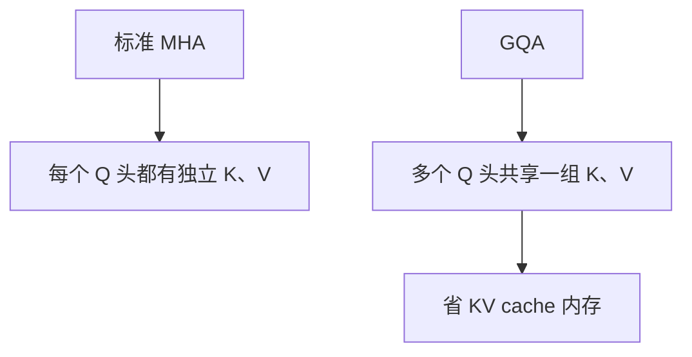

# Llama 注意力实现的源码解读

> 系列：AAOS-Guide · 25-transformer
> 难度：⭐⭐⭐⭐⭐ 深入
> 更新：2026-08-27
> 前置知识：《注意力机制的数学推导》

---

## 一、本文目标

上一篇《注意力机制的数学推导》讲了公式，这一篇看 **Llama（最流行的开源大模型）的实际代码**，看注意力在工程里怎么高效实现。

## 二、Llama 注意力的特殊优化

Llama 对标准注意力做了几处工程优化：

| 优化 | 说明 |
|------|------|
| RoPE 旋转位置编码 | 更好的位置信息 |
| KV Cache | 避免重复计算 |
| GQA 分组查询 | 减少 KV 头数，省内存 |

## 三、Llama 注意力模块的源码（简化）

```python
# llama 模型里的注意力模块（简化版）
class Attention(nn.Module):
    def __init__(self, args):
        # Q、K、V 的投影层
        self.wq = nn.Linear(dim, n_heads * head_dim, bias=False)
        self.wk = nn.Linear(dim, n_kv_heads * head_dim, bias=False)
        self.wv = nn.Linear(dim, n_kv_heads * head_dim, bias=False)
        self.wo = nn.Linear(n_heads * head_dim, dim, bias=False)

    def forward(self, x, ...):
        # 1. 计算 Q、K、V
        q = self.wq(x)
        k = self.wk(x)
        v = self.wv(x)

        # 2. 应用 RoPE 旋转位置编码
        q, k = apply_rotary_emb(q, k, freqs_cis)

        # 3. 注意力计算（带 KV cache）
        output = attention(q, k, v, ...)

        # 4. 输出投影
        return self.wo(output)
```

## 四、注意力计算的核心（带 KV Cache）

```python
def attention(q, k, v, cache_k=None, cache_v=None):
    # 1. 如果有 KV cache，拼接历史
    if cache_k is not None:
        k = torch.cat([cache_k, k], dim=1)
        v = torch.cat([cache_v, v], dim=1)

    # 2. 注意力得分：Q·Kᵀ / √d
    scores = torch.matmul(q, k.transpose(1, 2)) / math.sqrt(head_dim)

    # 3. softmax
    scores = F.softmax(scores, dim=-1)

    # 4. 加权求和
    output = torch.matmul(scores, v)

    return output
```

## 五、KV Cache 的核心价值

生成式模型逐 token 生成，如果每次都重新算所有 token 的 K、V，会重复计算：



**关键理解**：KV Cache 把「已生成 token 的 K、V」缓存起来，生成新 token 时只算新 token 的 K、V，大幅加速。

## 六、RoPE 旋转位置编码

Llama 用 RoPE 替代传统的位置编码：

```python
def apply_rotary_emb(x, freqs_cis):
    # 把向量两两分组，按角度旋转
    # 公式：x' = x·cos(θ) - y·sin(θ)
    #       y' = x·sin(θ) + y·cos(θ)
    x_ = x.reshape(...)
    x_out = torch.stack([x_[..., 0] * cos - x_[..., 1] * sin,
                         x_[..., 0] * sin + x_[..., 1] * cos], dim=-1)
    return x_out
```

**核心理解**：RoPE 通过「旋转」把位置信息编码进 Q、K，让模型感知相对位置。

## 七、GQA（分组查询注意力）

GQA 是 Llama 2 之后的优化：多个 Q 头共享一组 K、V：



**价值**：KV Cache 的内存占用大幅下降，端侧推理更友好。

## 八、Llama 注意力与标准注意力的对比

| 维度 | 标准注意力 | Llama 注意力 |
|------|-----------|-------------|
| 位置编码 | 可学习/正弦 | RoPE 旋转 |
| KV Cache | 无 | 有（加速） |
| 多注意力 | MHA | GQA（省内存） |

## 九、总结

| 要点 | 结论 |
|------|------|
| 核心公式 | softmax(Q·Kᵀ/√d)·V |
| KV Cache | 缓存历史 K、V，加速生成 |
| RoPE | 旋转位置编码 |
| GQA | 分组查询，省内存 |

---

**下一篇预告**：《AIDL 生成代码的完整解读》

> 配套仓库：[AAOS-Guide](https://github.com/jason5200/AAOS-Guide)
