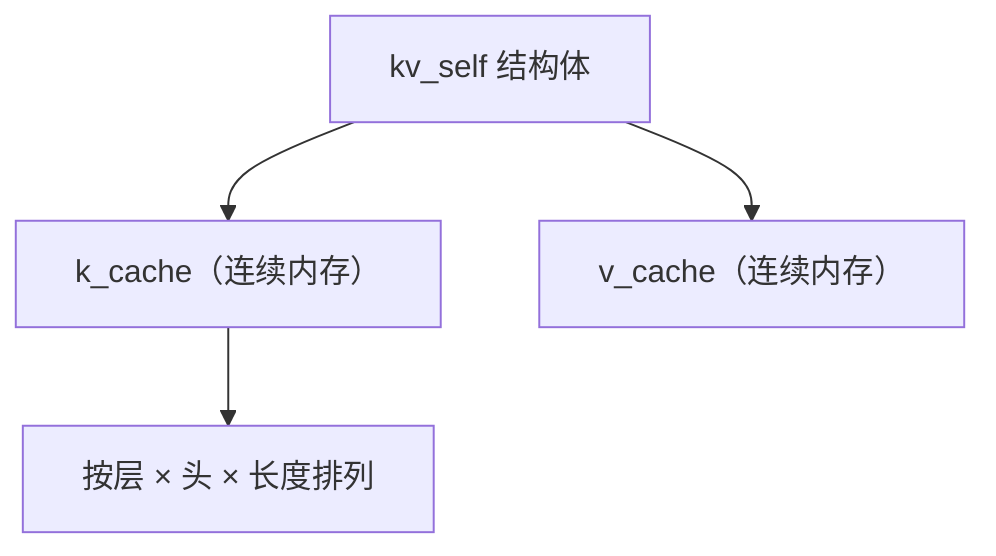
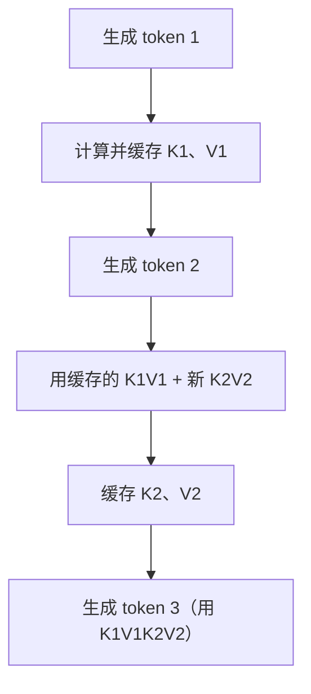

# llama.cpp 的 KV Cache 实现

> 系列：AAOS-Guide · 25-transformer
> 难度：⭐⭐⭐⭐⭐ 深入
> 更新：2026-08-27
> 前置知识：《Llama 注意力实现的源码解读》

---

## 一、本文目标

llama.cpp 是端侧跑大模型的事实标准，它的 **KV Cache** 实现是性能关键。这一篇深入到 llama.cpp 的 C/C++ 源码，看 KV Cache 到底怎么管理内存、怎么读写。

## 二、KV Cache 的内存布局

llama.cpp 用连续内存块存 KV Cache：



## 三、KV Cache 的核心结构

```cpp
// llama.cpp 简化版
struct llama_kv_cache {
    // K 和 V 的缓存（连续内存）
    std::vector<float> k;   // K cache
    std::vector<float> v;   // V cache

    // 已缓存的 token 数
    int32_t n = 0;

    // 内存布局：每层、每个头、每个位置
    // offset = layer * n_heads * n_embd + head * n_embd
};
```

## 四、内存大小计算

KV Cache 的内存占用可以精确计算：

```cpp
// 每层的 KV 大小
size_t layer_size = n_heads * n_embd_head;  // 头数 × 每头维度

// 总大小（所有层 × 2（K和V）× 上下文长度）
size_t total = n_layers * layer_size * 2 * n_ctx;

// 例如 Llama-7B：32 层 × 4096 头维度 × 2 × 2048 上下文
// ≈ 32 × 4096 × 2 × 2048 × 2字节(FP16) ≈ 1GB
```

## 五、写入 KV Cache

每次生成新 token，把它的 K、V 写入缓存：

```cpp
// 简化：写入当前 token 的 K、V
void llama_kv_cache_store(int layer, int pos, float* k_data, float* v_data) {
    // 计算偏移
    size_t offset = layer * n_heads * n_embd_head + pos * n_embd_head;

    // 写入 K
    memcpy(k_cache.data() + offset, k_data, n_heads * n_embd_head * sizeof(float));
    // 写入 V
    memcpy(v_cache.data() + offset, v_data, n_heads * n_embd_head * sizeof(float));
}
```

## 六、读取 KV Cache（注意力计算时）

计算注意力时，读取历史的所有 K、V：

```cpp
// 简化：注意力计算，读取缓存的 K、V
void compute_attention(int layer, float* q, int n_tokens, float* output) {
    for (int pos = 0; pos < n_tokens; pos++) {
        // 读取位置 pos 的 K
        float* k = k_cache.data() + layer_offset + pos * n_embd_head;
        // 读取位置 pos 的 V
        float* v = v_cache.data() + layer_offset + pos * n_embd_head;
        // 计算 Q·K，累加到 output
        // ...
    }
}
```

## 七、KV Cache 的生命周期



**核心理解**：每生成一个 token，缓存它的 K、V；生成下一个 token 时，复用之前所有缓存的 K、V，只算新 token 的。

## 八、KV Cache 的量化

KV Cache 占用内存大，llama.cpp 支持对它量化：

| 量化 | 内存节省 | 精度损失 |
|------|----------|----------|
| FP16 | 基准 | 无 |
| Q8 | 省一半 | 小 |
| Q4 | 省 3/4 | 中 |

```cpp
// 量化 KV Cache
struct llama_kv_cache {
    // 量化后的缓存
    std::vector<uint8_t> k_quantized;  // Q8/Q4 存储
    // ...
};
```

## 九、总结

| 要点 | 结论 |
|------|------|
| 内存布局 | 连续内存，层×头×位置 |
| 写入 | 每 token 缓存 K、V |
| 读取 | 注意力时复用历史 K、V |
| 量化 | Q8/Q4 省内存 |

---

**下一篇预告**：《端侧向量检索的 SQLite 优化》

> 配套仓库：[AAOS-Guide](https://github.com/jason5200/AAOS-Guide)
