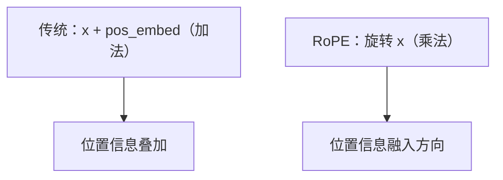

# llama.cpp 的 RoPE 位置编码实现

> 系列：AAOS-Guide · 25-transformer
> 难度：⭐⭐⭐⭐⭐ 深入
> 更新：2026-08-27
> 前置知识：《Llama 注意力实现的源码解读》

---

## 一、本文目标

RoPE（旋转位置编码）是 Llama 的核心创新之一，llama.cpp 里的实现高效且巧妙。这一篇深入到 llama.cpp 的 RoPE 源码。

## 二、RoPE 的核心思想

传统位置编码是「加法」（把位置向量加到词向量上），RoPE 是「旋转」（把词向量按位置角度旋转）。



**关键理解**：RoPE 通过旋转，让「相对位置」信息通过向量夹角自然体现——两个位置越近，旋转角度差越小，点积越大。

## 三、RoPE 的数学

对向量每两维一组，按角度 θ 旋转：

```
对于第 i 对维度（x, y），旋转角度为 pos × θᵢ：
  x' = x·cos(pos·θᵢ) - y·sin(pos·θᵢ)
  y' = x·sin(pos·θᵢ) + y·cos(pos·θᵢ)
```

其中 θᵢ = 10000^(-2i/d)，频率随维度递减。

## 四、llama.cpp 的 RoPE 实现

llama.cpp 里 RoPE 的核心函数：

```cpp
// llama.cpp 简化版
static void rope_f32(const float * x, float * dst,
                     int n_tokens, int n_dims, int mode,
                     const float * freq_factors) {
    for (int i0 = 0; i0 < n_tokens; i0++) {
        const float * x0 = x + i0 * n_dims;
        float * dst0 = dst + i0 * n_dims;

        for (int i1 = 0; i1 < n_dims; i1 += 2) {
            // 每一对维度
            float x0_i = x0[i1];
            float x1_i = x0[i1 + 1];

            // 位置
            float theta = pos * freq[i1/2];

            // 旋转
            float cos_theta = cosf(theta);
            float sin_theta = sinf(theta);

            dst0[i1]     = x0_i * cos_theta - x1_i * sin_theta;
            dst0[i1 + 1] = x0_i * sin_theta + x1_i * cos_theta;
        }
    }
}
```

## 五、频率的预计算

RoPE 的频率 θᵢ = 10000^(-2i/d) 可以预计算，避免重复计算：

```cpp
// 预计算频率
static void rope_yarn_ramp(...) {
    for (int i = 0; i < n_dims/2; i++) {
        // theta_i = 10000^(-2i/d)
        freq[i] = 1.0f / powf(10000.0f, (2.0f * i) / n_dims);
    }
}
```

## 六、SIMD 优化

llama.cpp 对 RoPE 做了 SIMD 优化，一次处理多对维度：

```cpp
// 用 AVX 一次旋转 8 对维度
static void rope_neox_avx2(...) {
    // 加载 8 个 cos 值
    __m256 cos_vec = _mm256_loadu_ps(cos_theta);
    __m256 sin_vec = _mm256_loadu_ps(sin_theta);

    // 一次旋转 8 对
    // x' = x*cos - y*sin
    // y' = x*sin + y*cos
    ...
}
```

## 七、RoPE 的优势

| 优势 | 说明 |
|------|------|
| 相对位置 | 自然编码相对距离 |
| 外推性 | 可扩展到更长序列 |
| 无需训练 | 位置信息靠旋转，无需学习参数 |

## 八、RoPE 与其他位置编码对比

| 方式 | 特点 |
|------|------|
| 绝对位置编码 | 简单，但难外推 |
| 可学习位置 | 灵活，但占参数 |
| RoPE | 相对位置，可外推 |

## 九、总结

| 要点 | 结论 |
|------|------|
| RoPE | 旋转位置编码 |
| 数学 | 每两维按角度旋转 |
| 频率 | θᵢ = 10000^(-2i/d) |
| 优化 | SIMD 加速 |
| 优势 | 相对位置、可外推 |

---

**下一篇预告**：《View layout 与 draw 的源码全链路》

> 配套仓库：[AAOS-Guide](https://github.com/jason5200/AAOS-Guide)
