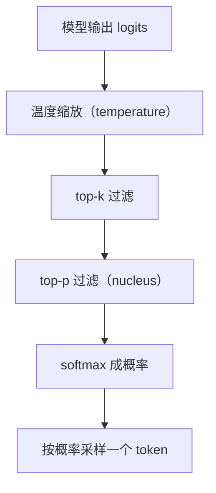
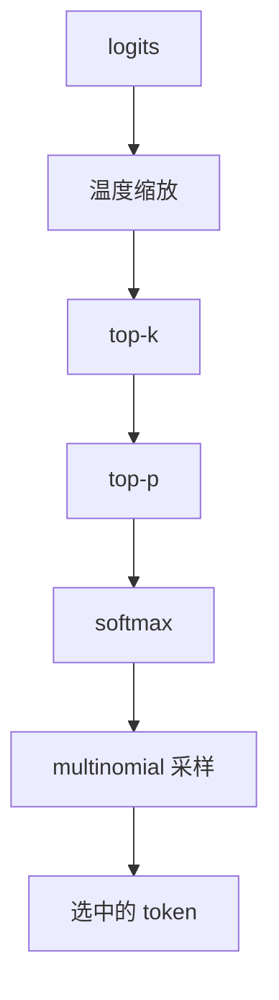

# llama.cpp 采样算法的完整源码

> 系列：AAOS-Guide · 25-transformer
> 难度：⭐⭐⭐⭐⭐ 深入
> 更新：2026-08-27
> 前置知识：《Llama 注意力实现的源码解读》

---

## 一、本文目标

模型输出的是「每个词的概率分布」，但最终要「选一个词」。这个「选词」的过程就是**采样（Sampling）**。这一篇深入到 llama.cpp 的采样源码。

## 二、采样的完整流程



## 三、温度采样（Temperature）

温度控制「随机性」：

```cpp
// llama.cpp 采样（简化）
void sample_temperature(float* logits, int n_vocab, float temp) {
    if (temp <= 0) {
        temp = 1.0f;  // 默认 1.0
    }
    // 所有 logits 除以温度
    for (int i = 0; i < n_vocab; i++) {
        logits[i] /= temp;
    }
}
```

**关键理解**：
- 温度高（>1）→ 分布更平 → 更随机、更多样
- 温度低（<1）→ 分布更尖 → 更确定、更保守

## 四、Top-K 采样

只保留概率最高的 K 个 token：

```cpp
void sample_top_k(float* logits, int n_vocab, int top_k) {
    if (top_k <= 0 || top_k >= n_vocab) return;

    // 找第 K 大的值作为阈值
    float kth_value = nth_element(logits, top_k);

    // 低于阈值的设为 -inf（排除）
    for (int i = 0; i < n_vocab; i++) {
        if (logits[i] < kth_value) {
            logits[i] = -INFINITY;
        }
    }
}
```

## 五、Top-P 采样（Nucleus）

按累积概率保留 token，直到达到阈值 p：

```cpp
void sample_top_p(float* logits, int n_vocab, float top_p) {
    if (top_p >= 1.0f) return;

    // 1. 先 softmax 成概率
    softmax(logits, n_vocab);

    // 2. 按概率降序排序
    sort_descending(logits);

    // 3. 累积概率，超过 p 的截断
    float cumsum = 0;
    for (int i = 0; i < n_vocab; i++) {
        cumsum += logits[i];
        if (cumsum > top_p) {
            // 超过 p 的部分设为 -inf
            logits[i] = -INFINITY;
        }
    }
}
```

**关键理解**：Top-P 比 Top-K 更自适应——它动态决定保留多少 token（根据分布的「尖度」）。

## 六、Softmax

过滤后重新 softmax 成概率分布：

```cpp
void softmax(float* logits, int n_vocab) {
    // 1. 找最大值（数值稳定）
    float max_logit = -INFINITY;
    for (int i = 0; i < n_vocab; i++) {
        if (logits[i] > max_logit) max_logit = logits[i];
    }

    // 2. exp 并求和
    float sum = 0;
    for (int i = 0; i < n_vocab; i++) {
        logits[i] = expf(logits[i] - max_logit);
        sum += logits[i];
    }

    // 3. 归一化
    for (int i = 0; i < n_vocab; i++) {
        logits[i] /= sum;
    }
}
```

## 七、按概率采样（Multinomial）

最后按概率随机选一个 token：

```cpp
int sample_multinomial(float* probs, int n_vocab, float rng) {
    // rng 是 [0, 1) 的随机数
    float cumsum = 0;
    for (int i = 0; i < n_vocab; i++) {
        cumsum += probs[i];
        if (rng < cumsum) {
            return i;  // 选中这个 token
        }
    }
    return n_vocab - 1;
}
```

## 八、采样参数的影响

| 参数 | 作用 | 车载建议 |
|------|------|----------|
| temperature | 随机性 | 意图识别低（0.1），闲聊可高（0.7） |
| top_k | 候选数 | 40 常见 |
| top_p | 累积阈值 | 0.9 常见 |
| repeat_penalty | 防重复 | 1.1 常见 |

## 九、完整的采样链



## 十、总结

| 要点 | 结论 |
|------|------|
| 温度 | 控制随机性 |
| top-k | 固定保留 K 个 |
| top-p | 自适应截断 |
| 采样 | multinomial 按概率选 |

---

**下一篇预告**：《View 硬件加速的完整源码》

> 配套仓库：[AAOS-Guide](https://github.com/jason5200/AAOS-Guide)
