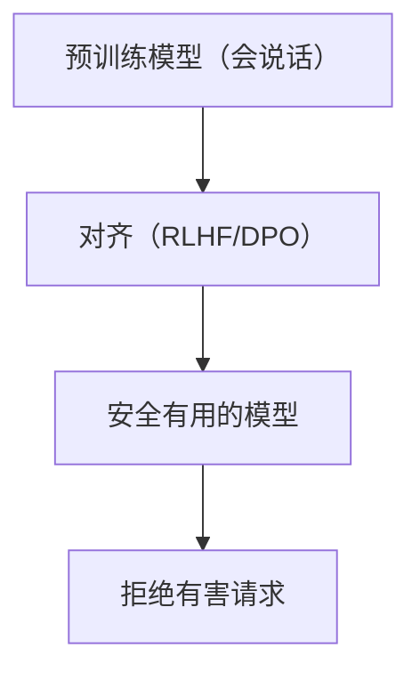
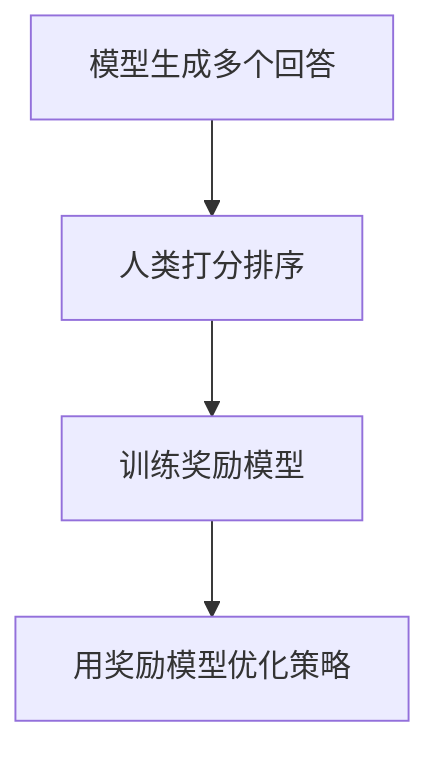
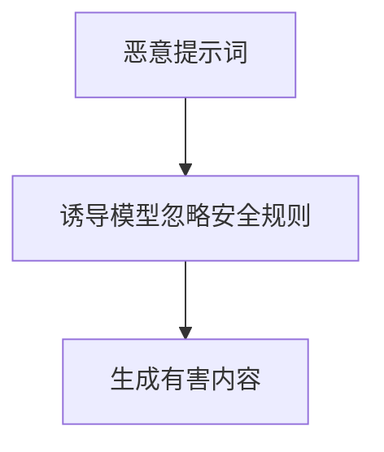
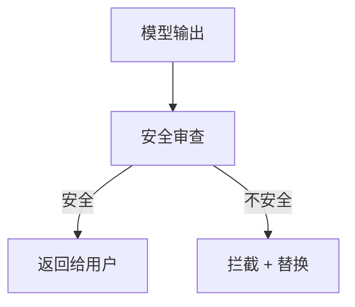

# 大模型安全：对齐与防护

> 系列：AAOS-Guide · 47-llm-safety
> 难度：⭐⭐⭐⭐ 深入
> 更新：2026-08-27
> 前置知识：《大模型训练：从预训练到微调》

---

## 一、大模型有哪些安全风险

大模型能力强大，但也带来安全风险：

| 风险 | 说明 |
|------|------|
| 有害内容 | 生成暴力、违法内容 |
| 偏见 | 输出歧视性内容 |
| 幻觉 | 一本正经胡说 |
| 隐私泄露 | 泄露训练数据 |
| 越狱 | 绕过安全限制 |

## 二、对齐（Alignment）是什么

对齐就是让模型的输出符合**人类价值观**：安全、有用、诚实。



## 三、对齐的方法

| 方法 | 说明 |
|------|------|
| RLHF | 人类反馈强化学习 |
| DPO | 直接偏好优化（更简单） |
| 宪法 AI | 用规则约束模型 |

### RLHF 的流程



## 四、越狱攻击（Jailbreak）

攻击者试图绕过模型的安全限制：



**常见越狱手法**：角色扮演、假设场景、编码绕过。

## 五、防护措施

### 1. 输入过滤

```python
def filter_input(user_input):
    dangerous_keywords = ["如何制造炸弹", "黑客攻击", "违法"]
    for keyword in dangerous_keywords:
        if keyword in user_input:
            return "抱歉，我无法回答这个问题"
    return user_input
```

### 2. 输出审查

对模型输出做二次审查：



### 3. 安全提示词

在系统提示词里强调安全：

```
你是安全、有帮助的助手。对于涉及暴力、违法、伤害他人的请求，请礼貌拒绝。
```

## 六、车载场景的安全特别要求

车载大模型的安全风险更严重：

| 场景 | 风险 |
|------|------|
| 误导航 | 引导到危险路段 |
| 误控车 | 错误操作车辆 |
| 分心 | 输出大量文字让司机分心 |

**车载安全原则**：
- 关键操作需确认
- 驾驶中输出精简
- 拒绝危险指令

## 七、安全评估

上线前要做安全评估：

| 评估项 | 说明 |
|--------|------|
| 有害内容拒绝率 | 能拒绝多少有害请求 |
| 越狱成功率 | 被攻破的概率 |
| 偏见检测 | 是否有偏见输出 |
| 幻觉率 | 胡说的比例 |

## 八、总结

| 要点 | 结论 |
|------|------|
| 风险 | 有害/偏见/幻觉/隐私/越狱 |
| 对齐 | RLHF/DPO 让模型安全 |
| 防护 | 输入过滤、输出审查 |
| 车载 | 关键操作确认、精简输出 |

---

**本系列完**。AI 上车方向 30 篇全部完成，形成从 Transformer 到安全对齐的完整体系。

> 配套仓库：[AAOS-Guide](https://github.com/jason5200/AAOS-Guide)
