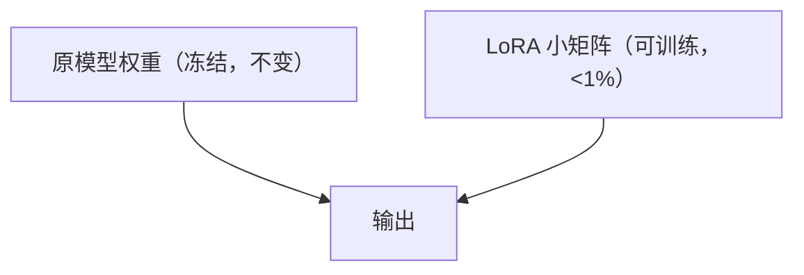
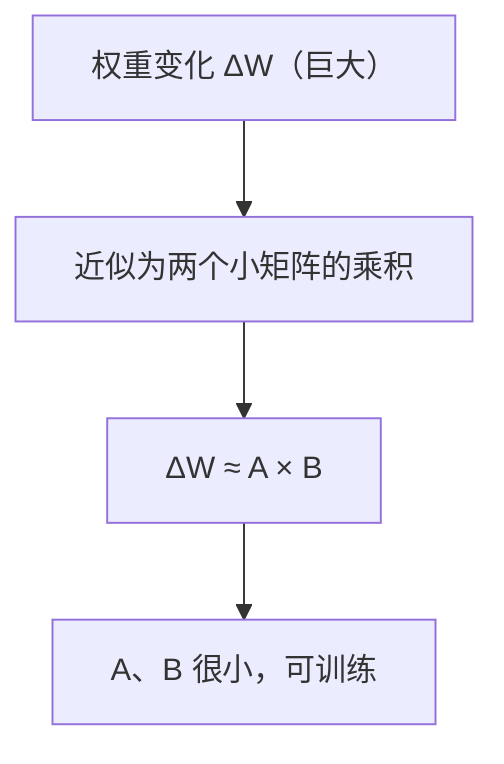
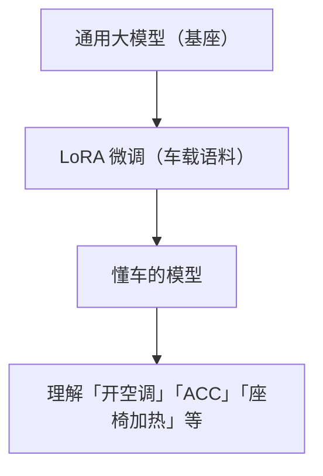
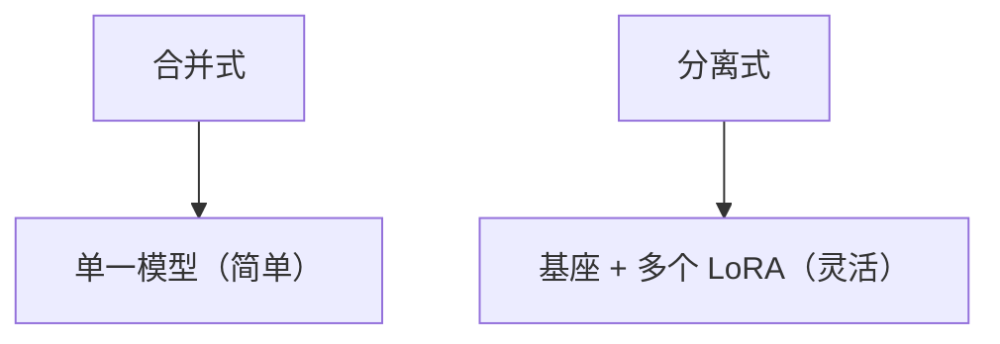

# LoRA 微调实战

> 系列：AAOS-Guide · 43-lora
> 难度：⭐⭐⭐⭐⭐ 深入
> 更新：2026-08-27
> 前置知识：《大模型训练：从预训练到微调》

---

## 一、LoRA 解决了什么问题

全量微调大模型，需要更新所有参数，显存和算力要求极高，个人/小团队难以承担。

**LoRA（Low-Rank Adaptation）**：不更新原模型，只训练一个「低秩小矩阵」，大幅降低门槛。



## 二、LoRA 的核心原理

大模型的权重矩阵虽然巨大，但「有效的变化」其实在低秩空间里。LoRA 用一个「低秩分解」来近似权重变化：



**关键理解**：LoRA 训练的是「变化量」而不是「全部权重」，所以参数极少。

## 三、LoRA 的优势

| 优势 | 说明 |
|------|------|
| 参数量小 | 通常 < 1% 原模型 |
| 显存低 | 单卡即可训练 |
| 可插拔 | 不同任务换不同 LoRA |
| 不破坏原模型 | 原权重冻结 |

## 四、LoRA 微调实战（PEFT 库）

```python
from peft import LoraConfig, get_peft_model
from transformers import AutoModelForCausalLM, AutoTokenizer

# 加载模型
model = AutoModelForCausalLM.from_pretrained("Qwen/Qwen-7B")
tokenizer = AutoTokenizer.from_pretrained("Qwen/Qwen-7B")

# 配置 LoRA
lora_config = LoraConfig(
    r=8,              # 低秩维度
    lora_alpha=32,    # 缩放系数
    target_modules=["q_proj", "v_proj"],  # 目标层
    lora_dropout=0.1,
    task_type="CAUSAL_LM"
)

# 应用 LoRA
model = get_peft_model(model, lora_config)

# 只训练 LoRA 参数
model.print_trainable_parameters()
# 输出：trainable params: 0.5%（很少）
```

## 五、关键参数

| 参数 | 说明 |
|------|------|
| `r` | 低秩维度，越大能力越强但参数越多 |
| `lora_alpha` | 缩放系数 |
| `target_modules` | 对哪些层做 LoRA |
| `dropout` | 防止过拟合 |

## 六、车载场景的 LoRA 微调

车载大模型可以用 LoRA 针对车载语料微调：



**好处**：保留基座模型的通用能力，只增量学习车载知识。

## 七、LoRA 的部署

微调后，LoRA 权重可以：

1. **合并**：LoRA 权重合并回基座模型，部署合并后的模型。
2. **分离**：基座 + LoRA 分别部署，推理时动态加载。



## 八、总结

| 要点 | 结论 |
|------|------|
| LoRA | 低秩适配，训练小矩阵 |
| 优势 | 参数少、显存低、可插拔 |
| 工具 | PEFT 库 |
| 车载 | 车载语料微调 |

---

**下一篇预告**：《端侧多模态模型部署》

> 配套仓库：[AAOS-Guide](https://github.com/jason5200/AAOS-Guide)
