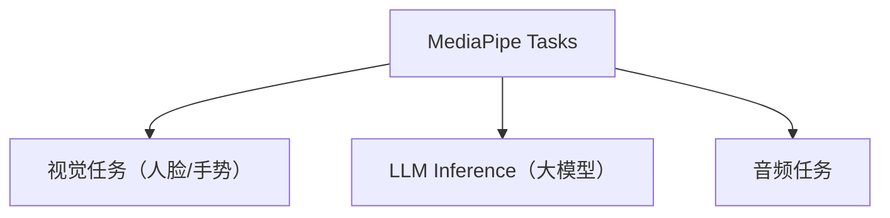
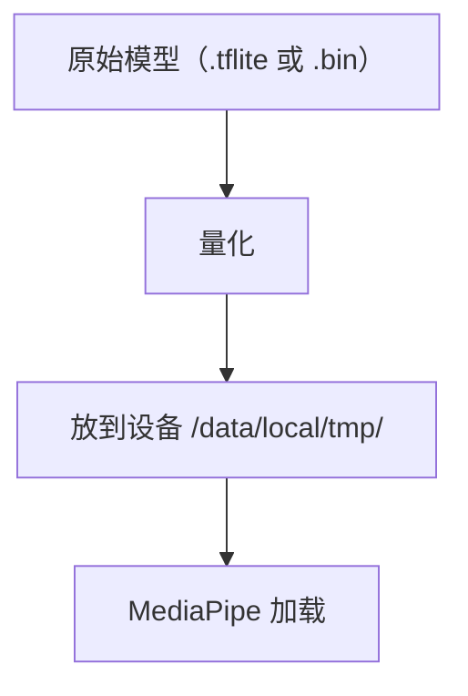

# MediaPipe LLM Inference 实战

> 系列：AAOS-Guide · 30-mediapipe
> 难度：⭐⭐⭐⭐ 深入
> 更新：2026-08-27
> 前置知识：《端侧推理框架对比》

---

## 一、MediaPipe 是什么

MediaPipe 是 Google 的端侧 AI 框架，除了传统的视觉任务，还提供了 **LLM Inference API**，让 Android 端跑大模型变得简单。



## 二、为什么选 MediaPipe 跑 LLM

| 优势 | 说明 |
|------|------|
| Google 官方 | 维护可靠 |
| API 简单 | 几行代码跑起来 |
| Android 友好 | 原生支持 |
| 支持流式 | 逐 token 输出 |

## 三、集成 MediaPipe

```groovy
// build.gradle
dependencies {
    implementation 'com.google.mediapipe:tasks-genai:0.10.14'
}
```

## 四、初始化 LLM

```kotlin
import com.google.mediapipe.tasks.genai.llminference.LlmInference

// 配置选项
val options = LlmInference.LlmInferenceOptions.builder()
    .setModelPath("/data/local/tmp/model.bin")  // 量化后的模型
    .setMaxTokens(512)                          // 最大生成长度
    .setTemperature(0.7f)                       // 随机性
    .setTopK(40)                                // 采样参数
    .build()

val llmInference = LlmInference.createFromOptions(context, options)
```

## 五、生成回复（同步）

```kotlin
val prompt = "车载座舱是什么？"
val response = llmInference.generateResponse(prompt)
textView.text = response
```

## 六、流式输出（异步）

对话场景需要流式输出，逐 token 显示：

```kotlin
val result = llmInference.generateResponseAsync(prompt)

result.addOnSuccessListener { partialResult ->
    // 部分结果，流式更新 UI
    val partialText = partialResult.output
    textView.append(partialText)
}

result.addOnCompleteListener {
    // 生成完成
    val fullText = it.result.output
}
```

## 七、完整的对话应用骨架

```kotlin
class ChatActivity : AppCompatActivity() {
    private lateinit var llmInference: LlmInference

    override fun onCreate(savedInstanceState: Bundle?) {
        super.onCreate(savedInstanceState)
        setContentView(R.layout.activity_chat)

        // 初始化 LLM（耗时，放子线程）
        lifecycleScope.launch(Dispatchers.IO) {
            llmInference = LlmInference.createFromOptions(
                this@ChatActivity, options)
        }
    }

    fun sendMessage(prompt: String) {
        lifecycleScope.launch {
            llmInference.generateResponseAsync(prompt)
                .addOnSuccessListener { partial ->
                    runOnUiThread {
                        tvChat.append(partial.output)
                    }
                }
        }
    }
}
```

## 八、模型准备

MediaPipe 需要特定格式的量化模型：



**注意**：
- 模型要用 MediaPipe 支持的格式（`.bin` 或 `.tflite`）
- 模型文件放设备可访问路径

## 九、性能与限制

| 维度 | 说明 |
|------|------|
| 模型大小 | 建议 1-4B 参数量化 |
| 首 token 延迟 | 初始化后首次较慢 |
| 内存 | 模型常驻内存 |
| 温度/topK | 影响生成多样性 |

## 十、总结

| 要点 | 结论 |
|------|------|
| MediaPipe | Google 端侧 AI 框架 |
| LLM API | 几行代码跑大模型 |
| 流式输出 | generateResponseAsync |
| 模型 | 量化后 .bin/.tflite |

---

**下一篇预告**：《ONNX Runtime Mobile 实战》

> 配套仓库：[AAOS-Guide](https://github.com/jason5200/AAOS-Guide) · [AI-Android-Demo](https://github.com/jason5200/AI-Android-Demo)
