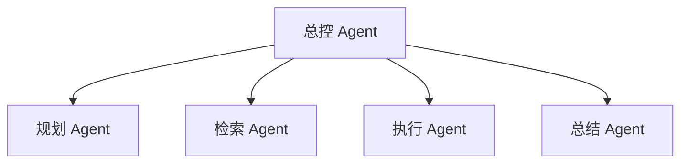
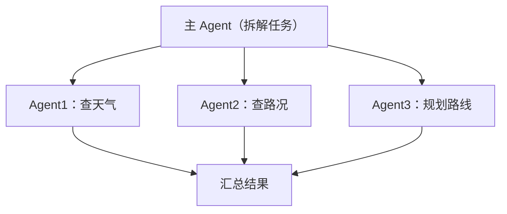
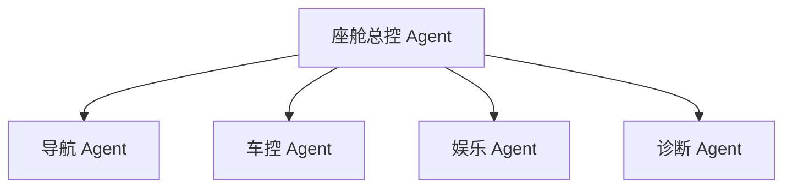

# 多 Agent 协作

> 系列：AAOS-Guide · 38-multi-agent
> 难度：⭐⭐⭐⭐ 深入
> 更新：2026-08-27
> 前置知识：《Agent 的规划：ReAct》

---

## 一、为什么需要多 Agent

单个 Agent 能力有限：一个模型既要理解、又要规划、又要执行，容易顾此失彼。

**多 Agent**：让多个「专家 Agent」分工协作，各司其职。



## 二、多 Agent 的协作模式

| 模式 | 说明 |
|------|------|
| 主从式 | 一个主 Agent 调度多个子 Agent |
| 流水线 | 多个 Agent 按顺序处理 |
| 辩论式 | 多个 Agent 互相讨论达成共识 |
| 市场式 | Agent 之间像市场一样交易 |

## 三、主从式（最常用）

主 Agent 拆解任务，分配给专家 Agent：



## 四、车载场景的多 Agent

车载座舱可以设计多个专家 Agent：

| Agent | 职责 |
|-------|------|
| 导航 Agent | 路线规划、路况 |
| 车控 Agent | 空调、车窗、座椅 |
| 娱乐 Agent | 音乐、视频 |
| 诊断 Agent | 车辆健康、故障 |



## 五、多 Agent 的实现框架

| 框架 | 说明 |
|------|------|
| AutoGen | 微软，多 Agent 对话 |
| CrewAI | 角色化 Agent 团队 |
| LangGraph | 图结构的 Agent 编排 |
| MetaGPT | 软件公司式多 Agent |

## 六、CrewAI 示例

```python
from crewai import Agent, Task, Crew

# 定义 Agent
navigator = Agent(role="导航专家", goal="规划最优路线")
mechanic = Agent(role="车辆诊断", goal="检查车辆状态")

# 定义任务
task1 = Task(description="规划回家路线", agent=navigator)
task2 = Task(description="检查油量是否足够", agent=mechanic)

# 协作
crew = Crew(agents=[navigator, mechanic], tasks=[task1, task2])
result = crew.kickoff()
```

## 七、多 Agent 的挑战

| 挑战 | 说明 |
|------|------|
| 协调成本 | Agent 之间通信开销 |
| 结果不一致 | 多个 Agent 结论冲突 |
| 成本翻倍 | 多个模型调用，费用高 |
| 调试困难 | 出问题难定位是哪个 Agent |

## 八、总结

| 要点 | 结论 |
|------|------|
| 多 Agent | 分工协作 |
| 协作模式 | 主从/流水线/辩论/市场 |
| 车载场景 | 导航/车控/娱乐/诊断分工 |
| 框架 | AutoGen/CrewAI/LangGraph |

---

**下一篇预告**：《Agent 的记忆系统》

> 配套仓库：[AAOS-Guide](https://github.com/jason5200/AAOS-Guide)
