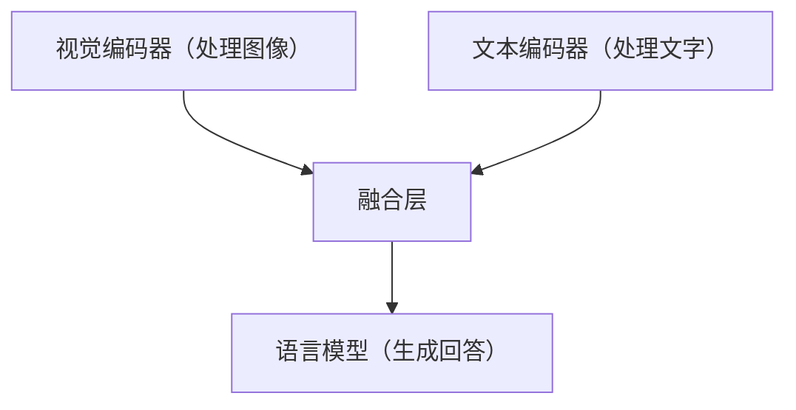
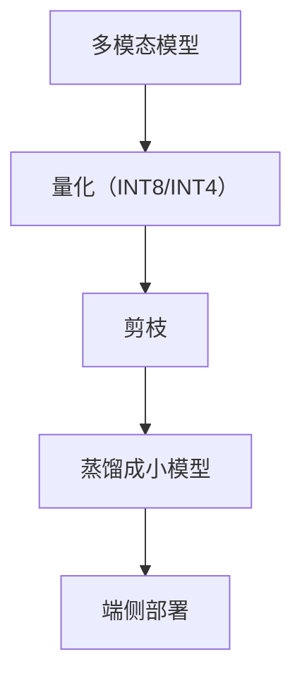
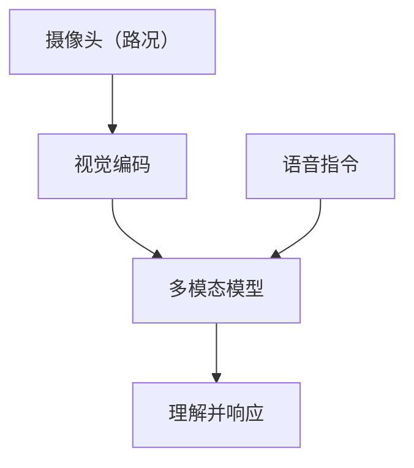

# 端侧多模态模型部署

> 系列：AAOS-Guide · 44-multimodal-deploy
> 难度：⭐⭐⭐⭐⭐ 深入
> 更新：2026-08-27
> 前置知识：《车载多模态》《模型量化》

---

## 一、多模态模型端侧部署的挑战

多模态模型（理解图像+文本）比纯文本模型大得多，端侧部署更难：

| 挑战 | 说明 |
|------|------|
| 模型更大 | 视觉编码器 + 语言模型 |
| 算力需求高 | 图像处理吃算力 |
| 内存占用大 | 两个模型组件 |
| 实时性 | 视觉要快 |

## 二、多模态模型的架构

多模态模型通常由三部分组成：



**关键理解**：视觉编码器把图像变成向量，语言模型再理解这些向量。

## 三、端侧可用的多模态模型

| 模型 | 参数量 | 端侧可行性 |
|------|--------|-----------|
| MiniCPM-V | 2B-8B | 量化后可端侧 |
| Qwen-VL | 7B+ | 较难 |
| MobileVLM | 小 | 适合端侧 |
| LLaVA | 7B+ | 较难 |

## 四、端侧部署的优化手段



| 手段 | 效果 |
|------|------|
| 量化 | 缩小 4 倍 |
| 蒸馏 | 换小模型 |
| 分层加载 | 按需加载视觉/语言部分 |

## 五、端侧多模态的推理流程

```python
# 端侧多模态推理（简化）
def multimodal_inference(image, question):
    # 1. 视觉编码（可能用 NPU 加速）
    image_embedding = vision_encoder.encode(image)

    # 2. 文本编码
    text_embedding = text_encoder.encode(question)

    # 3. 融合 + 生成
    answer = language_model.generate(image_embedding, text_embedding)
    return answer
```

## 六、硬件加速

多模态模型要充分利用硬件：

| 硬件 | 用途 |
|------|------|
| NPU | 视觉编码加速 |
| GPU | 语言模型推理 |
| CPU | 兜底 |

## 七、车载端侧多模态的场景



**典型场景**：指着某个按键问「这个是什么」，模型同时理解图像（手指位置）和语音（问题）。

## 八、端侧部署清单

- [ ] 选合适的端侧多模态模型
- [ ] 量化到 INT4/INT8
- [ ] 视觉编码器用 NPU 加速
- [ ] 测试端到端延迟
- [ ] 监控内存占用

## 九、总结

| 要点 | 结论 |
|------|------|
| 挑战 | 模型大、算力高 |
| 架构 | 视觉编码 + 融合 + 语言模型 |
| 优化 | 量化、蒸馏、NPU 加速 |
| 场景 | 图像+语音融合理解 |

---

**下一篇预告**：《语音合成 TTS 端侧化》

> 配套仓库：[AAOS-Guide](https://github.com/jason5200/AAOS-Guide)
