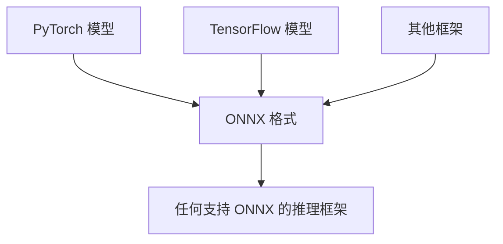
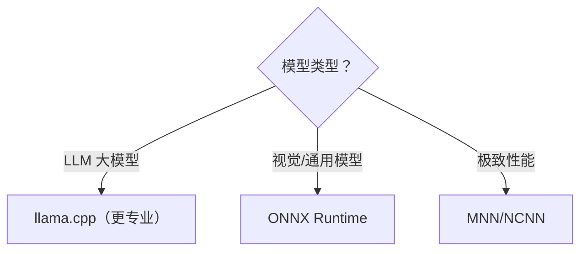

# ONNX Runtime Mobile 实战

> 系列：AAOS-Guide · 31-onnx
> 难度：⭐⭐⭐⭐ 深入
> 更新：2026-08-27
> 前置知识：《端侧推理框架对比》

---

## 一、ONNX 是什么

**ONNX（Open Neural Network Exchange）**：开放的模型交换格式，解决「模型在不同框架之间不通用」的问题。



**核心价值**：训练用 PyTorch，导出 ONNX，端侧用 ONNX Runtime 跑，互不锁定。

## 二、ONNX Runtime 家族

| 版本 | 场景 |
|------|------|
| ONNX Runtime（桌面/服务器） | 云端、PC |
| ONNX Runtime Mobile | 移动端 |
| ONNX Runtime Web | 浏览器 |

## 三、集成 ONNX Runtime Mobile

```groovy
// build.gradle
dependencies {
    implementation 'com.microsoft.onnxruntime:onnxruntime-android:1.17.0'
}
```

## 四、加载并运行模型

```kotlin
import ai.onnxruntime.*

// 加载模型
val ortEnv = OrtEnvironment.getEnvironment()
val session = ortEnv.createSession("/data/local/tmp/model.onnx")

// 准备输入
val inputName = session.inputNames.first()
val input = OnnxTensor.createTensor(ortEnv, floatArrayOf(1f, 2f, 3f), longArrayOf(1, 3))

// 推理
val results = session.run(mapOf(inputName to input))

// 获取输出
val output = results.use {
    val tensor = it.first().value as OnnxTensor
    tensor.floatBuffer
}
```

## 五、模型转换：从 PyTorch 到 ONNX

```python
import torch

# 训练好的 PyTorch 模型
model = MyModel()
model.load_state_dict(torch.load("model.pth"))

# 导出 ONNX
dummy_input = torch.randn(1, 3, 224, 224)
torch.onnx.export(
    model, dummy_input, "model.onnx",
    input_names=["input"], output_names=["output"]
)
```

## 六、ONNX 的量化

ONNX 模型也可以量化以减小体积：

```python
from onnxruntime.quantization import quantize_dynamic

quantize_dynamic(
    "model.onnx",
    "model_quantized.onnx",
    weight_type=QuantType.QInt8
)
```

## 七、ONNX Runtime 的优势

| 优势 | 说明 |
|------|------|
| 跨框架 | 一次导出，到处运行 |
| 跨平台 | 手机/PC/服务器/Web |
| 性能 | 优化好，支持硬件加速 |
| 生态 | 微软维护，社区活跃 |

## 八、使用场景



## 九、总结

| 要点 | 结论 |
|------|------|
| ONNX | 开放模型格式 |
| ONNX Runtime | 跨平台推理引擎 |
| 转换 | torch.onnx.export |
| 优势 | 跨框架、跨平台 |

---

**下一篇预告**：《Embedding 与向量化》

> 配套仓库：[AAOS-Guide](https://github.com/jason5200/AAOS-Guide)
