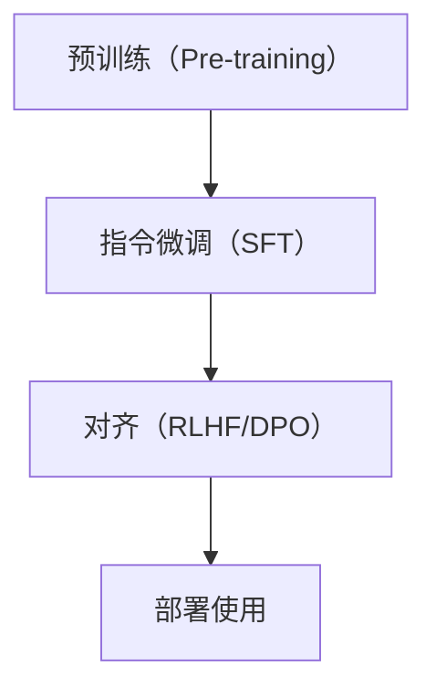
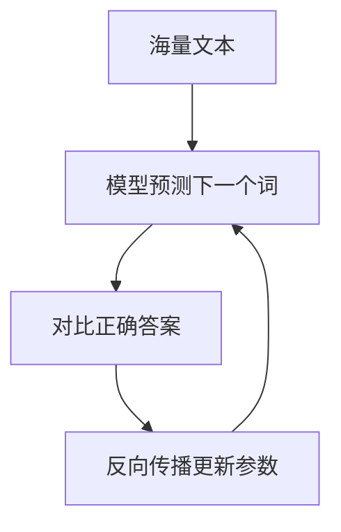
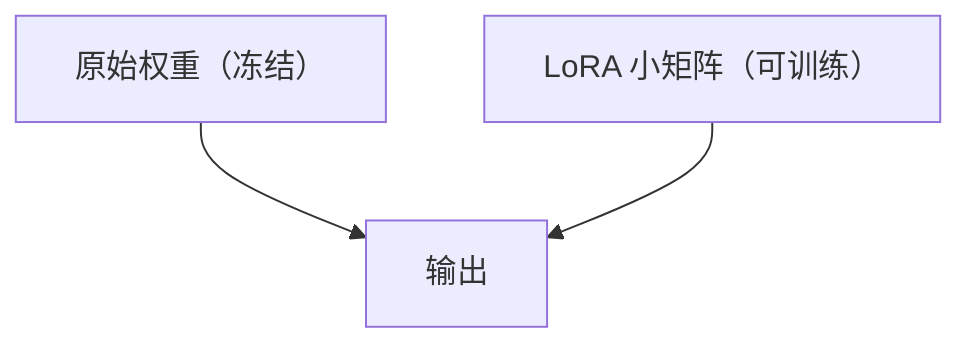
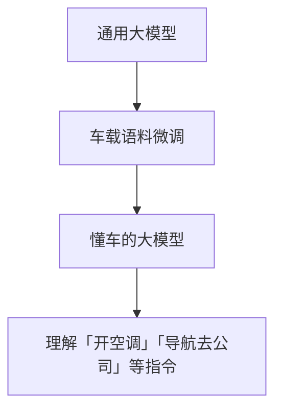

# 大模型训练：从预训练到微调

> 系列：AAOS-Guide · 26-training
> 难度：⭐⭐⭐⭐ 深入
> 更新：2026-08-27
> 前置知识：《Transformer 原理》

---

## 一、大模型的训练阶段

大模型不是「一步训练到位」的，而是分阶段：



## 二、预训练：学习语言本身

预训练是「烧钱」的阶段，在海量无标注文本上学习：

| 任务 | 说明 |
|------|------|
| 预测下一个词 | 让模型学会语言规律 |
| 海量数据 | 网页、书籍、代码 |
| 巨量算力 | 数千张 GPU |



**结果**：模型学会了语法、知识、推理能力。

## 三、指令微调（SFT）：学会听指令

预训练后的模型「会说话但不会办事」，指令微调让它「听懂指令」：


**数据示例**：
```
指令：把「你好」翻译成英文
回答：Hello
```

## 四、对齐（Alignment）：学会安全有用

即使会听指令，模型仍可能「胡说八道」或有偏见。对齐让它「安全、有用、诚实」。

| 方法 | 说明 |
|------|------|
| RLHF | 人类反馈强化学习 |
| DPO | 直接偏好优化（更简单） |

**核心理解**：对齐让模型的回答符合人类价值观。

## 五、微调 vs 继续预训练

| 方式 | 说明 | 数据量 |
|------|------|--------|
| 全量微调 | 更新所有参数 | 大 |
| LoRA | 只训练小矩阵 | 小 |
| 继续预训练 | 领域数据继续训练 | 大 |

## 六、LoRA：低成本的微调

LoRA 是当前最流行的微调方法，**不更新原模型参数**，只训练一个「旁路小矩阵」：



**优势**：
- 参数量小（通常 < 1%）
- 显存占用低
- 可插拔（换任务换 LoRA）

## 七、车载场景的微调

车载大模型针对车载语料微调：



## 八、总结

| 要点 | 结论 |
|------|------|
| 训练三阶段 | 预训练→SFT→对齐 |
| 预训练 | 学语言，烧钱 |
| SFT | 学听指令 |
| 对齐 | 学安全有用 |
| LoRA | 低成本微调 |

---

**下一篇预告**：《模型量化：INT8/INT4 原理与实战》

> 配套仓库：[AAOS-Guide](https://github.com/jason5200/AAOS-Guide)
