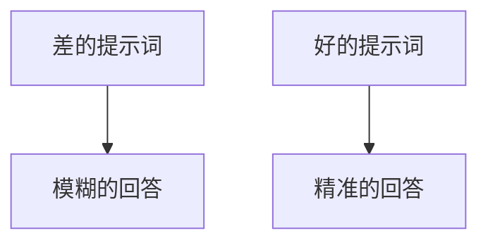

# 提示词工程：Prompt 设计

> 系列：AAOS-Guide · 46-prompt
> 难度：⭐⭐⭐ 进阶
> 更新：2026-08-27
> 前置知识：《Transformer 原理》

---

## 一、提示词工程是什么

大模型的能力，很大程度取决于「你怎么问」。**提示词工程（Prompt Engineering）**就是设计高质量提示词的技术。



## 二、核心技巧

### 1. 角色设定

给模型一个角色，让它进入状态：

```
你是资深车载工程师，请用通俗语言解释 CarService。
```

### 2. 明确要求

说清楚要什么格式、多少字、什么风格：

```
用 200 字以内的中文，分点列出 CarService 的 3 个核心子服务。
```

### 3. 提供上下文

给模型必要的背景信息：

```
背景：用户开的是新能源汽车，正在高速上。
问题：如何优化空调以延长续航？
```

### 4. 分步引导

复杂任务拆解成步骤：

```
请分三步回答：
1. 先分析问题
2. 再给出方案
3. 最后总结要点
```

## 三、Few-shot（少样本提示）

给模型几个示例，让它模仿：

```
把英文翻译成中文：
输入：Hello → 输出：你好
输入：Goodbye → 输出：再见
输入：Thank you → 输出：？
```

## 四、思维链提示（CoT）

引导模型逐步推理：

```
问题：一个苹果 2 元，3 个苹果多少钱？
请一步步思考：
1. 单价是 2 元
2. 数量是 3 个
3. 总价 = 2 × 3 = 6 元
```

## 五、车载场景的提示词设计

### 导航指令理解

```
你是车载导航助手。用户说「回家」，请提取：
- 目的地：用户的"家"（从常用地点获取）
- 意图：开始导航
- 输出 JSON：{"destination": "家", "action": "navigate"}
```

### 车控指令理解

```
你是车载控制助手。识别用户的控制指令：
用户：「把空调调到 24 度」
输出 JSON：{"device": "hvac", "param": "temperature", "value": 24}
```

## 六、提示词的常见问题

| 问题 | 解决 |
|------|------|
| 回答太笼统 | 明确要求细节 |
| 格式不对 | 指定输出格式 |
| 答非所问 | 提供上下文 |
| 胡说八道 | 约束「不知道就说不知道」 |

## 七、提示词的工程化管理

提示词要像代码一样管理：

```python
# 提示词模板化管理
NAV_PROMPT = """你是车载导航助手。
用户输入：{user_input}
请提取目的地和意图，输出 JSON。
"""

def build_prompt(user_input):
    return NAV_PROMPT.format(user_input=user_input)
```

## 八、总结

| 要点 | 结论 |
|------|------|
| 提示词工程 | 设计高质量提示词 |
| 核心技巧 | 角色/要求/上下文/分步 |
| Few-shot | 给示例模仿 |
| CoT | 引导逐步推理 |

---

**下一篇预告**：《大模型安全：对齐与防护》

> 配套仓库：[AAOS-Guide](https://github.com/jason5200/AAOS-Guide)
