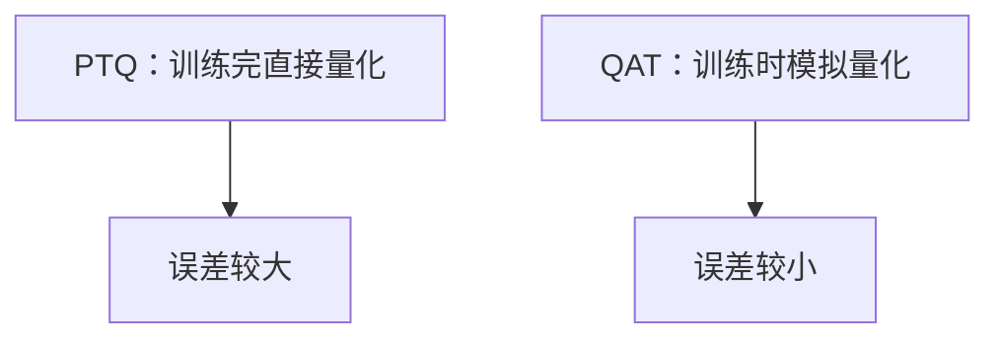
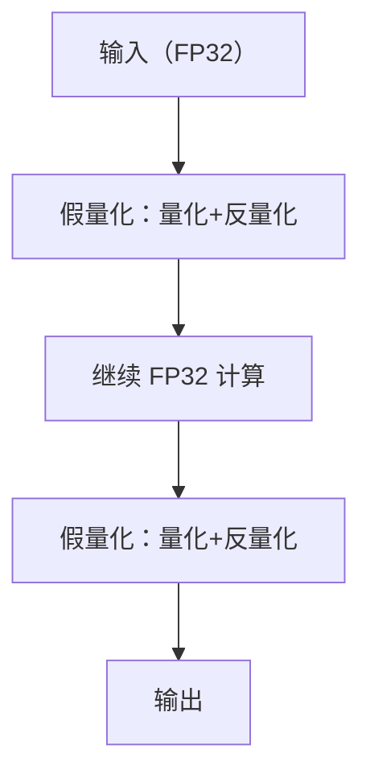
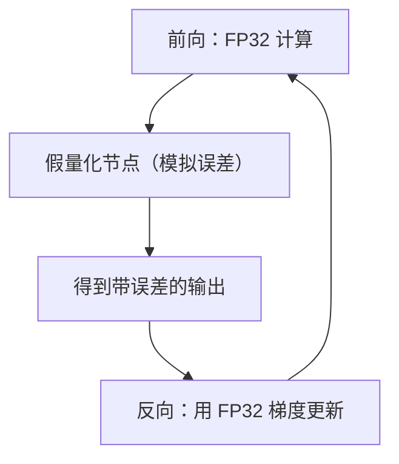
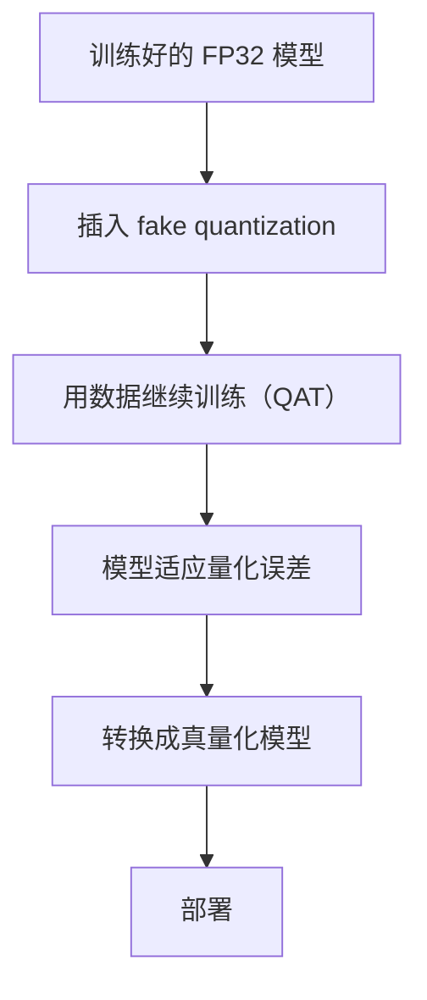

# 量化感知训练 QAT 的完整流程

> 系列：AAOS-Guide · 27-quantization
> 难度：⭐⭐⭐⭐⭐ 深入
> 更新：2026-08-27
> 前置知识：《模型量化》《模型量化误差的完整分析》

---

## 一、本文目标

前面讲了 PTQ（训练后量化）和它的误差，这一篇深入 **QAT（量化感知训练）**——训练时就「模拟」量化，让模型适应量化误差，从而比 PTQ 精度更高。

## 二、QAT vs PTQ



| 方式 | 流程 | 精度 |
|------|------|------|
| PTQ | 训练 → 量化 | 较低 |
| QAT | 训练（含量化模拟）→ 量化 | 较高 |

## 三、QAT 的核心思想

QAT 在训练时，给模型插入「假量化（Fake Quantization）」节点：



**关键理解**：前向计算时模拟量化误差，但反向传播用 FP32 梯度，让模型「学会容忍」量化误差。

## 四、Fake Quantization 的实现

```python
def fake_quantize(x, scale, zero_point):
    """模拟量化+反量化，产生和真量化一样的误差"""
    # 1. 量化
    q = torch.round(x / scale) + zero_point
    # 2. 反量化（产生误差）
    x_hat = (q - zero_point) * scale
    return x_hat
```

## 五、用 PyTorch 实现 QAT

```python
import torch.quantization as quant

# 1. 定义模型
model = MyModel()

# 2. 插入 fake quantization 节点
model.qconfig = quant.get_default_qat_qconfig('fbgemm')
model = quant.prepare_qat(model, inplace=True)

# 3. 用 QAT 训练（模型会模拟量化）
for epoch in range(epochs):
    train(model, train_loader)

# 4. 转换成真正的量化模型
model = quant.convert(model, inplace=True)
```

## 六、QAT 训练时发生了什么



**关键理解**：前向有量化误差，反向是 FP32 精确梯度，模型在「有误差的环境」里学习，自然适应了误差。

## 七、QAT 的精度提升

| 位宽 | PTQ 精度损失 | QAT 精度损失 |
|------|--------------|--------------|
| INT8 | 1-3% | <1% |
| INT4 | 5-10% | 2-4% |

**关键理解**：位宽越低，QAT 相对 PTQ 的优势越明显。INT4 量化强烈建议用 QAT。

## 八、QAT 的代价

| 代价 | 说明 |
|------|------|
| 需要训练 | 要有训练数据和算力 |
| 时间更长 | 训练要重新做 |
| 复杂度高 | 要处理量化节点 |

## 九、QAT 的完整流程



## 十、总结

| 要点 | 结论 |
|------|------|
| QAT | 训练时模拟量化 |
| fake quant | 量化+反量化 |
| 优势 | 比 PTQ 精度高 |
| 代价 | 需训练数据和算力 |

---

**下一篇预告**：《CarPropertyService 属性读写源码》

> 配套仓库：[AAOS-Guide](https://github.com/jason5200/AAOS-Guide)
