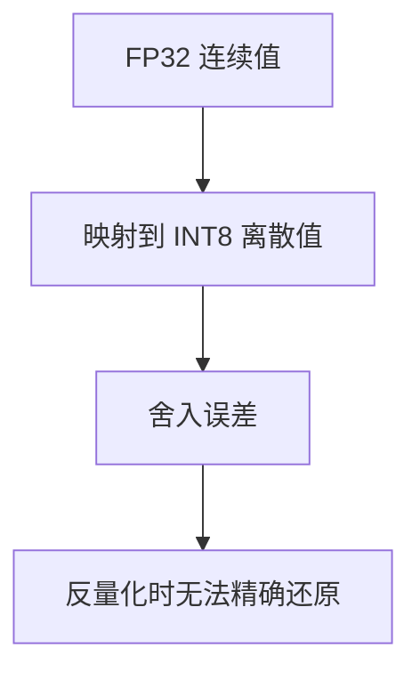
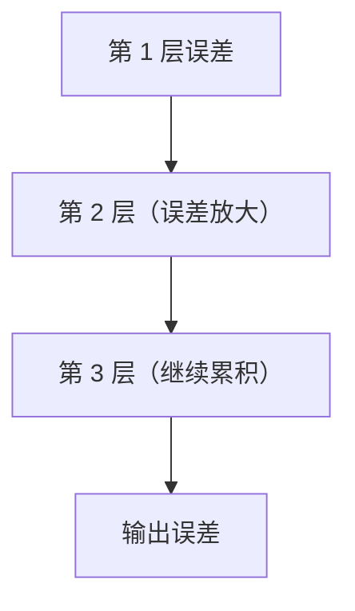
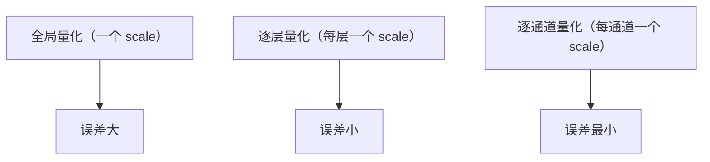

# 模型量化误差的完整分析

> 系列：AAOS-Guide · 27-quantization
> 难度：⭐⭐⭐⭐⭐ 深入
> 更新：2026-08-27
> 前置知识：《模型量化：INT8/INT4 原理与实战》

---

## 一、本文目标

上一篇《模型量化》讲了量化的「怎么做」，这一篇深入分析**量化带来的误差**：误差从哪来、有多大、怎么减小。

## 二、量化误差的来源

量化把 FP32 连续值映射到 INT8 离散值，这个「舍入」就产生了误差：



## 三、量化误差的数学表示

量化和反量化过程：

```
量化：q = round(x / scale) + zero_point
反量化：x' = (q - zero_point) × scale
误差：Δ = x - x'
```

其中误差 Δ 的最大值约为 `scale / 2`（半个量化步长）。

## 四、scale 的确定

scale 由「数值范围」决定：

```
scale = (max - min) / (2^bits - 1)
```

例如 INT8（bits=8，范围 255）：

```
数值范围 [-1, 1]：scale = 2 / 255 ≈ 0.0078
误差上限 ≈ scale/2 ≈ 0.0039
```

**关键理解**：数值范围越大，scale 越大，量化误差也越大。所以「范围小」的量化更精确。

## 五、不同位宽的误差对比

| 位宽 | 量化级数 | scale（范围[-1,1]） | 最大误差 |
|------|----------|---------------------|----------|
| FP32 | 约 2^23 | - | 极小 |
| INT8 | 255 | 0.0078 | 0.0039 |
| INT4 | 15 | 0.133 | 0.067 |
| INT2 | 3 | 0.667 | 0.333 |

**关键理解**：位宽越低，误差越大。INT4 的误差约是 INT8 的 17 倍。

## 六、量化误差的传播

单层的量化误差会在多层网络中**累积**：



**关键理解**：深层网络的量化误差会累积，这就是为什么「逐层量化」比「全局量化」精度高——逐层能更好地控制每层的误差。

## 七、减小量化误差的方法

### 1. 逐层/逐通道量化



### 2. 量化感知训练（QAT）

训练时就模拟量化，让模型「适应」量化误差：

```python
# QAT：训练时用 fake quantization
model = prepare_qat(model)
model.train(...)  # 模型学会容忍量化误差
```

### 3. 混合精度

关键层用高精度，非关键层用低精度：

```
注意力层 → INT8（关键，精度要求高）
FFN 层 → INT4（非关键，可容忍误差）
```

## 八、量化误差的实测评估

量化后要评估精度损失：

| 评估项 | 方法 |
|--------|------|
| 困惑度 | 量化前后对比 |
| 任务准确率 | 量化前后对比 |
| 关键输出 | 抽样人工检查 |

## 九、总结

| 要点 | 结论 |
|------|------|
| 误差来源 | 舍入 |
| 误差大小 | ≈ scale/2 |
| 位宽影响 | 越低误差越大 |
| 减小方法 | 逐通道、QAT、混合精度 |

---

**下一篇预告**：《View 事件分发的完整源码》

> 配套仓库：[AAOS-Guide](https://github.com/jason5200/AAOS-Guide)
