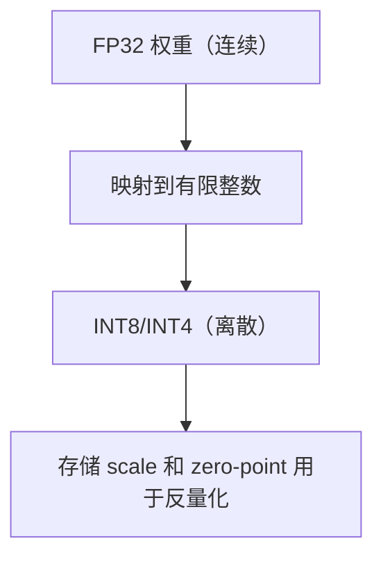
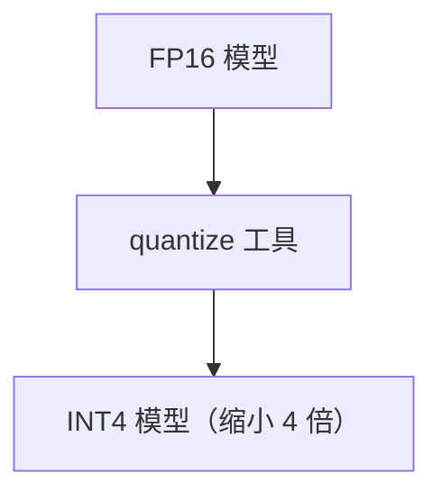
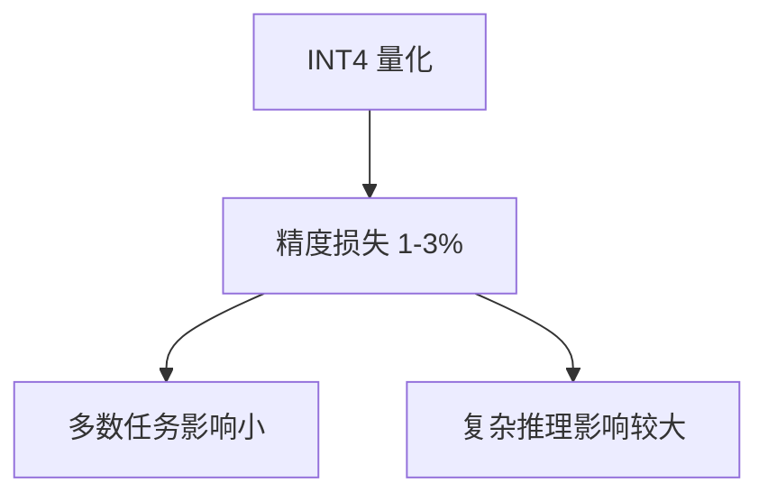

# 模型量化：INT8 / INT4 原理与实战

> 系列：AAOS-Guide · 27-quantization
> 难度：⭐⭐⭐⭐ 深入
> 更新：2026-08-27
> 前置知识：《大模型上车：端侧推理》

---

## 一、为什么需要量化

大模型太大，端侧跑不动：

| 精度 | 7B 模型大小 |
|------|-------------|
| FP32 | 约 28GB |
| FP16 | 约 14GB |
| INT8 | 约 7GB |
| INT4 | 约 3.5GB |

**量化**：把高精度（FP32）权重降到低精度（INT8/INT4），大幅缩小模型，代价是轻微精度损失。

## 二、量化的原理

量化本质是「把连续值映射到离散值」：



**核心公式**：
```
量化值 = round(原始值 / scale) + zero_point
原始值 ≈ (量化值 - zero_point) × scale
```

## 三、量化的两种方式

| 方式 | 说明 | 精度损失 |
|------|------|----------|
| 训练后量化（PTQ） | 训练完后直接量化 | 较大 |
| 量化感知训练（QAT） | 训练时模拟量化 | 较小 |

**端侧部署常用 PTQ**（简单快速），对精度要求高用 QAT。

## 四、对称 vs 非对称量化

| 类型 | scale | zero-point |
|------|-------|-----------|
| 对称 | 有 | 0 |
| 非对称 | 有 | 非 0 |

**对称量化**更简单，常用于 INT8；**非对称**精度更好。

## 五、实战：用 llama.cpp 量化

llama.cpp 是最流行的量化工具：

```bash
# 把 FP16 模型量化成 INT4
./quantize model-fp16.bin model-q4.bin q4_0

# 常用量化类型
q4_0   # 4-bit 基础
q4_K_M # 4-bit 混合（推荐）
q8_0   # 8-bit
```



## 六、量化类型的选择

| 类型 | 大小 | 质量 | 适用 |
|------|------|------|------|
| q8_0 | 大 | 好 | 内存充足 |
| q4_K_M | 中 | 较好 | 推荐 |
| q2_K | 小 | 差 | 极致省内存 |

## 七、量化的精度损失

量化会损失精度，但通常可接受：



**关键理解**：量化是「用少量精度换大量体积」的权衡。

## 八、端侧量化实践清单

- [ ] 选好量化类型（q4_K_M 是平衡点）
- [ ] 量化后测试关键任务精度
- [ ] 确认端侧框架支持该格式
- [ ] 记录量化前后的体积和效果对比

## 九、总结

| 要点 | 结论 |
|------|------|
| 量化目的 | 缩小模型，端侧可跑 |
| 原理 | 高精度→低精度映射 |
| 方式 | PTQ / QAT |
| 工具 | llama.cpp quantize |
| 权衡 | 体积 vs 精度 |

---

**下一篇预告**：《模型蒸馏与剪枝》

> 配套仓库：[AAOS-Guide](https://github.com/jason5200/AAOS-Guide)
