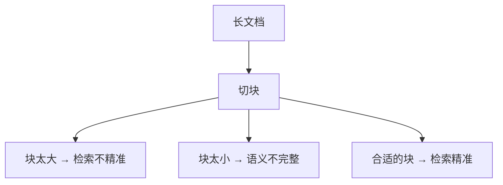

# RAG 的分块策略

> 系列：AAOS-Guide · 36-rag-chunking
> 难度：⭐⭐⭐⭐ 深入
> 更新：2026-08-27
> 前置知识：《车载 RAG 实战》

---

## 一、分块为什么重要

RAG 的第一步是把长文档切成小块（chunk），分块质量直接影响检索效果：



**核心矛盾**：块太大，包含太多无关内容；块太小，割裂语义。

## 二、常见的分块策略

| 策略 | 说明 |
|------|------|
| 固定大小 | 按字符数/词数切 |
| 按段落 | 按自然段落切 |
| 按语义 | 用模型判断语义边界 |
| 递归分块 | 先大后小，按分隔符递归 |

## 三、固定大小分块

最简单，但容易割裂语义：

```python
def fixed_chunk(text, chunk_size=500):
    chunks = []
    for i in range(0, len(text), chunk_size):
        chunks.append(text[i:i+chunk_size])
    return chunks
```

**缺点**：可能把一句话切到两个块里。

## 四、重叠分块（Overlapping）

固定大小分块时，让相邻块有重叠，避免割裂：


```python
def overlap_chunk(text, chunk_size=500, overlap=50):
    chunks = []
    for i in range(0, len(text), chunk_size - overlap):
        chunks.append(text[i:i+chunk_size])
    return chunks
```

## 五、按段落分块

按自然段落切，保持语义完整：

```python
def paragraph_chunk(text):
    return text.split("\n\n")  # 按空行切
```

**优点**：语义完整；**缺点**：段落长度不均。

## 六、递归分块（推荐）

先按大分隔符（章节）切，不够再按小分隔符（段落、句子）切：

```python
def recursive_chunk(text, separators=["\n\n", "\n", "。", " "], chunk_size=500):
    # 优先用大分隔符
    for sep in separators:
        parts = text.split(sep)
        if len(parts) > 1:
            # 递归处理每个部分
            chunks = []
            for part in parts:
                chunks.extend(recursive_chunk(part, separators[1:], chunk_size))
            return chunks
    return [text]
```

**核心理解**：递归分块兼顾「语义完整」和「大小合适」，是当前最常用的方案。

## 七、车载场景的分块建议

车载说明书、手册的分块：

| 内容 | 建议策略 |
|------|----------|
| 用户手册 | 按小节（功能点）分块 |
| FAQ | 每个问答一对 |
| 故障排查 | 按「症状→原因→解决」分块 |

## 八、分块的调优要点

| 要点 | 说明 |
|------|------|
| 块大小 | 500-1000 字符是常见范围 |
| 重叠 | 10%-20% 重叠 |
| 语义完整 | 尽量按语义边界切 |
| 元数据 | 保留标题、章节信息 |

## 九、总结

| 要点 | 结论 |
|------|------|
| 分块矛盾 | 太大不精准，太小割语义 |
| 常见策略 | 固定/段落/重叠/递归 |
| 推荐 | 递归分块 |
| 调优 | 大小、重叠、语义边界 |

---

**下一篇预告**：《Agent 的规划：ReAct 与思维链》

> 配套仓库：[AAOS-Guide](https://github.com/jason5200/AAOS-Guide)
