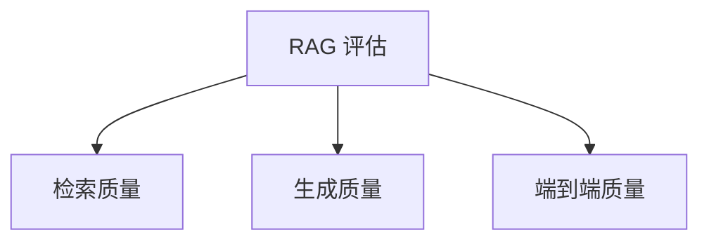
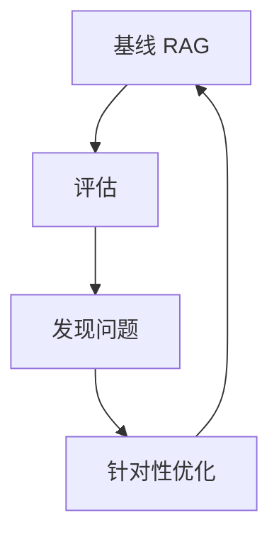

# RAG 的评估与优化

> 系列：AAOS-Guide · 35-rag-eval
> 难度：⭐⭐⭐⭐ 深入
> 更新：2026-08-27
> 前置知识：《RAG 进阶：混合检索与重排序》

---

## 一、为什么 RAG 需要评估

RAG 系统上线前，必须回答一个问题：**它到底答得准不准？**

不评估就上线，可能出现：
- 检索错文档 → 答非所问
- 幻觉 → 一本正经胡说
- 检索不全 → 漏掉关键信息

## 二、RAG 评估的三个维度

RAG 是「检索 + 生成」两段，评估也要分开：



| 维度 | 问题 |
|------|------|
| 检索质量 | 找对文档了吗？ |
| 生成质量 | 答案对吗？ |
| 端到端 | 整体回答好吗？ |

## 三、检索质量指标

| 指标 | 含义 |
|------|------|
| Recall@k | top-k 结果中命中相关文档的比例 |
| Precision@k | top-k 结果中相关文档的比例 |
| MRR | 第一个相关文档的排名倒数 |

```python
def recall_at_k(retrieved, relevant, k=5):
    retrieved_k = retrieved[:k]
    hits = len(set(retrieved_k) & set(relevant))
    return hits / len(relevant)
```

## 四、生成质量指标

| 指标 | 含义 |
|------|------|
| 忠实度（Faithfulness） | 答案是否基于检索内容 |
| 相关性（Relevance） | 答案是否切题 |
| 正确性 | 答案是否正确 |

**忠实度是 RAG 特有的**：答案必须来自检索到的文档，不能凭空编造。

## 五、端到端评估框架

常用评估框架：

| 框架 | 说明 |
|------|------|
| RAGAS | 专门的 RAG 评估 |
| TruLens | 可观测 + 评估 |
| 人工评估 | 最可靠但慢 |

```python
from ragas import evaluate
from ragas.metrics import faithfulness, answer_relevancy

result = evaluate(
    dataset,
    metrics=[faithfulness, answer_relevancy]
)
```

## 六、RAG 的常见问题与优化

| 问题 | 优化 |
|------|------|
| 检索不准 | 调 Embedding、混合检索、重排序 |
| 幻觉 | 提示词约束、忠实度检查 |
| 检索不全 | 调 top-k、优化分块 |
| 上下文过长 | 控制检索块数、摘要压缩 |

## 七、迭代优化流程



**关键理解**：RAG 优化是「评估 → 发现问题 → 优化 → 再评估」的循环。

## 八、车载 RAG 的评估要点

车载场景的评估还要考虑：

| 要点 | 说明 |
|------|------|
| 领域准确 | 车载术语要准 |
| 安全 | 不能给出危险建议 |
| 时效 | 回答要快 |
| 离线 | 无网络也要能用 |

## 九、总结

| 要点 | 结论 |
|------|------|
| 三维评估 | 检索/生成/端到端 |
| 检索指标 | Recall/Precision/MRR |
| 生成指标 | 忠实度/相关性 |
| 优化循环 | 评估→优化→再评估 |

---

**下一篇预告**：《RAG 的分块策略》

> 配套仓库：[AAOS-Guide](https://github.com/jason5200/AAOS-Guide)
