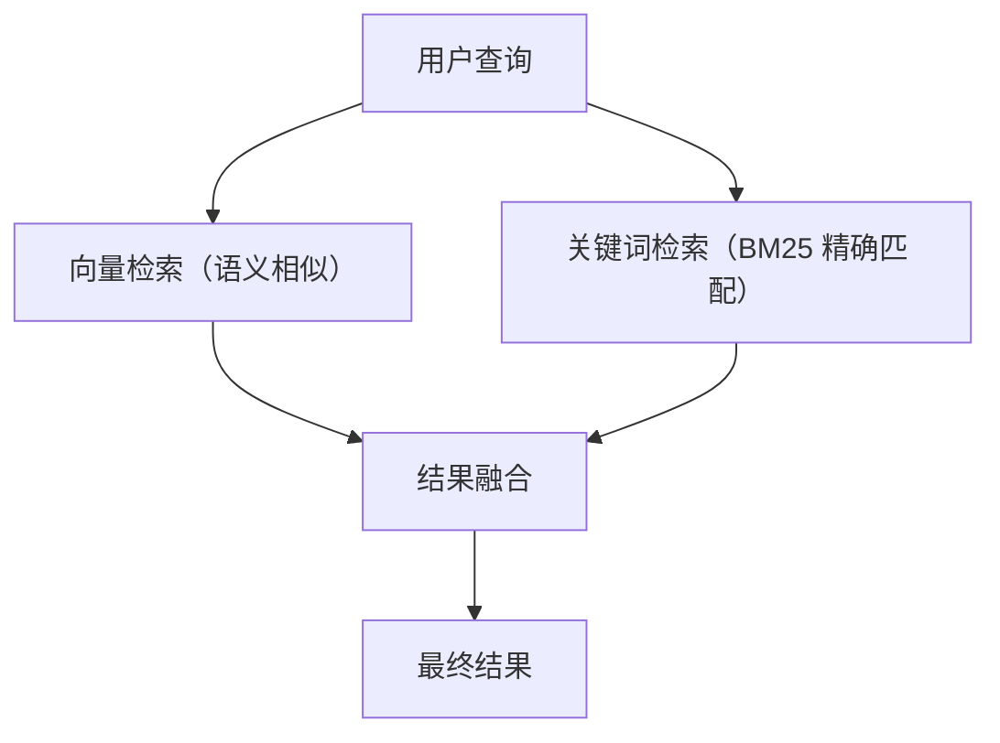
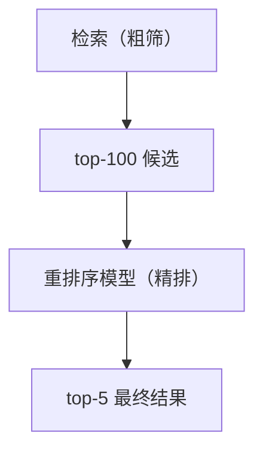
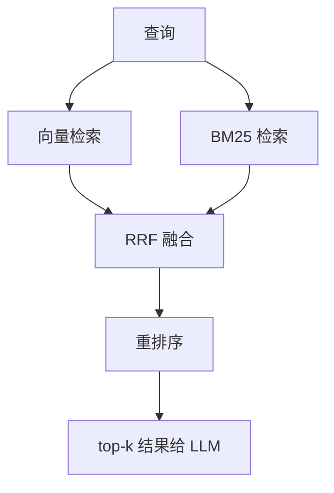

# RAG 进阶：混合检索与重排序

> 系列：AAOS-Guide · 34-rag-advanced
> 难度：⭐⭐⭐⭐⭐ 深入
> 更新：2026-08-27
> 前置知识：《车载 RAG 实战》《向量数据库选型》

---

## 一、纯向量检索的不足

基础 RAG 只用「向量相似度」检索，但向量检索有盲区：

| 盲区 | 例子 |
|------|------|
| 精确匹配差 | 搜「AAOS」和「Android Automotive OS」向量可能不够近 |
| 专有名词 | 车型代号、错误码 |
| 短查询 | 「ACC」这类缩写 |

**解决方案**：混合检索（Hybrid Search）。

## 二、混合检索：向量 + 关键词

混合检索同时用两种检索，取长补短：



| 检索方式 | 擅长 | 不足 |
|----------|------|------|
| 向量检索 | 语义相似 | 精确匹配差 |
| BM25 关键词 | 精确匹配 | 不懂语义 |

## 三、BM25 关键词检索

BM25 是经典的关键词检索算法：

```python
from rank_bm25 import BM25Okapi

# 文档集合
docs = ["自适应巡航怎么设置", "空调温度调节方法", ...]

# 分词后的文档
tokenized_docs = [doc.split() for doc in docs]
bm25 = BM25Okapi(tokenized_docs)

# 检索
query = "ACC 设置"
scores = bm25.get_scores(query.split())
```

## 四、结果融合（RRF）

两种检索的结果要融合，常用 **RRF（Reciprocal Rank Fusion）**：

```
RRF得分 = Σ 1/(k + rank)
```

```python
def rrf(vector_rank, keyword_rank, k=60):
    return 1/(k + vector_rank) + 1/(k + keyword_rank)
```

**核心理解**：RRF 不关心具体分数，只关心排名，简单有效。

## 五、重排序（Rerank）

检索出的候选结果，再用**更精细的模型重新排序**：



| 模型 | 说明 |
|------|------|
| bge-reranker | 中文重排序 |
| cross-encoder | 精细判断相关性 |

## 六、完整的 RAG 检索流程



## 七、端侧实现的考虑

车载端侧做混合检索：

| 组件 | 端侧方案 |
|------|----------|
| 向量检索 | SQLite 向量扩展 |
| BM25 | 轻量实现 |
| 重排序 | 小模型（量化） |

## 八、总结

| 要点 | 结论 |
|------|------|
| 混合检索 | 向量 + 关键词 |
| BM25 | 关键词精确匹配 |
| RRF | 结果融合 |
| 重排序 | 精细二次排序 |

---

**下一篇预告**：《RAG 的评估与优化》

> 配套仓库：[AAOS-Guide](https://github.com/jason5200/AAOS-Guide)
