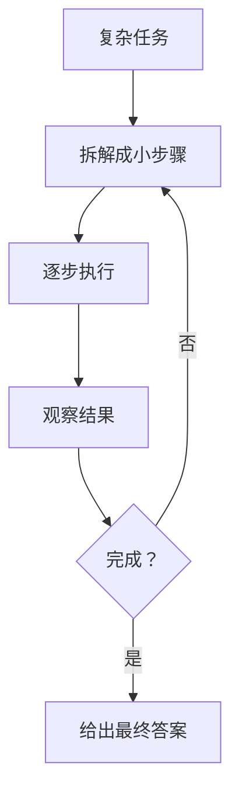
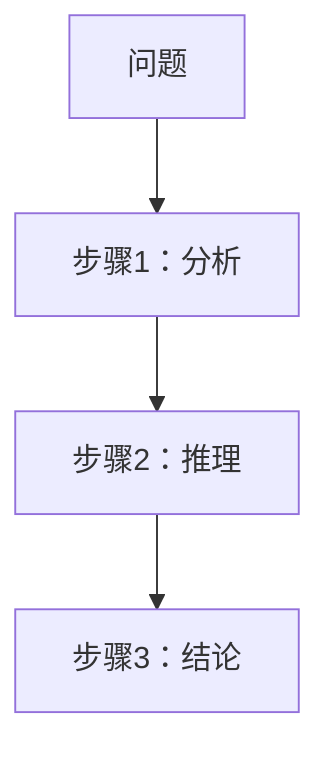
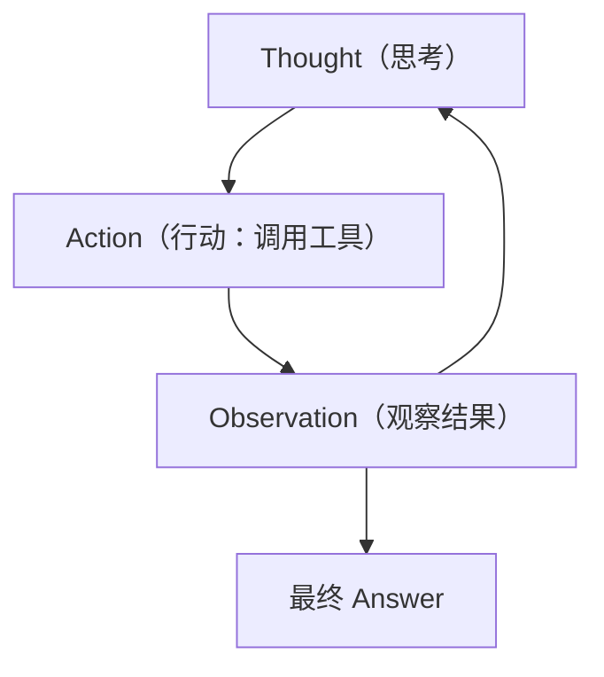
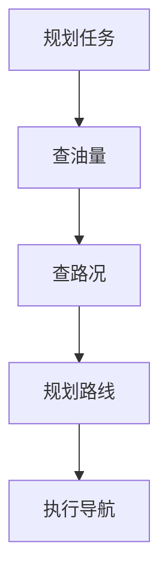

# Agent 的规划：ReAct 与思维链

> 系列：AAOS-Guide · 37-agent-react
> 难度：⭐⭐⭐⭐ 深入
> 更新：2026-08-27
> 前置知识：《Agent 框架：Function Calling 实战》

---

## 一、Agent 的「思考」能力

普通大模型是「一步回答」，但复杂任务需要「多步推理」。Agent 的核心就是让模型学会**规划**：



## 二、思维链（CoT）

**思维链（Chain-of-Thought）**：让模型「把思考过程写出来」，逐步推理。



**关键理解**：让模型「先想后答」，而不是直接猜答案，推理更准。

## 三、ReAct：推理 + 行动

**ReAct（Reasoning + Acting）**：让模型交替进行「推理」和「行动」，这是 Agent 的核心模式。



### ReAct 的循环示例

```
任务：明天上海天气怎么样，适合出游吗？

Thought 1: 我需要查明天的天气
Action 1: 调用 get_weather(上海, 明天)
Observation 1: 明天上海晴，25 度

Thought 2: 晴天 25 度，适合出游
Answer: 明天上海晴朗 25 度，很适合出游
```

## 四、ReAct 的实现

```python
def react_loop(question, tools, llm, max_steps=5):
    prompt = f"问题：{question}\n可用工具：{tools}\n请逐步思考并行动"
    
    for step in range(max_steps):
        response = llm(prompt)
        
        if "Answer:" in response:
            return response.split("Answer:")[1]
        
        # 解析 Action，执行工具
        action = parse_action(response)
        observation = execute_tool(action)
        prompt += f"\n观察结果：{observation}"
    
    return "未能完成任务"
```

## 五、ReAct 与 Function Calling 的关系

| 方式 | 说明 |
|------|------|
| ReAct | 用提示词引导「思考+行动」 |
| Function Calling | 模型直接输出函数调用 |

**关系**：Function Calling 是 ReAct 的工程化实现，更结构化、更可靠。

## 六、规划能力的几种模式

| 模式 | 说明 |
|------|------|
| CoT | 逐步推理 |
| ReAct | 推理+行动 |
| ToT（思维树） | 多分支探索 |
| Plan-and-Execute | 先规划后执行 |

## 七、车载场景的规划示例

用户：「下班回家，顺便加个油，避开拥堵」



## 八、总结

| 要点 | 结论 |
|------|------|
| 规划能力 | Agent 多步推理 |
| CoT | 逐步思考 |
| ReAct | 推理+行动循环 |
| 工程实现 | Function Calling |

---

**下一篇预告**：《多 Agent 协作》

> 配套仓库：[AAOS-Guide](https://github.com/jason5200/AAOS-Guide)
