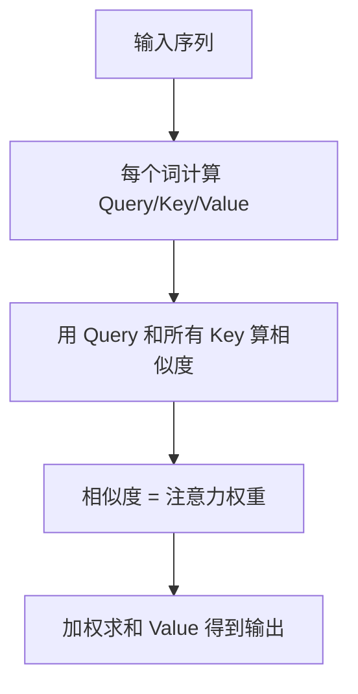
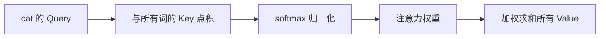
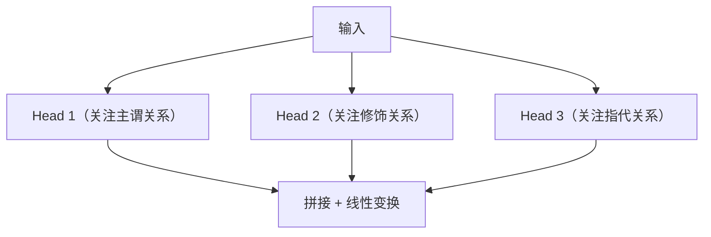
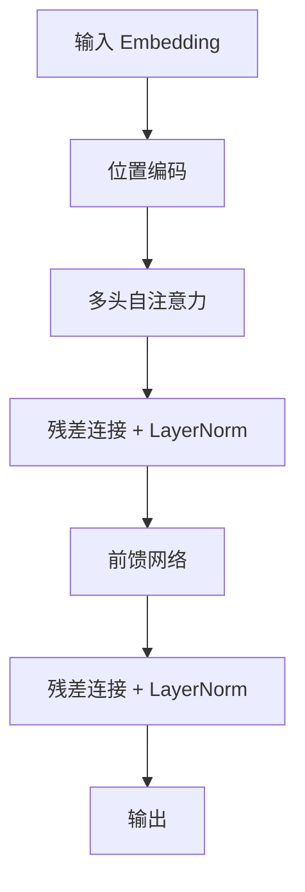
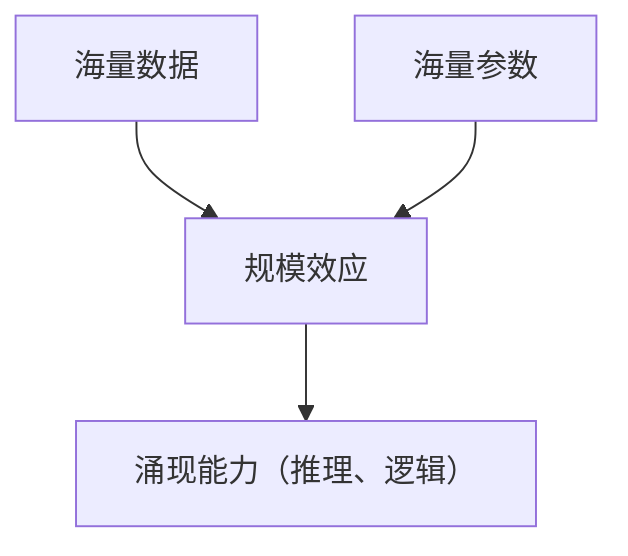

# Transformer 原理：注意力机制

> 系列：AAOS-Guide · 25-transformer
> 难度：⭐⭐⭐⭐ 深入
> 更新：2026-08-27
> 前置知识：对大模型（LLM）的基本认知

---

## 一、为什么需要 Transformer

在大模型之前，处理序列（如文本）主要靠 RNN/LSTM。但它们有个致命问题：**串行处理，无法并行，长序列会遗忘**。

Transformer 在 2017 年提出，核心创新是**注意力机制（Attention）**，彻底解决了这两个问题：

| 问题 | RNN 的困境 | Transformer 的解法 |
|------|-----------|-------------------|
| 并行 | 串行，慢 | 完全并行 |
| 长依赖 | 会遗忘 | 注意力直接建模 |

## 二、注意力机制的核心思想

注意力机制回答一个问题：**处理当前词时，应该「看」哪些词？**

**类比**：查字典时，你的「查询词」（Query）和每个「词条」（Key）对比，找到最相关的，读它的「释义」（Value）。

## 三、Self-Attention 的计算

以句子「The cat sat on the mat」为例：

**关键理解**：每个词都会「关注」句子里的其他词，理解词与词之间的关系。比如「cat」会高度关注「sat」，因为它们是主谓关系。

## 四、多头注意力（Multi-Head Attention）

单个注意力只能捕捉一种关系，多头注意力并行捕捉多种关系：

**核心理解**：多头注意力让模型从多个角度理解词之间的关系。

## 五、Transformer 的整体架构

**关键组件**：
- **位置编码**：让模型知道词的顺序（注意力本身不感知顺序）
- **残差连接**：缓解梯度消失
- **LayerNorm**：稳定训练

## 六、Transformer 的两大分支

| 分支 | 结构 | 代表 |
|------|------|------|
| Encoder | 双向，理解 | BERT |
| Decoder | 单向，生成 | GPT |

大模型（ChatGPT、文心一言）都是 **Decoder 结构**：从左到右逐词生成。

## 七、为什么 Transformer 能「涌现」能力

大模型的智能来自「规模 + 数据」：

**关键理解**：Transformer 架构本身不神奇，神奇的是「足够大」之后涌现出的能力。

## 八、总结

| 要点 | 结论 |
|------|------|
| Transformer 核心 | 注意力机制 |
| 注意力 | Query/Key/Value 加权 |
| 多头 | 多角度理解关系 |
| 大模型 | Decoder 结构 + 规模 |

---

**下一篇预告**：《大模型训练：从预训练到微调》

> 配套仓库：[AAOS-Guide](https://github.com/jason5200/AAOS-Guide)
