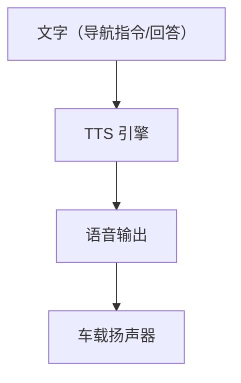
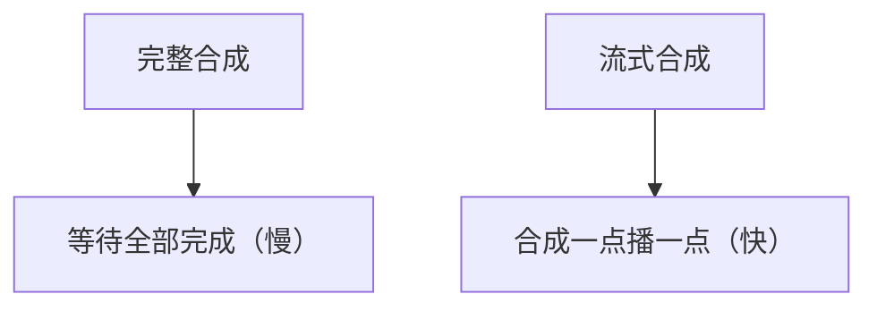

# 语音合成 TTS 端侧化

> 系列：AAOS-Guide · 45-tts
> 难度：⭐⭐⭐⭐ 深入
> 更新：2026-08-27
> 前置知识：《车载语音助手》

---

## 一、TTS 在车载场景的重要性

车载语音交互，TTS（语音合成）是「输出」端。没有 TTS，导航播报、语音助手回答都无从谈起。



## 二、TTS 的两代技术

| 代际 | 技术 | 特点 |
|------|------|------|
| 传统 | 拼接式合成 | 机械、不自然 |
| 现代 | 神经网络 TTS | 自然、接近真人 |

## 三、现代 TTS 模型

| 模型 | 特点 |
|------|------|
| VITS | 端到端，质量高 |
| Tacotron2 + WaveGlow | 经典组合 |
| ChatTTS | 对话式，自然 |
| Piper | 轻量，端侧友好 |

## 四、端侧 TTS 的选择

车载端侧 TTS 要考虑：

| 因素 | 说明 |
|------|------|
| 实时性 | 播报要快（首字节延迟） |
| 音质 | 自然、清晰 |
| 体积 | 模型要小 |
| 离线 | 无网也能用 |

## 五、端侧 TTS 的实现

```kotlin
// 使用 Android TTS
val tts = TextToSpeech(context) { status ->
    if (status == TextToSpeech.SUCCESS) {
        // 初始化成功
    }
}

// 合成并播放
tts.speak("前方 200 米右转", TextToSpeech.QUEUE_FLUSH, null, "nav-1")

// 不用时释放
tts.shutdown()
```

## 六、流式 TTS（降低首字延迟）

车载导航要求播报快，用**流式 TTS**：边合成边播放，不等全部合成完。



**关键理解**：流式 TTS 大幅降低「从指令到出声」的延迟。

## 七、TTS 与音频焦点

TTS 播报要考虑音频焦点（和导航、音乐协调）：

```java
// 播报前请求焦点
AudioFocusRequest request = new AudioFocusRequest.Builder(
    AudioManager.AUDIOFOCUS_GAIN_TRANSIENT_MAY_DUCK)
    .setAudioAttributes(new AudioAttributes.Builder()
        .setUsage(AudioAttributes.USAGE_NAVIGATION_GUIDANCE)
        .build())
    .build();
audioManager.requestAudioFocus(request);
tts.speak(...);
```

## 八、常见坑

| 坑 | 说明 |
|----|------|
| 首字延迟高 | 用流式 TTS |
| 播报被音乐打断 | 音频焦点管理 |
| 多语言混读 | 配置语言 |
| TTS 未释放 | 内存泄漏 |

## 九、总结

| 要点 | 结论 |
|------|------|
| TTS | 语音合成，交互输出端 |
| 现代 TTS | 神经网络，自然 |
| 端侧要点 | 实时、音质、体积、离线 |
| 优化 | 流式合成、音频焦点 |

---

**下一篇预告**：《提示词工程：Prompt 设计》

> 配套仓库：[AAOS-Guide](https://github.com/jason5200/AAOS-Guide)
