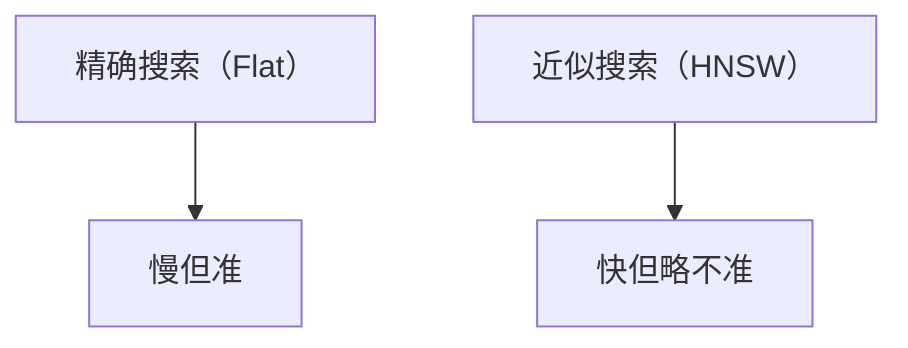

# 向量数据库选型：Milvus / FAISS

> 系列：AAOS-Guide · 33-vectordb
> 难度：⭐⭐⭐⭐ 深入
> 更新：2026-08-27
> 前置知识：《Embedding 与向量化》

---

## 一、为什么需要向量数据库

普通数据库存的是「精确值」（找 name = "张三"），但向量检索要的是「相似值」（找「和这句最像的」）。


## 二、向量数据库的核心能力

| 能力 | 说明 |
|------|------|
| 向量存储 | 存高维向量 |
| 相似检索 | 找最相近的向量 |
| 索引加速 | ANN 近似最近邻 |
| 混合查询 | 向量 + 元数据过滤 |

## 三、主流向量数据库

| 方案 | 类型 | 特点 |
|------|------|------|
| FAISS | 库 | Meta 出品，高性能 |
| Milvus | 数据库 | 分布式，功能全 |
| Chroma | 数据库 | 轻量，易用 |
| Qdrant | 数据库 | Rust 实现，快 |

## 四、FAISS：高性能向量库

FAISS 是 Meta 的向量检索库，不是完整数据库，而是「向量索引引擎」：

```python
import faiss
import numpy as np

# 创建向量索引
d = 512  # 维度
index = faiss.IndexFlatL2(d)  # L2 距离

# 添加向量
vectors = np.random.random((1000, d)).astype('float32')
index.add(vectors)

# 检索最相似的 top-5
query = np.random.random((1, d)).astype('float32')
distances, indices = index.search(query, 5)
```

## 五、Milvus：分布式向量数据库

Milvus 是功能完整的向量数据库：


**特点**：
- 支持海量向量
- 分布式扩展
- 混合查询（向量 + 标量）

## 六、端侧向量库的选择

车载端侧资源有限，选型要考虑：

| 方案 | 端侧适合度 |
|------|-----------|
| SQLite + 向量扩展 | ✅ 轻量，适合 |
| FAISS | ✅ 高性能，库 |
| Milvus Lite | ✅ 单机版 |
| 完整 Milvus | ❌ 太重 |

**端侧推荐**：SQLite + 向量扩展 或 FAISS。

## 七、ANN 索引：加速检索

数据量大时，暴力搜索太慢，用 **ANN（近似最近邻）**索引：

| 索引 | 特点 |
|------|------|
| Flat | 暴力搜索，精确但慢 |
| IVF | 聚类加速，近似 |
| HNSW | 图结构，快且准 |



## 八、选型建议

| 场景 | 推荐 |
|------|------|
| 端侧轻量 | SQLite + 向量 / FAISS |
| 服务器 | Milvus |
| 快速原型 | Chroma |
| 极致性能 | FAISS + HNSW |

## 九、总结

| 要点 | 结论 |
|------|------|
| 向量库 | 相似检索 |
| FAISS | 高性能向量库 |
| Milvus | 分布式向量数据库 |
| 端侧 | SQLite + 向量 / FAISS |

---

**下一篇预告**：《RAG 进阶：混合检索与重排序》

> 配套仓库：[AAOS-Guide](https://github.com/jason5200/AAOS-Guide)
