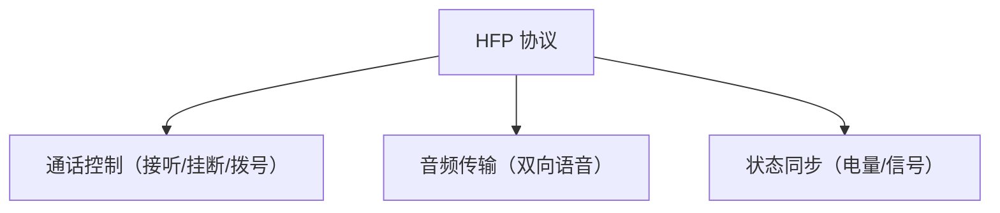
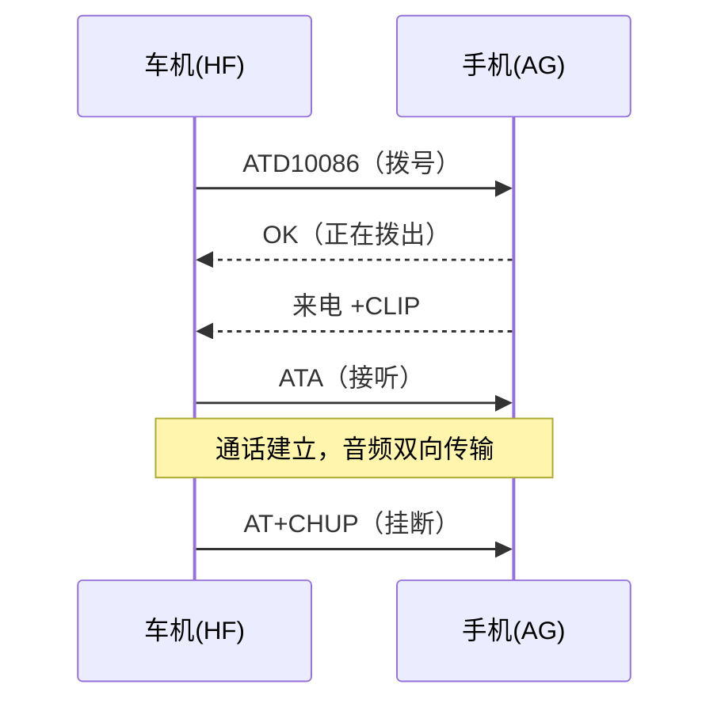
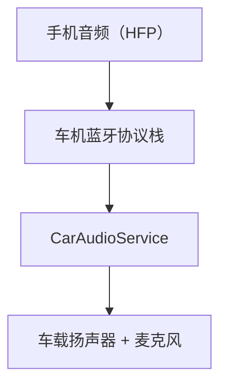

# 车载蓝牙电话：HFP 协议

> 系列：AAOS-Guide · 13-bluetooth
> 难度：⭐⭐⭐⭐ 深入
> 更新：2026-08-27
> 前置知识：《CarService 架构》《CarAudioService》

---

## 一、车载蓝牙电话的场景

司机手机通过蓝牙连到车机，用车机免提打电话：


**核心价值**：开车不用手持手机，安全免提通话。

## 二、HFP 协议是什么

**HFP（Hands-Free Profile）**：蓝牙免提协议，定义了手机和车机之间打电话的交互规范。



## 三、角色划分

| 角色 | 设备 |
|------|------|
| AG（Audio Gateway） | 手机（音频源） |
| HF（Hands-Free） | 车机（免提端） |

车机是 **HF 角色**，手机是 **AG 角色**。车机通过 HFP 指令控制手机拨打电话。

## 四、HFP 的核心指令

| 指令 | 作用 |
|------|------|
| `ATA` | 接听电话 |
| `AT+CHUP` | 挂断电话 |
| `ATD123456` | 拨号 |
| `AT+VGS` | 调节通话音量 |



## 五、Android 的蓝牙电话实现

Android 通过 BluetoothHeadsetClient 实现 HFP 客户端：

```java
BluetoothHeadsetClient client = ...;

// 拨号
client.dial("10086");

// 接听
client.acceptCall(device);

// 挂断
client.terminateCall(device);
```

## 六、车载蓝牙电话的音频路由

通话音频要路由到车载麦克风和扬声器，走 CarAudioService：



## 七、电话与媒体的优先级

通话时，媒体（音乐）要自动暂停或降低：

| 场景 | 行为 |
|------|------|
| 来电 | 音乐暂停 |
| 通话中 | 音乐静音 |
| 通话结束 | 音乐恢复 |

这是通过音频焦点（Audio Focus）实现的，上一篇《CarAudioService》讲过。

## 八、常见问题

| 问题 | 原因 |
|------|------|
| 电话没声音 | 音频路由错误 |
| 对方听不到 | 麦克风权限/路由 |
| 通话断断续续 | 蓝牙信号/射频干扰 |
| 无法同步通讯录 | PBAP 协议未实现 |

## 九、总结

| 要点 | 结论 |
|------|------|
| HFP | 蓝牙免提协议 |
| 角色 | 车机 HF，手机 AG |
| 核心指令 | ATA/AT+CHUP/ATD |
| 音频 | 路由到车载，焦点管理 |

---

**下一篇预告**：《车载导航：从定位到路径规划》

> 配套仓库：[AAOS-Guide](https://github.com/jason5200/AAOS-Guide)
