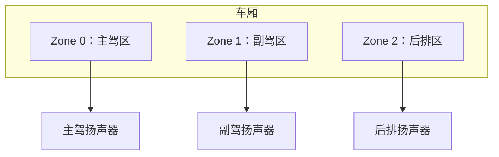
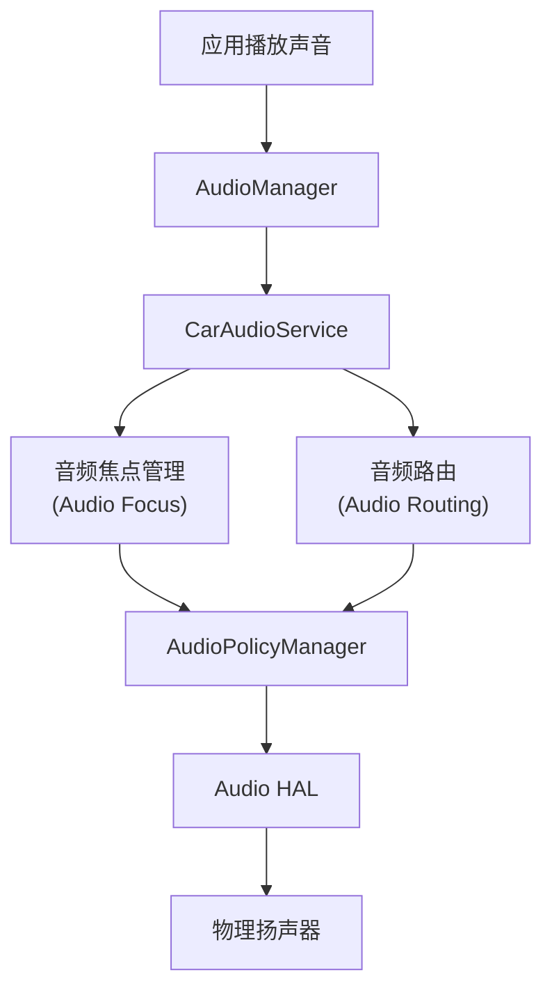
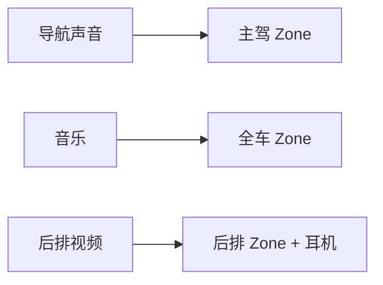

# CarAudioService：车载音频管理

> 系列：AAOS-Guide · 06-audio
> 难度：⭐⭐⭐⭐ 深入
> 更新：2026-08-26
> 前置知识：《CarService 架构》

---

## 一、车载音频和手机有什么不同

手机音频场景简单：一个扬声器 + 一个耳机，谁放声音就是谁。但车里有**多个物理声区**，且音频路由有严格的安全优先级：

- 导航播报 vs 音乐播放，谁优先？
- 主驾、副驾、后排，声音怎么分区？
- 倒车雷达的「滴滴声」，必须绝对优先，不能被音乐盖住。

**CarAudioService** 就是 AAOS 里解决这些问题的核心服务。

## 二、车载音频的两大核心概念

### 1. 音频分区（Audio Zone）

车被划分成多个物理声区：



每个 Zone 有独立的音量、独立的音频路由。主驾听导航，副驾可以同时看视频听自己耳机。

### 2. 音频属性（Audio Attribute）

每种声音都有「属性」，决定它的**用途和优先级**：

| 属性 | 用途 | 优先级 |
|------|------|--------|
| `USAGE_EMERGENCY` | 紧急广播 | 最高 |
| `USAGE_SAFETY` | 安全提示（倒车雷达） | 很高 |
| `USAGE_NAVIGATION_GUIDANCE` | 导航播报 | 高 |
| `USAGE_MEDIA` | 音乐、视频 | 中 |
| `USAGE_ALARM` | 闹钟 | 中 |

**核心理解**：CarAudioService 会根据音频属性，决定「哪些声音能同时响、谁的声音更大、谁的声音要压低谁」。

## 三、CarAudioService 的架构



## 四、音频焦点（Audio Focus）

这是车载音频最核心的机制。当多个 App 同时想发声，系统需要一个「仲裁者」。

```java
// App 请求音频焦点
AudioManager audioManager = getSystemService(AudioManager.class);
AudioFocusRequest request = new AudioFocusRequest.Builder(AudioManager.AUDIOFOCUS_GAIN)
    .setAudioAttributes(new AudioAttributes.Builder()
        .setUsage(AudioAttributes.USAGE_NAVIGATION_GUIDANCE)
        .build())
    .build();

int result = audioManager.requestAudioFocus(request);
```

**典型场景**：
1. 正在放音乐（持有焦点）
2. 导航要播报「前方右转」
3. 导航请求焦点 → 音乐**自动降低音量**（ducking）
4. 导航播报完 → 音乐恢复

## 五、音频路由：声音去哪

CarAudioService 根据音频属性，把声音路由到正确的 Zone 和物理设备：



**关键点**：
- 导航默认只在主驾 Zone 播报（不打扰其他乘客）。
- 音乐可以全车播放。
- 后排娱乐可以路由到后排耳机，主驾听不到。

## 六、音量管理：分区独立音量

每个 Zone 有独立的音量：

```java
// 获取主驾 Zone 的媒体音量
CarAudioManager carAudioManager = car.getCarManager(Car.AUDIO_SERVICE);
int groupId = carAudioManager.getGroupForUsage(AudioAttributes.USAGE_MEDIA);
int volume = carAudioManager.getGroupVolume(groupId);
```

**关键理解**：调「主驾媒体音量」不影响「副驾媒体音量」，这就是分区音量的意义。

## 七、车载音频的特殊场景

### 1. 安全提示绝对优先

倒车雷达、碰撞预警这类安全声音，音频属性是 `USAGE_SAFETY`，优先级极高：

- 会**打断**当前所有声音
- 不能被静音
- 路由到全车，且音量由系统控制

### 2. 紧急广播

`USAGE_EMERGENCY`（如紧急救援广播）优先级最高，强制全车播放。

### 3. 乘客静音

主驾可以「静音后排」，让后排娱乐区静音，专注驾驶。

## 八、开发实战：一个导航播报 App

```kotlin
// 导航播报：请求焦点 + 指定属性
val audioManager = getSystemService(AudioManager::class.java)

val attributes = AudioAttributes.Builder()
    .setUsage(AudioAttributes.USAGE_NAVIGATION_GUIDANCE)
    .setContentType(AudioAttributes.CONTENT_TYPE_SPEECH)
    .build()

val focusRequest = AudioFocusRequest.Builder(AudioManager.AUDIOFOCUS_GAIN_TRANSIENT_MAY_DUCK)
    .setAudioAttributes(attributes)
    .setWillPauseWhenDucked(false)
    .build()

audioManager.requestAudioFocus(focusRequest)
// 播放导航语音 ...
// 播完释放焦点
audioManager.abandonAudioFocusRequest(focusRequest)
```

> `AUDIOFOCUS_GAIN_TRANSIENT_MAY_DUCK`：临时获取焦点，其他声音（音乐）可以降低音量而不是停止。

## 九、总结

| 要点 | 结论 |
|------|------|
| 车载音频核心 | CarAudioService 管理分区 + 焦点 + 路由 |
| 音频分区 | 车厢分成多个 Zone，独立音量和路由 |
| 音频焦点 | 仲裁谁发声、谁压低谁 |
| 安全优先 | 安全/紧急声音绝对优先 |
| 开发要点 | 请求焦点时指定 usage 属性 |

---

**下一篇预告**：《车载 OTA 升级：从差分包到 A/B 分区》

> 配套仓库：[AAOS-Guide](https://github.com/jason5200/AAOS-Guide)
