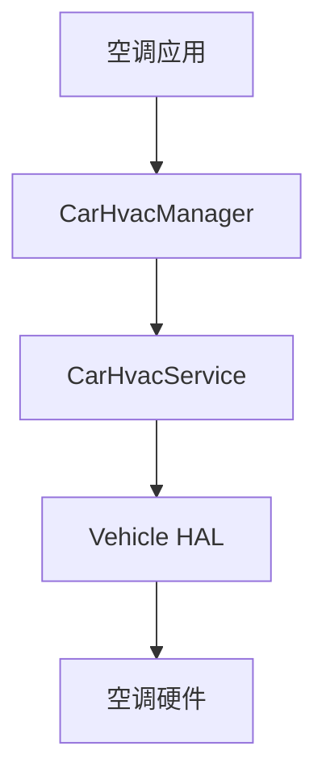

# CarHvacService：空调控制深入

> 系列：AAOS-Guide · 01-car-service
> 难度：⭐⭐⭐⭐ 深入
> 更新：2026-08-27
> 前置知识：《CarService 架构》《CarPropertyManager》

---

## 一、HVAC 是什么

**HVAC（Heating, Ventilation, Air Conditioning）**：采暖、通风、空调。是车机里最复杂的控制功能之一。

一个完整的车载空调系统涉及：

- 温度（主驾/副驾分区）
- 风速、风向
- 内外循环
- 除霜、座椅加热、方向盘加热
- 前后排分区控制

## 二、CarHvacService 的职责

CarHvacService 是 CarService 的子服务，负责把「空调相关的车辆属性」暴露给应用。



## 三、通过 CarHvacManager 控制空调

```java
CarHvacManager hvacManager = car.getCarManager(Car.HVAC_SERVICE);

// 设置主驾温度
hvacManager.setIntProperty(
    VehiclePropertyIds.HVAC_TEMPERATURE_SET,
    0,      // areaId = 0 表示主驾
    24      // 24 度
);

// 设置风速
hvacManager.setIntProperty(
    VehiclePropertyIds.HVAC_FAN_SPEED,
    0,
    3       // 3 档风
);
```

## 四、空调相关的车辆属性

| 属性 | 说明 |
|------|------|
| `HVAC_TEMPERATURE_SET` | 设定温度 |
| `HVAC_TEMPERATURE_VALUE` | 实际温度 |
| `HVAC_FAN_SPEED` | 风速 |
| `HVAC_FAN_DIRECTION` | 风向 |
| `HVAC_AC_ON` | 空调开关 |
| `HVAC_RECIRC_ON` | 内外循环 |

## 五、多区空调（areaId）

车载空调通常分区，`areaId` 指定控制哪个区：

| areaId | 区域 |
|--------|------|
| 0 | 主驾 |
| 1 | 副驾 |
| 2+ | 后排 |

```java
// 副驾温度设为 26 度（areaId = 1）
hvacManager.setIntProperty(
    VehiclePropertyIds.HVAC_TEMPERATURE_SET,
    1,      // 副驾区
    26
);
```

## 六、一个完整的空调控制示例

```kotlin
class ClimateControlActivity : AppCompatActivity() {
    private lateinit var hvacManager: CarHvacManager

    override fun onCreate(savedInstanceState: Bundle?) {
        super.onCreate(savedInstanceState)
        val car = Car.createCar(this)
        hvacManager = car.getCarManager(Car.HVAC_SERVICE) as CarHvacManager
    }

    fun setDriverTemp(temp: Int) {
        // 主驾温度
        hvacManager.setIntProperty(
            VehiclePropertyIds.HVAC_TEMPERATURE_SET, 0, temp)
    }

    fun setFanSpeed(speed: Int) {
        // 风速
        hvacManager.setIntProperty(
            VehiclePropertyIds.HVAC_FAN_SPEED, 0, speed)
    }

    fun toggleAC(on: Boolean) {
        // 空调开关
        hvacManager.setBooleanProperty(
            VehiclePropertyIds.HVAC_AC_ON, 0, on)
    }
}
```

## 七、温度单位的坑

车辆属性的温度单位可能是**摄氏度或华氏度**，取决于车辆配置。读取前要确认：

```java
// 查询温度单位
int unit = hvacManager.getIntProperty(
    VehiclePropertyIds.HVAC_TEMPERATURE_DISPLAY_UNITS, 0);
// 0 = 摄氏度，1 = 华氏度
```

## 八、常见坑

| 坑 | 说明 |
|----|------|
| areaId 写错 | 控制错区域 |
| 温度单位混淆 | 摄氏/华氏搞混 |
| 忽略权限 | 需要 CONTROL_CAR_CLIMATE 权限 |
| 行驶中复杂操作 | 考虑驾驶分心限制 |

## 九、总结

| 要点 | 结论 |
|------|------|
| HVAC | 采暖通风空调 |
| 控制入口 | CarHvacManager |
| 多区控制 | areaId 指定区域 |
| 注意 | 温度单位、权限、分心 |

---

**下一篇预告**：《CarSensorService：车辆传感器数据》

> 配套仓库：[AAOS-Guide](https://github.com/jason5200/AAOS-Guide)
