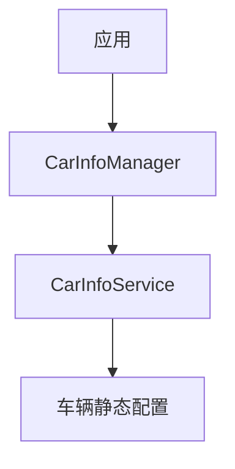

# CarInfoService：车辆静态信息

> 系列：AAOS-Guide · 01-car-service
> 难度：⭐⭐⭐ 进阶
> 更新：2026-08-27
> 前置知识：《CarService 架构》

---

## 一、静态信息 vs 动态信息

车辆数据分两类：

| 类型 | 特点 | 示例 |
|------|------|------|
| 静态信息 | 不随行驶变化 | 车型、VIN、厂商 |
| 动态信息 | 实时变化 | 车速、油量 |

**CarInfoService** 专门管理**静态信息**，这些数据在车辆出厂时就确定了。

## 二、CarInfoService 的职责



## 三、通过 CarInfoManager 读取

```java
CarInfoManager infoManager = car.getCarManager(Car.INFO_SERVICE);

// 读取 VIN（车辆识别码）
String vin = infoManager.getCarInfo(CarInfoManager.VIN);

// 读取车型
String model = infoManager.getCarInfo(CarInfoManager.MODEL);

// 读取厂商
String manufacturer = infoManager.getCarInfo(CarInfoManager.MANUFACTURER);
```

## 四、常见的静态信息

| 键 | 说明 |
|----|------|
| `VIN` | 车辆识别码（唯一） |
| `MODEL` | 车型 |
| `MANUFACTURER` | 厂商 |
| `MODEL_YEAR` | 年份 |
| `VEHICLE_ID` | 车辆 ID |

## 五、静态信息的用途

### 1. 车型适配

不同车型的硬件配置不同，App 根据车型做适配：

```java
String model = infoManager.getCarInfo(CarInfoManager.MODEL);
if (model.equals("Model-X")) {
    // 该车型有座椅加热，显示相关 UI
    showSeatHeating();
}
```

### 2. 唯一标识

VIN 是车辆唯一标识，用于：

- 云端绑定车辆
- 诊断、召回
- 个性化配置

### 3. 诊断信息

```java
// 读取诊断相关
String diagnosticInfo = infoManager.getCarInfo(...);
```

## 六、CarInfoManager 与 CarPropertyManager 的区别

| 维度 | CarInfoManager | CarPropertyManager |
|------|----------------|-------------------|
| 数据类型 | 静态（不变） | 动态（实时） |
| 读取方式 | getCarInfo | getProperty |
| 典型数据 | VIN、车型 | 车速、油量 |
| 是否监听 | 不需要 | 可以监听 |

## 七、一个完整的示例

```kotlin
class VehicleInfoActivity : AppCompatActivity() {
    override fun onCreate(savedInstanceState: Bundle?) {
        super.onCreate(savedInstanceState)
        val car = Car.createCar(this)
        val infoManager = car.getCarManager(Car.INFO_SERVICE) as CarInfoManager

        val vin = infoManager.getCarInfo(CarInfoManager.VIN)
        val model = infoManager.getCarInfo(CarInfoManager.MODEL)
        val year = infoManager.getCarInfo(CarInfoManager.MODEL_YEAR)

        textView.text = "车型：$model $year\nVIN：$vin"
    }
}
```

## 八、常见坑

| 坑 | 说明 |
|----|------|
| 混淆静态和动态 | 车型用 Info，车速用 Property |
| 读不存在的键 | 某些车型可能没有该信息 |
| 权限 | 部分信息需要权限 |

## 九、总结

| 要点 | 结论 |
|------|------|
| 静态信息 | 车型、VIN、厂商等不变数据 |
| 读取方式 | CarInfoManager.getCarInfo |
| 用途 | 车型适配、唯一标识、诊断 |
| 与 Property 区别 | 静态 vs 动态 |

---

**下一篇预告**：《CarUxRestrictionsService：驾驶分心深入》

> 配套仓库：[AAOS-Guide](https://github.com/jason5200/AAOS-Guide)
