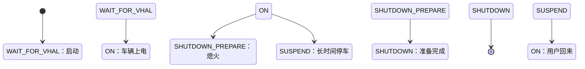
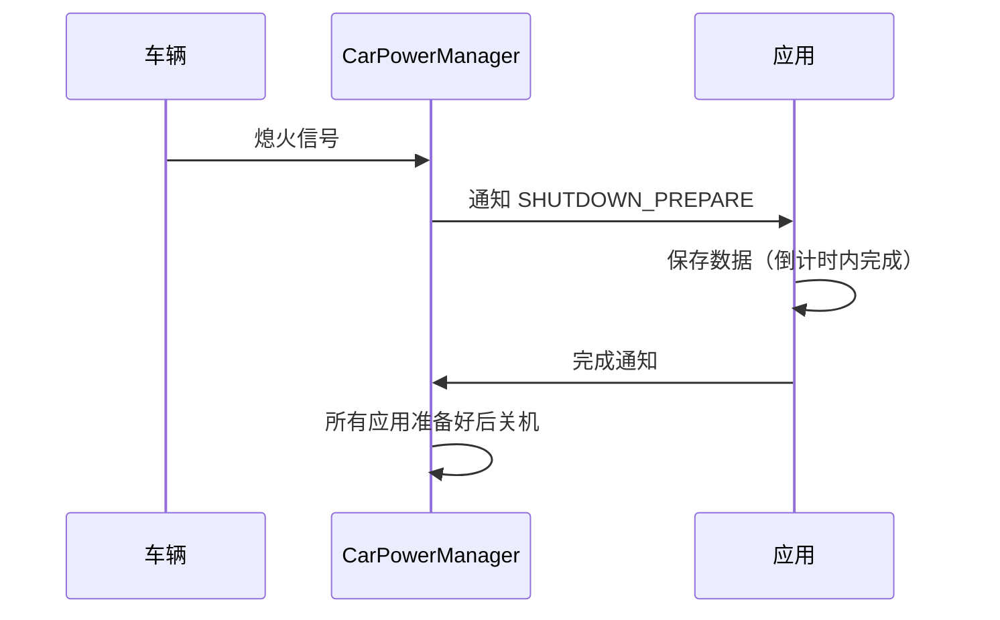
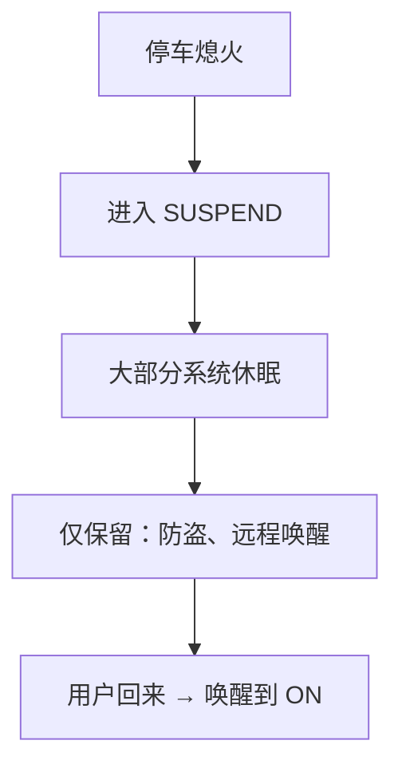

# CarPowerManagementService：电源状态管理

> 系列：AAOS-Guide · 01-car-service
> 难度：⭐⭐⭐⭐ 深入
> 更新：2026-08-27
> 前置知识：《CarService 架构》

---

## 一、为什么车载电源管理复杂

手机的电源状态很简单：亮屏、息屏、关机。但车的电源状态复杂得多：

- 停车但人在车里（空调、音乐要能开）
- 行驶中（全功能）
- 熄火锁车（大部分系统休眠，但防盗、远程控制要监听）
- 深度休眠（省电，只保留极少数功能）

**CarPowerManagementService** 就是管理这些复杂电源状态的系统服务。

## 二、电源状态机



## 三、核心状态

| 状态 | 说明 |
|------|------|
| `ON` | 车辆正常上电，全功能 |
| `SHUTDOWN_PREPARE` | 熄火准备，应用保存状态 |
| `SHUTDOWN` | 系统关机 |
| `SUSPEND` | 挂起/休眠，省电 |

## 四、App 如何感知电源状态

```java
CarPowerManager powerManager = car.getCarManager(Car.POWER_SERVICE);

// 注册电源状态监听
powerManager.setListener(listener);

CarPowerManager.CarPowerStateListener listener = new CarPowerManager.CarPowerStateListener() {
    @Override
    public void onStateChanged(int state) {
        switch (state) {
            case CarPowerManager.STATE_ON:
                // 上电，恢复功能
                break;
            case CarPowerManager.STATE_SHUTDOWN_PREPARE:
                // 即将关机，保存数据
                saveData();
                break;
            case CarPowerManager.STATE_SUSPEND:
                // 休眠，释放资源
                break;
        }
    }
};
```

## 五、关机准备（Shutdown Prepare）

这是最关键的应用场景：熄火时，系统会给应用一个「准备时间」保存状态。



**关键**：应用必须在限定时间内（通常几秒）完成保存，否则可能丢数据。

## 六、应用如何请求延迟关机

如果应用正在做重要操作（如写文件），可以请求「延迟关机」：

```java
// 请求延迟关机
powerManager.requestShutdownDelay(CarPowerManager.SHUTDOWN_DELAY_MAX, timeUnit);
```

**注意**：延迟时间是有限的，滥用会被系统忽略。

## 七、SUSPEND（休眠）机制

车长时间不启动，系统进入休眠省电：



## 八、开发最佳实践

| 场景 | 建议 |
|------|------|
| 收到 SHUTDOWN_PREPARE | 立即保存关键数据 |
| 需要时间保存 | 请求延迟关机 |
| 收到 SUSPEND | 释放资源、停止耗电任务 |
| 收到 ON | 恢复功能、刷新数据 |

## 九、总结

| 要点 | 结论 |
|------|------|
| 电源服务 | 管理复杂车载电源状态 |
| 核心状态 | ON/SHUTDOWN_PREPARE/SHUTDOWN/SUSPEND |
| App 监听 | setListener + 状态回调 |
| 关键场景 | 关机前保存数据 |

---

**下一篇预告**：《CarHvacService：空调控制深入》

> 配套仓库：[AAOS-Guide](https://github.com/jason5200/AAOS-Guide)
