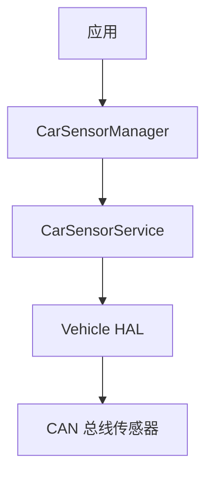
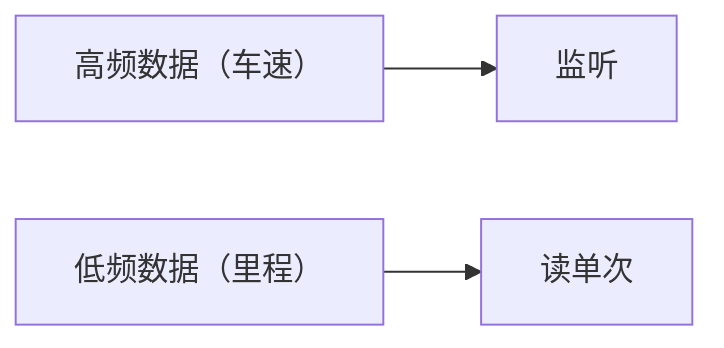

# 车辆传感器数据：从 CarSensorManager 到 CarPropertyManager

> 系列：AAOS-Guide · 01-car-service
> 难度：⭐⭐⭐ 进阶
> 更新：2026-08-26
> 对照：[AOSP android-14.0.0_r67](https://github.com/jason5200/AAOS-Guide/blob/main/AOSP_VERSION.md)
> 前置知识：《CarService 架构》《CarPropertyManager》

---

> **API 状态（先看这个）**  
> `CarSensorManager` / `CarSensorService` 是旧接口。AAOS 现行做法是把车速、油量、档位等做成 **Vehicle Property**，用 `CarPropertyManager` 读写（见 [carproperty-manager.md](/articles/carservice-api/carproperty-manager.md)）。  
> 下面保留旧 API 只为读历史代码和旧项目；**新代码不要再注册 `CarSensorManager`。**

## 一、车辆信号 vs 手机传感器

手机的传感器（加速度计、陀螺仪）用于感知手机姿态。车辆的传感器完全不同：

- 车速、转速
- 油量、电量、续航
- 胎压、温度
- 档位、方向盘角度

这些数据在现行 AAOS 里是 **Vehicle Property**，由 CarPropertyService 经 VHAL 从总线来。下面的 Sensor API 只用于读旧工程。

## 二、CarSensorService 的职责



## 三、通过 CarSensorManager 读取传感器

```java
CarSensorManager sensorManager = car.getCarManager(Car.SENSOR_SERVICE);

// 读取车速（m/s）
SensorEvent event = sensorManager.getLatestSensorEvent(
    CarSensorManager.SENSOR_TYPE_CAR_SPEED);
if (event != null) {
    float speed = event.floatValues[0];  // 车速
}
```

## 四、常见的传感器类型

| 类型 | 说明 | 数据 |
|------|------|------|
| `SENSOR_TYPE_CAR_SPEED` | 车速 | m/s |
| `SENSOR_TYPE_ENGINE_RPM` | 发动机转速 | rpm |
| `SENSOR_TYPE_FUEL_LEVEL` | 油量 | % |
| `SENSOR_TYPE_EV_BATTERY_LEVEL` | 电量 | % |
| `SENSOR_TYPE_ODOMETER` | 里程 | km |

## 五、监听传感器变化

除了读取单次数据，更常用的是**持续监听**：

```java
CarSensorManager.OnSensorChangedListener listener = new CarSensorManager.OnSensorChangedListener() {
    @Override
    public void onSensorChanged(CarSensorEvent event) {
        if (event.sensorType == CarSensorManager.SENSOR_TYPE_CAR_SPEED) {
            float speed = event.floatValues[0];
            // 更新车速显示
        }
    }
};

// 注册监听，指定采样率
sensorManager.registerListener(
    listener,
    CarSensorManager.SENSOR_TYPE_CAR_SPEED,
    CarSensorManager.SENSOR_RATE_NORMAL
);

// 不用时注销
sensorManager.unregisterListener(listener);
```

## 六、采样率

| 采样率 | 说明 |
|--------|------|
| `SENSOR_RATE_NORMAL` | 常规（如 10Hz） |
| `SENSOR_RATE_FASTEST` | 最快 |
| 自定义 | 指定具体 Hz |

**注意**：采样率过高会耗电、刷屏，按需设置。

## 七、传感器数据的实时性

车速这类数据变化快，适合用监听；里程这类变化慢，适合读单次。



## 八、常见坑

| 坑 | 说明 |
|----|------|
| 忘记注销监听 | 内存泄漏 |
| 采样率过高 | 耗电、卡顿 |
| 忽略数据单位 | 车速是 m/s 不是 km/h |
| 权限缺失 | 需要 CAR_SPEED 等权限 |

## 九、新项目应该怎么写

```java
CarPropertyManager propertyManager =
        (CarPropertyManager) car.getCarManager(Car.PROPERTY_SERVICE);

propertyManager.registerCallback(callback,
        VehiclePropertyIds.PERF_VEHICLE_SPEED,
        CarPropertyManager.SENSOR_RATE_NORMAL);
```

属性 ID、权限和区域（AreaId）以你的 Vehicle HAL 配置为准。

## 十、总结

| 要点 | 结论 |
|------|------|
| 现行 API | `CarPropertyManager` |
| 旧 API | `CarSensorManager`（不要用在新代码） |
| 数据来源 | Vehicle HAL → CarService |
| 注意 | 单位、采样率、注销回调、权限 |

---

**下一篇**：[车辆静态信息也走 Property](/articles/audio/car-info.md)
