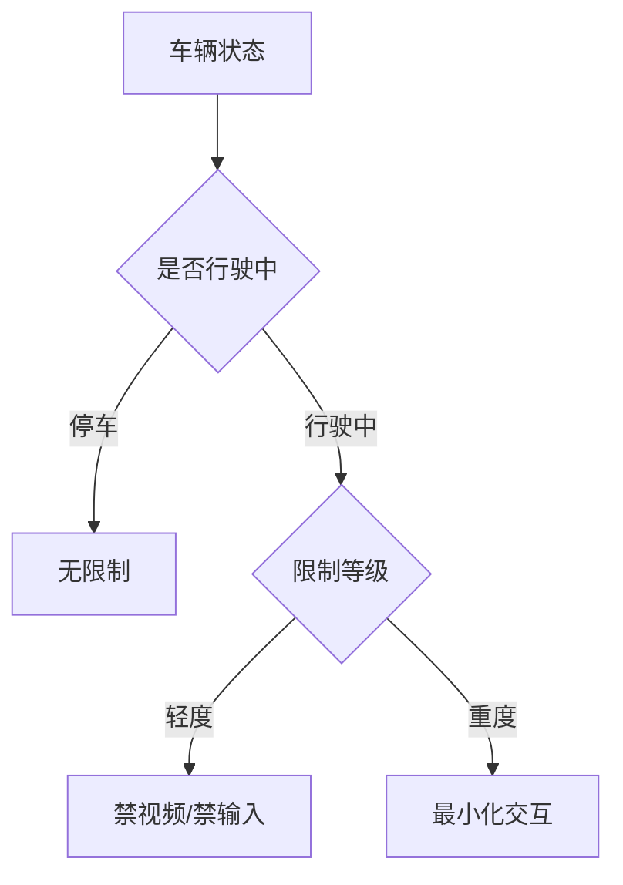

# CarUxRestrictionsService：驾驶分心深入

> 系列：AAOS-Guide · 01-car-service
> 难度：⭐⭐⭐⭐ 深入
> 更新：2026-08-27
> 前置知识：《CarService 权限模型》

---

## 一、驾驶分心问题的本质

开车时，司机的注意力是稀缺资源。任何让司机分心的 UI，都可能导致事故。

**CarUxRestrictionsService** 就是系统用来「限制行驶中 UI 操作」的服务，是车载安全的底线机制。

## 二、分心限制的三个等级



## 三、限制的具体内容

| 限制项 | 说明 |
|--------|------|
| 视频播放 | 行驶中禁止 |
| 文字输入 | 行驶中禁止键盘 |
| 长文本显示 | 限制阅读量 |
| 手势游戏 | 禁止 |

## 四、App 查询限制状态

```java
CarUxRestrictionsManager manager = car.getCarManager(
    Car.CAR_UX_RESTRICTION_SERVICE);

CarUxRestrictions restrictions = manager.getCurrentCarUxRestrictions();

// 是否需要分心优化
boolean needOptimize = restrictions.isRequiresDistractionOptimization();

// 具体的限制项
boolean noVideo = restrictions.isNoVideo();
boolean noText = restrictions.isNoTextEntry();
```

## 五、监听限制变化

限制状态会随「停车 → 行驶 → 停车」动态变化，必须监听：

```java
CarUxRestrictionsManager.OnUxRestrictionsChangedListener listener =
    restrictions -> {
        if (restrictions.isRequiresDistractionOptimization()) {
            // 进入行驶状态，简化 UI
            optimizeForDriving();
        } else {
            // 停车了，恢复完整功能
            restoreFullUI();
        }
    };

manager.registerListener(listener);
// 不用时注销
manager.unregisterListener(listener);
```

## 六、UI 适配的最佳实践

### 行驶中的 UI 设计

```kotlin
fun applyUxRestrictions(restrictions: CarUxRestrictions) {
    if (restrictions.isRequiresDistractionOptimization()) {
        // 行驶中：大按钮、少文字、语音优先
        videoButton.visibility = View.GONE      // 隐藏视频
        textInput.isEnabled = false             // 禁用输入
        enlargeButtons()                        // 放大按钮
        enableVoiceControl()                    // 启用语音
    } else {
        // 停车中：完整功能
        videoButton.visibility = View.VISIBLE
        textInput.isEnabled = true
    }
}
```

## 七、分心限制与安全的平衡

| 场景 | 处理 |
|------|------|
| 导航播报 | 允许（语音优先） |
| 音乐切换 | 允许（简单操作） |
| 看视频 | 禁止（行驶中） |
| 输入地址 | 禁止（用语音替代） |

## 八、常见坑

| 坑 | 说明 |
|----|------|
| 忽略分心限制 | 车企审核不通过 |
| 只查一次不监听 | 状态变化后 UI 不更新 |
| 分心限制过度 | 影响可用性 |
| 忘记注销监听 | 内存泄漏 |

## 九、总结

| 要点 | 结论 |
|------|------|
| 分心服务 | 限制行驶中 UI 操作 |
| 三级限制 | 无/轻度/重度 |
| App 适配 | 查询 + 监听状态 |
| 安全底线 | 禁视频、禁输入、语音优先 |

---

**下一篇预告**：《Vehicle HAL 深入：从 AIDL 到实现》

> 配套仓库：[AAOS-Guide](https://github.com/jason5200/AAOS-Guide)
