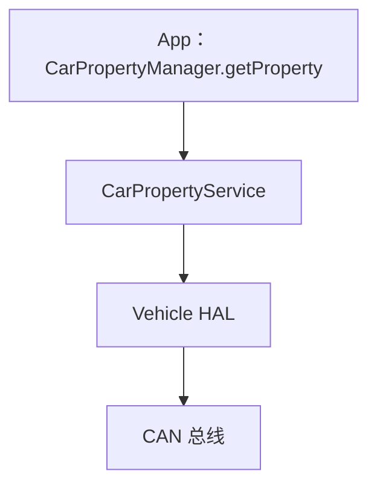
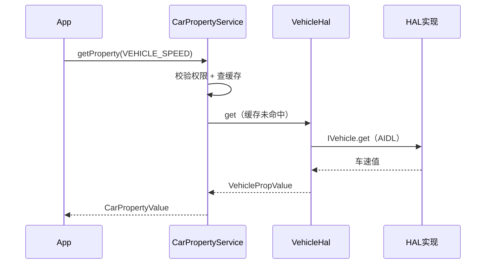

# CarPropertyService 属性读写源码

> 系列：AAOS-Guide · 01-car-service
> 难度：⭐⭐⭐⭐⭐ 深入
> 更新：2026-08-27
> 前置知识：《CarPropertyManager》《Vehicle HAL 深入》

---

## 一、本文目标

前面讲了 CarPropertyManager 的用法，这一篇深入到 **CarPropertyService** 源码，看一次「读车速」从 App 到 Vehicle HAL 的完整代码链。

## 二、读写属性的完整链路



## 三、App 侧：CarPropertyManager

```java
// CarPropertyManager.java
public CarPropertyValue getProperty(int propId, int areaId) {
    // 通过 Binder 调用 CarPropertyService
    return mCarPropertyService.getProperty(propId, areaId);
}
```

## 四、CarPropertyService 侧

```java
// CarPropertyService.java
public CarPropertyValue getProperty(int propId, int areaId) {
    // 1. 校验权限
    assertPermission(propId);

    // 2. 查缓存（如果有）
    CarPropertyValue cached = mCachedValues.get(propId);
    if (cached != null) {
        return cached;
    }

    // 3. 通过 Vehicle HAL 读
    VehiclePropValue value = mVehicleHal.get(...);
    return new CarPropertyValue(value);
}
```

## 五、权限校验

```java
private void assertPermission(int propId) {
    // 根据属性类型确定需要的权限
    String permission = getPermissionForProperty(propId);
    if (permission != null) {
        mContext.enforceCallingOrSelfPermission(permission, ...);
    }
}

private String getPermissionForProperty(int propId) {
    switch (propId) {
        case VehiclePropertyIds.VEHICLE_SPEED:
            return Car.PERMISSION_SPEED;  // 需要车速权限
        case VehiclePropertyIds.HVAC_TEMPERATURE_SET:
            return Car.PERMISSION_CONTROL_CAR_CLIMATE;  // 空调权限
        // ...
    }
}
```

## 六、VehicleHal 的 get 实现

```java
// VehicleHal.java
public VehiclePropValue get(VehiclePropValue request) {
    // 通过 AIDL 调用 HAL 实现
    return mVehicle.get(request);
}
```

## 七、属性缓存的优化

CarPropertyService 会缓存属性值，避免频繁读 HAL：

```java
// 缓存结构
private final SparseArray<CarPropertyValue> mCachedValues = new SparseArray<>();

// 订阅属性变化，更新缓存
private final IVehicleCallback mVehicleCallback = new IVehicleCallback.Stub() {
    @Override
    public void onPropertyEvent(List<VehiclePropValue> values) {
        for (VehiclePropValue value : values) {
            // 更新缓存
            mCachedValues.put(value.prop, new CarPropertyValue(value));
        }
    }
};
```

**关键理解**：CarPropertyService 通过「订阅」机制实时更新缓存，App 读属性时优先从缓存拿，减少 HAL 调用。

## 八、写属性的流程

```java
// CarPropertyService.java
public void setProperty(int propId, int areaId, Object value) {
    // 1. 校验权限
    assertPermission(propId);

    // 2. 构造 VehiclePropValue
    VehiclePropValue propValue = new VehiclePropValue();
    propValue.prop = propId;
    propValue.areaId = areaId;
    propValue.value = value;

    // 3. 通过 Vehicle HAL 写
    mVehicleHal.set(propValue);
}
```

## 九、完整的读写时序



## 十、总结

| 要点 | 结论 |
|------|------|
| 读链路 | App → Service → HAL → CAN |
| 权限校验 | assertPermission |
| 缓存优化 | 订阅 + 缓存 |
| 写流程 | 校验 → 构造 → set |

---

**下一篇预告**：《MessageQueue 的 native 层 next 唤醒源码》

> 配套仓库：[AAOS-Guide](https://github.com/jason5200/AAOS-Guide)
