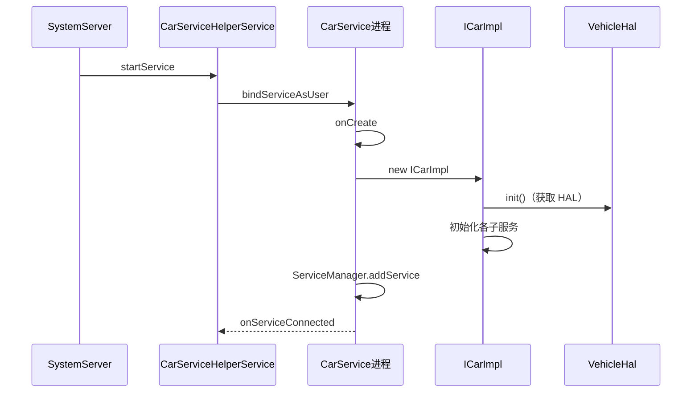

# CarService 启动流程的完整源码

> 系列：AAOS-Guide · 01-car-service
> 难度：⭐⭐⭐⭐⭐ 深入
> 更新：2026-08-27
> 前置知识：《CarService 架构》

---

## 一、本文目标

上一篇《CarService 架构》讲了 CarService 是独立进程，由 CarServiceHelperService 拉起。这一篇**深入到源码**，看它到底怎么启动、怎么初始化。

## 二、启动入口：CarServiceHelperService

CarService 的启动，由 SystemServer 里的 `CarServiceHelperService` 负责：

```java
// SystemServer.java
private void startOtherServices() {
    // ...
    // 启动 CarServiceHelperService（AAOS 专属）
    mSystemServiceManager.startService(CarServiceHelperService.class);
}
```

```java
// CarServiceHelperService.java
public class CarServiceHelperService extends SystemService {
    @Override
    public void onStart() {
        // 绑定 CarService（独立进程）
        Intent intent = new Intent();
        intent.setPackage("com.android.car");
        intent.setAction(Car.CAR_SERVICE_INTERFACE_NAME);
        if (!getContext().bindServiceAsUser(intent, mCarServiceConnection, ...)) {
            Slog.wtf(TAG, "cannot start car service");
        }
    }
}
```

**关键理解**：CarServiceHelperService 通过 `bindServiceAsUser` 绑定到 `com.android.car` 包，从而拉起 CarService 独立进程。

## 三、CarService 进程的入口

CarService 是独立进程，它的入口在 `CarService` 类：

```java
// CarService.java
public class CarService extends Service {
    private ICarImpl mICarImpl;

    @Override
    public void onCreate() {
        // 1. 获取 Vehicle HAL
        VehicleHal vehicleHal = new VehicleHal();

        // 2. 创建 ICarImpl（核心实现）
        mICarImpl = new ICarImpl(this, vehicleHal, ...);

        // 3. 初始化 ICarImpl
        mICarImpl.init();

        // 4. 发布 CarService 到 ServiceManager
        ServiceManager.addService("car_service", mICarImpl);
    }

    @Override
    public IBinder onBind(Intent intent) {
        // 返回 ICarImpl 作为 Binder
        return mICarImpl;
    }
}
```

## 四、ICarImpl.init() 的初始化流程

ICarImpl 是 CarService 的核心，init() 里初始化所有子服务：

```java
// ICarImpl.java
public class ICarImpl extends ICar.Stub {
    private final CarPropertyService mCarPropertyService;
    private final CarPowerManagementService mCarPowerManagementService;
    private final CarHvacService mCarHvacService;
    // ... 更多子服务

    @init()
    void init() {
        // 1. 初始化 Vehicle HAL
        mVehicleHal.init();

        // 2. 初始化各子服务（按依赖顺序）
        mCarPropertyService.init();
        mCarPowerManagementService.init();
        mCarHvacService.init();
        // ...

        // 3. 通知 CarServiceHelperService 启动完成
        mSystemActivityMonitoringService.init();
    }
}
```

## 五、VehicleHal 的初始化

VehicleHal 是 CarService 和硬件之间的桥梁：

```java
// VehicleHal.java
public class VehicleHal {
    private IVehicle mVehicle;  // HAL 的 AIDL 代理

    public void init() {
        // 通过 AIDL 获取 Vehicle HAL 服务
        mVehicle = android.hardware.automotive.vehicle.V2_0.IVehicle.getService();
        // 或 V3/V4 版本
    }
}
```

## 六、CarPropertyService 的初始化

CarPropertyService 初始化时，会从 HAL 获取所有属性配置：

```java
// CarPropertyService.java
public void init() {
    // 获取所有车辆属性
    List<VehiclePropConfig> configs = mVehicleHal.getAllPropConfigs();

    // 建立属性映射
    for (VehiclePropConfig config : configs) {
        mProps.put(config.prop, config);
    }

    // 订阅属性变化
    mVehicleHal.subscribe(mVehicleCallback, subscribeOptions);
}
```

## 七、完整的启动时序图



## 八、启动顺序的重要性

子服务的初始化**有依赖顺序**：

| 顺序 | 服务 | 依赖 |
|------|------|------|
| 1 | VehicleHal | 无 |
| 2 | CarPropertyService | VehicleHal |
| 3 | 其他子服务 | CarPropertyService |

**关键理解**：如果顺序错了，服务初始化会失败，导致 CarService 起不来。

## 九、总结

| 要点 | 结论 |
|------|------|
| 启动入口 | CarServiceHelperService |
| 拉起方式 | bindServiceAsUser |
| 核心 | ICarImpl.init() |
| 依赖顺序 | VehicleHal → CarProperty → 其他 |

---

**下一篇预告**：《注意力机制的数学推导》

> 配套仓库：[AAOS-Guide](https://github.com/jason5200/AAOS-Guide)
