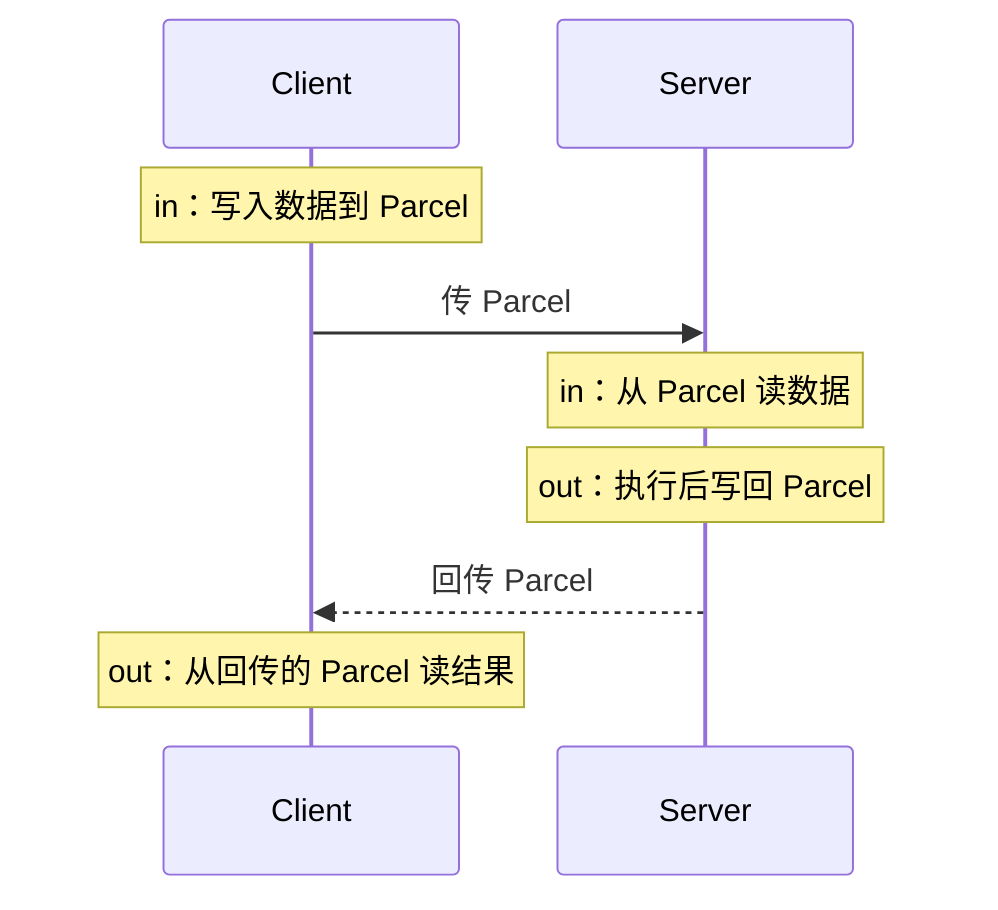

# AIDL 深入：in / out / inout 与 Parcelable

> 系列：Framework-Source-Note · binder
> 难度：⭐⭐⭐⭐ 深入
> 更新：2026-08-27
> 前置知识：《Binder 机制总览》《Binder 连接池》

---

## 一、AIDL 的三种数据流向

AIDL 方法参数可以标记 `in`、`out`、`inout`，它们决定了数据在跨进程时的**流向**：

| 标记 | 含义 | 数据流向 |
|------|------|----------|
| `in` | 只传入 | Client → Server |
| `out` | 只传出 | Server → Client |
| `inout` | 传入又传出 | 双向 |

```java
// IMyService.aidl
void test(in String inStr, out String outStr, inout String inoutStr);
```

**核心理解**：Binder 跨进程传数据，本质是「序列化 + 反序列化」。方向标记决定了「谁序列化、谁反序列化」。

## 二、in / out / inout 的数据拷贝过程



**关键点**：
- `in`：Client 写入，Server 读取。
- `out`：Server 写入，Client 读取（传入时为空）。
- `inout`：两边都读写。

## 三、Parcelable 是什么

跨进程传自定义对象，必须实现 `Parcelable` 接口——它定义了对象如何「序列化成字节流」和「从字节流恢复」。

```java
public class Book implements Parcelable {
    public String name;
    public int price;

    // 从 Parcel 恢复（反序列化）
    protected Book(Parcel in) {
        name = in.readString();
        price = in.readInt();
    }

    // 写入 Parcel（序列化）
    @Override
    public void writeToParcel(Parcel dest, int flags) {
        dest.writeString(name);
        dest.writeInt(price);
    }

    public static final Creator<Book> CREATOR = new Creator<Book>() {
        @Override
        public Book createFromParcel(Parcel in) {
            return new Book(in);
        }

        @Override
        public Book[] newArray(int size) {
            return new Book[size];
        }
    };

    @Override
    public int describeContents() {
        return 0;
    }
}
```

**注意**：`writeToParcel` 的写入顺序，必须和构造函数里的读取顺序**严格一致**。

## 四、Parcelable vs Serializable

| 维度 | Parcelable | Serializable |
|------|-----------|--------------|
| 性能 | 快（定制序列化） | 慢（反射） |
| 内存 | 省 | 耗（创建临时对象） |
| 实现 | 手写代码 | 实现接口即可 |
| 场景 | Android 进程通信 | 磁盘/网络 |

**结论**：Android 跨进程传对象，**必须用 Parcelable**，不用 Serializable。

## 五、自定义类型的 AIDL 声明

如果 AIDL 方法用到自定义 Parcelable 类型，需要额外声明：

```java
// Book.aidl（声明 Book 是 Parcelable）
parcelable Book;

// IMyService.aidl（引用 Book）
import com.example.Book;

interface IMyService {
    void addBook(in Book book);
    List<Book> getBooks();
}
```

**关键点**：
1. 需要单独建 `Book.aidl` 声明它是 parcelable。
2. AIDL 里要 `import` 该类型。

## 六、List / Map 等集合类型

AIDL 支持集合类型，但要注意：

```java
// IMyService.aidl
List<String> getNames();           // 支持
Map<String, Book> getBookMap();    // 支持
```

**注意**：跨进程传递 List 时，接收方拿到的是 **ArrayList**，不要强转成其他 List 类型。

## 七、常见坑

| 坑 | 说明 |
|----|------|
| 读写顺序不一致 | Parcelable 反序列化崩溃 |
| 忘记声明 parcelable | 编译错误 |
| 用 Serializable 传对象 | 性能差 |
| List 强转类型 | 跨进程后是 ArrayList |
| inout 误用 | 不必要的数据拷贝，浪费性能 |

## 八、总结

| 要点 | 结论 |
|------|------|
| in/out/inout | 控制数据流向 |
| Parcelable | 跨进程传对象的序列化机制 |
| 与 Serializable 区别 | Parcelable 性能更好 |
| 读写顺序 | 必须严格一致 |

---

**下一篇预告**：《Binder 的 oneway 异步调用》

> 配套仓库：[Framework-Source-Note](https://github.com/jason5200/Framework-Source-Note)
