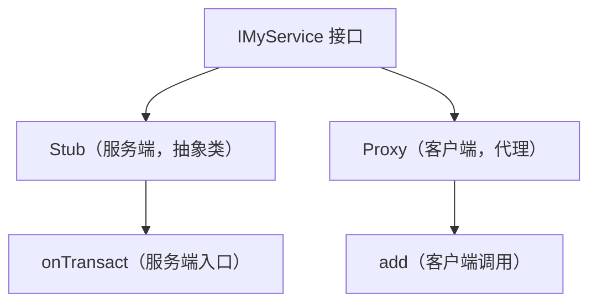
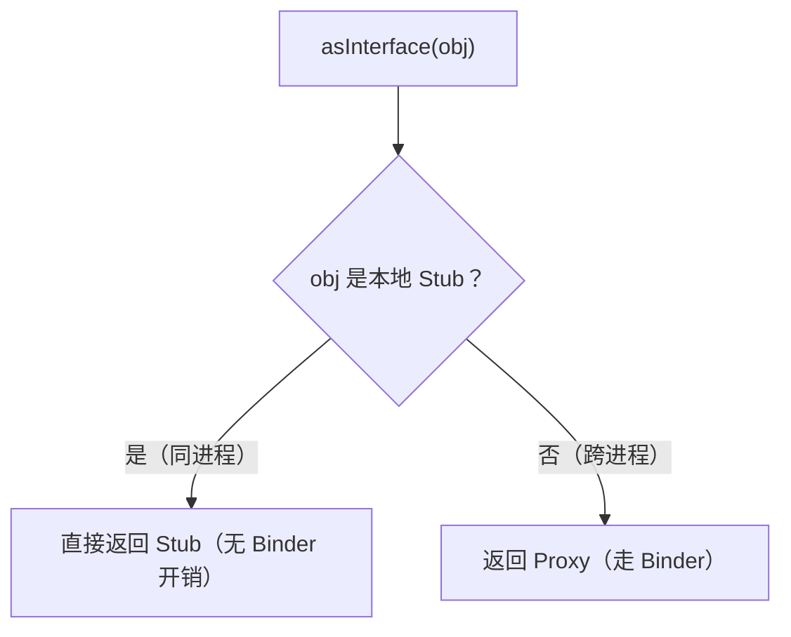
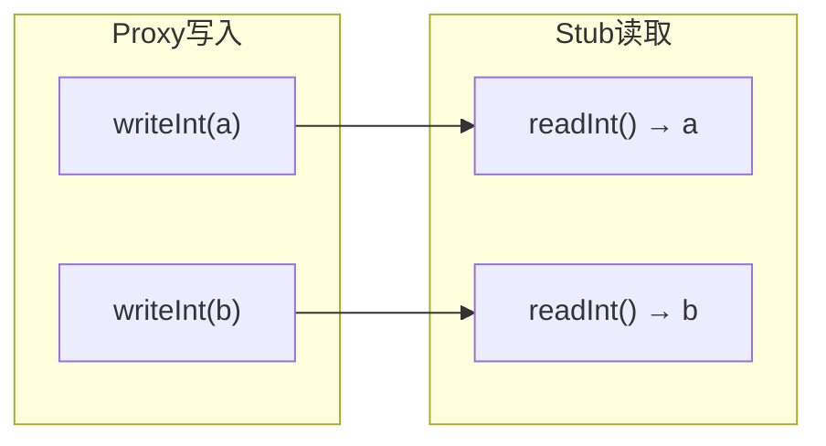

# AIDL 生成代码的完整解读

> 系列：Framework-Source-Note · binder
> 难度：⭐⭐⭐⭐⭐ 深入
> 更新：2026-08-27
> 前置知识：《AIDL 深入：in/out/inout 与 Parcelable》

---

## 一、本文目标

AIDL 文件会被编译器**自动生成**一套 Java 代码。这一篇深入到生成代码，看 Proxy 和 Stub 到底长什么样、怎么工作。

## 二、一个最简单的 AIDL

```java
// IMyService.aidl
interface IMyService {
    int add(int a, int b);
}
```

编译后生成 `IMyService.java`，包含三个关键结构：



## 三、Stub：服务端

```java
public interface IMyService extends android.os.IInterface {
    // 业务方法声明
    public int add(int a, int b) throws android.os.RemoteException;

    // Stub：服务端的抽象类
    public static abstract class Stub extends android.os.Binder
            implements IMyService {
        // 事务码
        static final int TRANSACTION_add = 1;

        // 把 Binder 转成接口
        public static IMyService asInterface(android.os.IBinder obj) {
            if (obj == null) return null;
            // 如果是本地对象（同进程），直接返回
            android.os.IInterface iin = obj.queryLocalInterface(DESCRIPTOR);
            if (iin instanceof IMyService) return (IMyService) iin;
            // 否则是远程，返回 Proxy
            return new IMyService.Stub.Proxy(obj);
        }

        @Override
        public android.os.IBinder asBinder() {
            return this;
        }

        // ★ 核心：onTransact 处理跨进程请求
        @Override
        public boolean onTransact(int code, android.os.Parcel data,
                android.os.Parcel reply, int flags) {
            switch (code) {
                case TRANSACTION_add: {
                    data.enforceInterface(DESCRIPTOR);
                    // 读取参数
                    int _arg0 = data.readInt();
                    int _arg1 = data.readInt();
                    // 调用真正的业务方法
                    int _result = this.add(_arg0, _arg1);
                    reply.writeNoException();
                    // 写入返回值
                    reply.writeInt(_result);
                    return true;
                }
            }
            return super.onTransact(code, data, reply, flags);
        }
    }
}
```

**关键理解**：Stub 的 `onTransact` 是服务端入口——读取参数 → 调用业务方法 → 写回结果。

## 四、Proxy：客户端

```java
private static class Proxy implements IMyService {
    private android.os.IBinder mRemote;

    Proxy(android.os.IBinder remote) {
        mRemote = remote;
    }

    @Override
    public android.os.IBinder asBinder() {
        return mRemote;
    }

    @Override
    public int add(int a, int b) throws android.os.RemoteException {
        // 1. 准备 Parcel
        android.os.Parcel _data = android.os.Parcel.obtain();
        android.os.Parcel _reply = android.os.Parcel.obtain();
        int _result;
        try {
            _data.writeInterfaceToken(DESCRIPTOR);
            // 2. 写入参数
            _data.writeInt(a);
            _data.writeInt(b);
            // 3. ★ 发起跨进程调用
            mRemote.transact(Stub.TRANSACTION_add, _data, _reply, 0);
            _reply.readException();
            // 4. 读取返回值
            _result = _reply.readInt();
        } finally {
            _data.recycle();
            _reply.recycle();
        }
        return _result;
    }
}
```

**关键理解**：Proxy 的 `add` 方法——打包参数 → `transact` 跨进程 → 读返回值。它自己不执行加法，只是「搬运工」。

## 五、asInterface 的巧妙之处

`asInterface` 是 AIDL 生成的第一个被调用的方法，它判断「同进程还是跨进程」：

```java
public static IMyService asInterface(android.os.IBinder obj) {
    // 同进程：obj 就是 Stub 本身，queryLocalInterface 能拿到
    android.os.IInterface iin = obj.queryLocalInterface(DESCRIPTOR);
    if (iin instanceof IMyService) return (IMyService) iin;
    // 跨进程：obj 是远程 Binder，返回 Proxy
    return new IMyService.Stub.Proxy(obj);
}
```



**核心理解**：同进程调用时，AIDL 自动优化为「直接调用」，不经过 Binder。这是 AIDL 的性能优化。

## 六、数据流的完整对应

Proxy 写入的顺序，必须和 Stub 读取的顺序一致：



## 七、DESCRIPTOR 的作用

每个 AIDL 接口有一个唯一的 `DESCRIPTOR`：

```java
static final String DESCRIPTOR = "com.example.IMyService";
```

**作用**：校验 Parcel 的接口描述符，防止「不同接口的 Parcel 被错误解析」。

## 八、总结

| 要点 | 结论 |
|------|------|
| 生成三结构 | 接口 + Stub + Proxy |
| Stub | 服务端，onTransact 处理请求 |
| Proxy | 客户端，transact 发请求 |
| asInterface | 同进程直调，跨进程 Proxy |
| 顺序 | 读写顺序必须一致 |

---

**下一篇预告**：《Looper 消息循环的 C++ 源码》

> 配套仓库：[Framework-Source-Note](https://github.com/jason5200/Framework-Source-Note)
