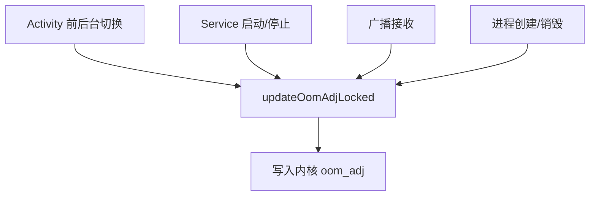

# AMS 进程管理的完整源码

> 系列：Framework-Source-Note · ams-wms
> 难度：⭐⭐⭐⭐⭐ 深入
> 更新：2026-08-27
> 前置知识：《AMS 启动流程解析》

---

## 一、本文目标

AMS 除了管 Activity，还管**进程**：什么时候杀进程、杀哪个进程。这一篇深入到源码，看 AMS 的进程优先级（oom_adj）机制。

## 二、进程优先级：oom_adj

Android 给每个进程一个 `oom_adj` 值，值越大越容易被杀：

| adj 范围 | 进程类型 | 被杀优先级 |
|----------|----------|-----------|
| 0 | 前台进程 | 几乎不杀 |
| 100 | 可见进程 | 低 |
| 200 | 服务进程 | 中 |
| 700 | 后台进程 | 高 |
| 900+ | 空进程 | 最先杀 |

**核心理解**：内存不足时，Linux 内核按 oom_adj 从高到低杀进程。

## 三、oom_adj 的计算

AMS 根据进程状态计算 oom_adj，核心在 `updateOomAdjLocked`：

```java
// ActivityManagerService.java
final boolean updateOomAdjLocked(ProcessRecord app, ...) {
    // 根据进程状态确定 adj
    if (app.getCurProcState() == PROCESS_STATE_NONEXISTENT) {
        app.curAdj = UNKNOWN_ADJ;
    } else if (app.hasForegroundActivities()) {
        // 有前台 Activity，adj 最低
        app.curAdj = FOREGROUND_APP_ADJ;  // 0
    } else if (app.hasVisibleActivities()) {
        // 有可见 Activity
        app.curAdj = VISIBLE_APP_ADJ;     // 100
    } else if (app.hasStartedServices()) {
        // 有启动的 Service
        app.curAdj = SERVICE_ADJ;         // 200
    } else if (app.hasActivities()) {
        // 有后台 Activity
        app.curAdj = PREVIOUS_APP_ADJ;    // 700
    } else {
        // 空进程
        app.curAdj = CACHED_APP_MIN_ADJ;  // 900
    }
    return true;
}
```

## 四、adj 值写入内核

计算出的 adj 值，通过 `/proc/[pid]/oom_adj` 写入内核：

```java
// ProcessList.java
public static final boolean setOomAdj(int pid, int uid, int amt) {
    // 写入 /proc/pid/oom_adj
    File f = new File("/proc/" + pid + "/oom_adj");
    // ...
    FileWriter fw = new FileWriter(f);
    fw.write(Integer.toString(amt));
    fw.close();
}
```

**关键理解**：AMS 计算逻辑层面的 adj，最终通过写 `/proc` 文件让 Linux 内核知道「杀进程时的优先级」。

## 五、进程状态到 adj 的映射

`curProcState` 是进程状态的枚举，映射到具体 adj：

| ProcessState | 含义 | adj |
|--------------|------|-----|
| PROCESS_STATE_TOP | 前台顶部 | 0 |
| PROCESS_STATE_IMPORTANT_FOREGROUND | 重要前台 | 50 |
| PROCESS_STATE_BOUND_TOP | 绑定前台服务 | 100 |
| PROCESS_STATE_FOREGROUND_SERVICE | 前台服务 | 200 |
| PROCESS_STATE_CACHED_EMPTY | 缓存空进程 | 900 |

## 六、何时触发 adj 更新

adj 更新由多个事件触发：



## 七、进程保活与 adj 的关系

「保活」的本质就是让进程的 adj 尽可能低：

| 保活手段 | 原理 |
|----------|------|
| 前台 Service | 提升到 FOREGROUND_SERVICE adj |
| 前台 Activity | adj = 0 |
| 绑定系统服务 | 提升优先级 |

**注意**：Android 高版本对保活限制越来越严，滥用会被系统惩罚。

## 八、总结

| 要点 | 结论 |
|------|------|
| oom_adj | 进程被杀优先级 |
| 计算 | updateOomAdjLocked 按状态 |
| 写入 | /proc/pid/oom_adj |
| 保活本质 | 降低 adj |

---

**下一篇预告**：《ViewRootImpl 绘制流程的完整源码》

> 配套仓库：[Framework-Source-Note](https://github.com/jason5200/Framework-Source-Note)
