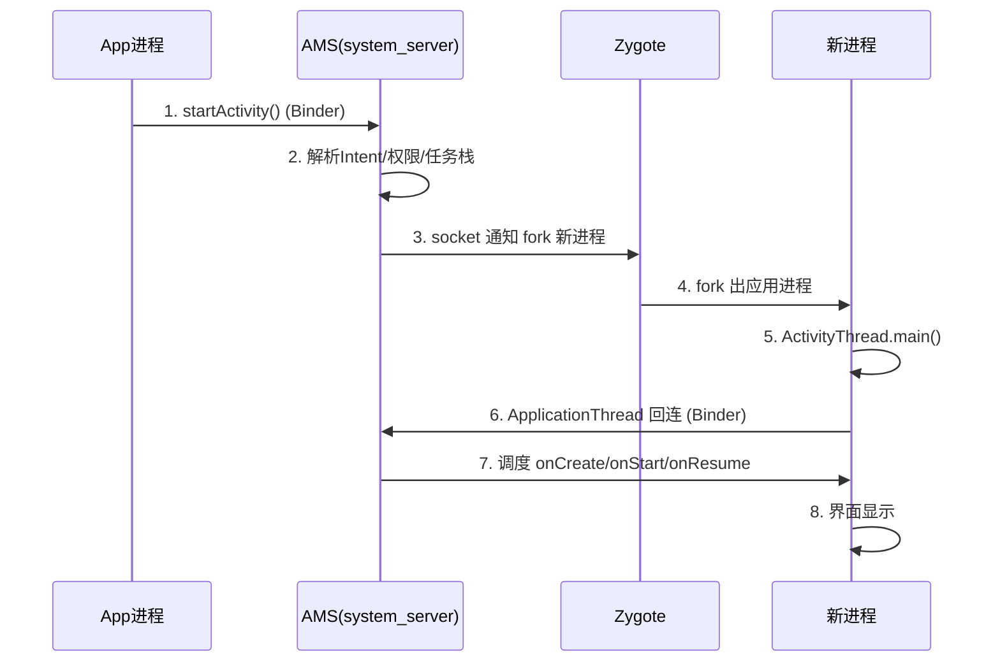

# AMS 启动流程解析

> 系列：Framework-Source-Note · ams-wms
> 难度：⭐⭐⭐⭐ 深入
> 更新：2026-08-21
> 前置知识：Binder 机制、系统启动流程

---

## 一、AMS 是什么，为什么重要

**AMS（ActivityManagerService）** 是 Android 最核心的系统服务之一，负责：

- Activity 的启动、调度、生命周期管理
- 任务栈（Task）与返回栈管理
- 进程管理（启动、调度、回收）
- 广播、Service、ContentProvider 的调度

它跑在 `system_server` 进程里，是所有 App 的「大管家」。

## 二、AMS 在系统启动中的位置

AMS 随系统启动而创建，时序如下：

```
init 进程
   │
   ▼
Zygote（孵化器）
   │
   ▼
SystemServer 进程
   │
   ├── 启动各种系统服务
   │
   ├── startBootstrapServices()   ← 启动 AMS（关键服务之一）
   │
   ├── startOtherServices()       ← 启动 WMS、PMS 等
   │
   └── 系统就绪（boot completed）
```

AMS 在 `SystemServer.startBootstrapServices()` 中创建，属于**引导服务**，优先级最高。

## 三、AMS 的创建与注册

简化后的创建流程：

```java
// SystemServer.java
private void startBootstrapServices() {
    // 1. 创建 AMS 实例
    ActivityManagerService ams = new ActivityManagerService(mSystemContext);

    // 2. 注册到 ServiceManager（供其他进程 Binder 调用）
    ServiceManager.addService(Context.ACTIVITY_SERVICE, ams);

    // 3. 设置系统进程
    ams.setSystemProcess();
}
```

**关键**：AMS 创建后立即注册到 `ServiceManager`，这样 App 进程才能通过 Binder 拿到它的代理。

## 四、一次 Activity 启动的完整链路

这是 AMS 最核心的工作。以 App 点击按钮启动一个 Activity 为例：



## 五、进程启动：AMS 与 Zygote 的配合

当目标 Activity 所在进程不存在时，AMS 需要「造」一个进程出来：

```
AMS
 │
 │ 1. 通过 Process.start() 发起请求
 ▼
ZygoteProcess（socket 连接）
 │
 ▼
Zygote（收到请求）
 │
 │ 2. fork() 出一个新进程
 ▼
新进程
 │
 │ 3. 执行 ActivityThread.main()
 ▼
应用启动，回连 AMS
```

**关键理解**：
- AMS 和 Zygote 之间用 **socket** 通信（不是 Binder，因为此时新进程还没有 Binder 环境）。
- 新进程 fork 出来后，第一件事是初始化 Binder，然后通过 `ApplicationThread` 回连 AMS。

## 六、ApplicationThread：双向通信的关键

App 进程里有一个 **ApplicationThread**（是 `IApplicationThread` 的 Binder 实现）：

- **AMS → App**：通过 ApplicationThread 调用 App 的生命周期方法（如 `scheduleLaunchActivity`）。
- **App → AMS**：通过 AMS 的 Binder 代理调用（如 `activityResumed`）。

这就是为什么 Activity 生命周期方法（onCreate 等）最终会在主线程执行——AMS 通过 Binder 通知 ApplicationThread，再由 Handler 切到主线程。

## 七、任务栈与启动模式

AMS 还负责管理任务栈，处理 `launchMode`：

| launchMode | 行为 |
|-----------|------|
| standard | 每次都新建实例 |
| singleTop | 栈顶复用 |
| singleTask | 栈内复用，清掉上方 |
| singleInstance | 独立任务栈 |

AMS 的 `ActivityStarter` 会根据 launchMode、Intent flags 决定是新建还是复用。

## 八、总结

| 要点 | 结论 |
|------|------|
| AMS 是什么 | Activity/进程/任务栈的管理者 |
| 位置 | system_server 进程，引导服务 |
| 启动链路 | startActivity → Binder → AMS → Zygote → 新进程 → 生命周期 |
| 进程通信 | AMS↔Zygote 用 socket，AMS↔App 用 Binder |
| 任务栈 | 管理 launchMode 与返回栈 |

---

**下一篇预告**：《WMS 窗口管理解析》

> 配套仓库：[Framework-Source-Note](https://github.com/jason5200/Framework-Source-Note)
