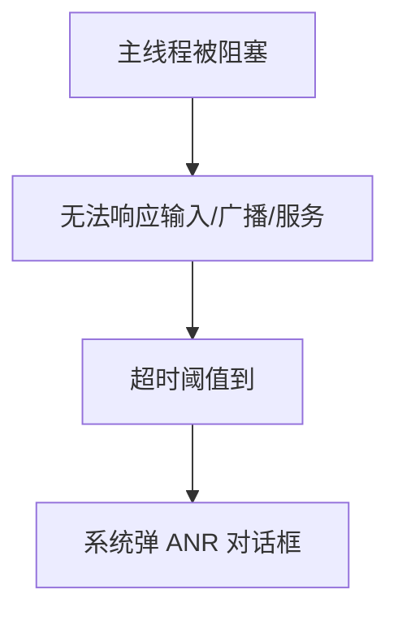
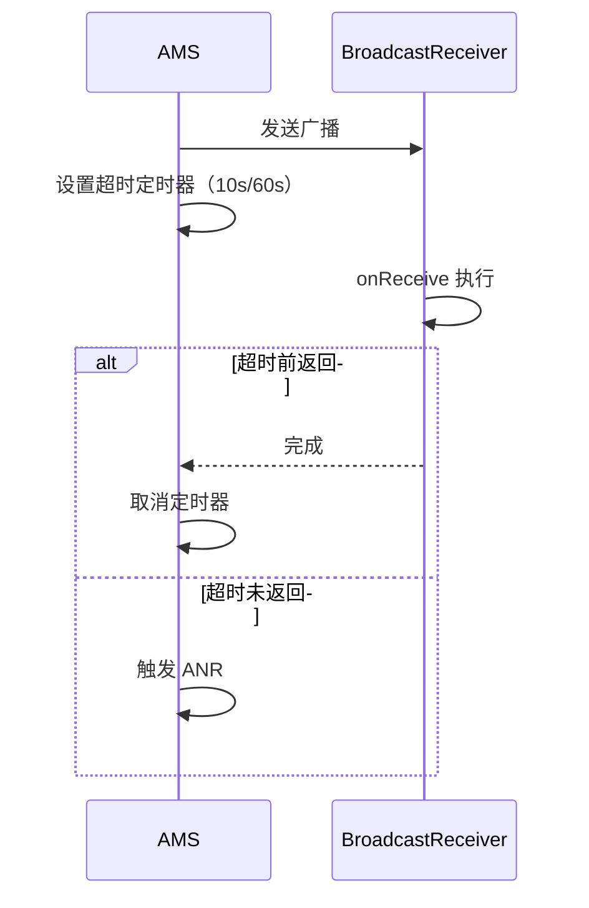

# ANR 原理与排查方法

> 系列：Framework-Source-Note · ams-wms
> 难度：⭐⭐⭐⭐ 深入
> 更新：2026-08-27
> 前置知识：《Handler 消息机制》《AMS 启动流程解析》

---

## 一、ANR 是什么

**ANR（Application Not Responding）**：应用在主线程长时间无响应，系统弹出「应用无响应」对话框。



## 二、三种 ANR 类型

| 类型 | 触发 | 超时阈值 |
|------|------|----------|
| 输入事件 | 按键/触摸无响应 | 5 秒 |
| 广播 | onReceive 未返回 | 前台 10 秒 / 后台 60 秒 |
| Service | 启动/绑定超时 | 前台 20 秒 / 后台 200 秒 |

## 三、ANR 的触发原理

系统有专门的「超时监测」机制。以广播为例：



**核心理解**：AMS 会给每个关键操作设一个「看门狗」定时器，超时未完成就判定 ANR。

## 四、ANR 的常见原因

| 原因 | 说明 |
|------|------|
| 主线程耗时操作 | IO、网络、大计算 |
| 锁竞争 | 主线程等锁 |
| Binder 调用阻塞 | 跨进程调用被对端阻塞 |
| 大量消息堆积 | 队列处理不过来 |

## 五、如何排查 ANR

### 1. 查看 ANR 日志

```bash
adb shell cat /data/anr/traces.txt
```

traces.txt 里记录了 ANR 发生时**所有线程的堆栈**。

### 2. 定位主线程堆栈

```java
"main" prio=5 tid=1 Blocked
  at com.example.MainActivity.doWork(MainActivity.java:100)
  at com.example.MainActivity.onCreate(MainActivity.java:50)
  ...
```

**关键**：看主线程 `main` 卡在哪个方法，那里就是 ANR 的根源。

### 3. 关键信息

- `Blocked`：等待锁
- `Running`：正在执行（可能死循环）
- `Native`：native 方法阻塞

## 六、一个 ANR 的典型案例

```java
@Override
protected void onCreate(Bundle savedInstanceState) {
    super.onCreate(savedInstanceState);
    setContentView(R.layout.activity_main);

    // ❌ 主线程做网络请求，必然 ANR
    String result = doNetworkRequest();  // 耗时 30 秒

    textView.setText(result);
}
```

**修复**：把耗时操作放到子线程。

```java
new Thread(() -> {
    String result = doNetworkRequest();
    runOnUiThread(() -> textView.setText(result));
}).start();
```

## 七、使用 ANR 监控工具

- **Android Vitals**：线上 ANR 监控
- **Traceview / Perfetto**：分析耗时
- **BlockCanary**：主线程卡顿检测（上一篇文章）

## 八、预防 ANR 的最佳实践

| 原则 | 说明 |
|------|------|
| 主线程只做 UI | 耗时操作全丢子线程 |
| 广播 onReceive 要快 | 耗时用 goAsync 或启动 Service |
| 避免主线程等锁 | 减少锁竞争 |
| 监控卡顿 | 接入 BlockCanary 等工具 |

## 九、总结

| 要点 | 结论 |
|------|------|
| ANR | 主线程无响应 |
| 三种类型 | 输入/广播/Service |
| 排查 | traces.txt 看主线程堆栈 |
| 预防 | 主线程只做 UI |

---

**下一篇预告**：《热修复原理深入：Tinker 与 Sophix》

> 配套仓库：[Framework-Source-Note](https://github.com/jason5200/Framework-Source-Note)
