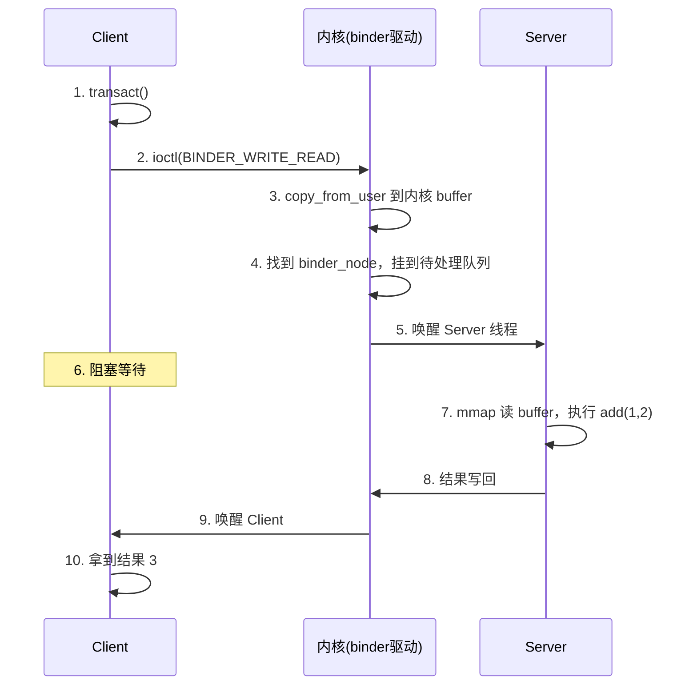

# Binder 驱动层深入

> 系列：Framework-Source-Note · binder
> 难度：⭐⭐⭐⭐⭐ 深入
> 更新：2026-08-23
> 前置知识：《Binder 机制总览》《一次 Binder 通信的完整流程》

---

## 一、为什么还要讲驱动层

前两篇讲了 Binder 的「是什么」和「通信流程」，但都在 Java 层。要真正理解 Binder 的性能与安全优势，必须下探到**内核驱动层**。

**Binder 驱动**是 Binder 机制的根基，它是一个 Linux 内核模块，设备节点为 `/dev/binder`。

## 二、Binder 驱动的核心数据结构

驱动层有几个关键对象：

| 对象 | 作用 |
|------|------|
| `binder_proc` | 每个使用 Binder 的进程在内核中的表示 |
| `binder_thread` | 每个 Binder 线程的表示 |
| `binder_node` | 服务端 Binder 实体（真实对象） |
| `binder_ref` | 客户端对 Binder 实体的引用（句柄） |
| `binder_buffer` | 内核缓冲区，存放跨进程数据 |

**核心理解**：`binder_node` 是「真实对象」（在 Server 进程），`binder_ref` 是「引用」（在 Client 进程）。Client 拿到的 handle，本质就是指向 `binder_ref` 的编号。

## 三、一次拷贝的秘密：mmap

前面提过 Binder 性能好的关键是「一次拷贝」。这个秘密就是 **mmap（内存映射）**。

传统 IPC（如 Socket）的数据流：

```
发送方用户空间 → 内核缓冲区 → 接收方用户空间
       ↑ 第 1 次拷贝      ↑ 第 2 次拷贝
```

Binder 的做法：

```
发送方用户空间 → 内核缓冲区（mmap 共享）
                     ↑
          接收方用户空间直接映射到这块内存
```

**原理**：Binder 驱动在进程初始化时，通过 `mmap` 在内核和接收方用户空间之间建立**内存映射**。这样：

1. 数据只需「发送方 → 内核」这一次拷贝。
2. 接收方通过映射**直接读内核这块内存**，省掉「内核 → 接收方」的拷贝。

## 四、驱动的命令协议：ioctl

App 层的一切 Binder 操作，最终都变成对 `/dev/binder` 的 `ioctl` 系统调用。

常用的 ioctl 命令：

| 命令 | 作用 |
|------|------|
| `BINDER_WRITE_READ` | 最核心：写入数据 + 读取数据 |
| `BINDER_SET_MAX_THREADS` | 设置最大线程数 |
| `BINDER_SET_CONTEXT_MGR` | 注册为 ServiceManager |
| `BINDER_THREAD_EXIT` | 线程退出 |

一次 `transact` 调用的内核侧，就是一次 `BINDER_WRITE_READ` ioctl。

## 五、驱动的数据流：一个完整例子

以「Client 调用 Server 的 `add(1,2)`」为例，看内核态发生什么：



## 六、驱动层的安全机制

Binder 的「安全」也来自驱动层：

1. **身份校验**：驱动能拿到调用方的 **UID/PID**，这是内核提供的，无法伪造。
2. **权限检查**：Server 可以调用 `getCallingUid()` 得知「谁在调用我」，据此决定是否放行。

这就是为什么 Binder 比 Socket 安全——**Socket 的发送方身份可以伪造，Binder 的身份由内核背书**。

## 七、线程模型

Binder 驱动还管理线程：

- Server 有一个 **Binder 线程池**。
- 当多个 Client 同时请求时，驱动会唤醒多个线程并发处理。
- 线程数可通过 `BINDER_SET_MAX_THREADS` 设置上限。

```
Client A ──┐
Client B ──┤──→ Binder 驱动 ──→ Server 线程池（多线程并发处理）
Client C ──┘
```

## 八、总结

| 要点 | 结论 |
|------|------|
| 驱动是什么 | Linux 内核模块，设备 /dev/binder |
| 核心对象 | binder_proc/thread/node/ref/buffer |
| 一次拷贝 | 通过 mmap 内存映射实现 |
| 操作方式 | ioctl（BINDER_WRITE_READ 等） |
| 安全来源 | 内核提供的 UID/PID 校验 |
| 线程模型 | Server 端 Binder 线程池 |

---

**下一篇预告**：《Handler 消息机制》已完成，本系列后续将补充 ContentProvider 与 PMS 等模块。

> 配套仓库：[Framework-Source-Note](https://github.com/jason5200/Framework-Source-Note)
