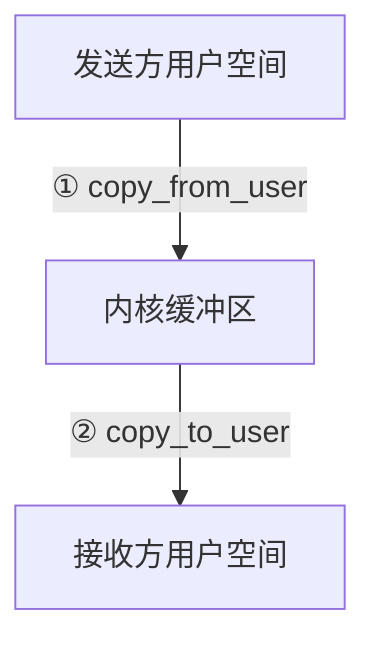
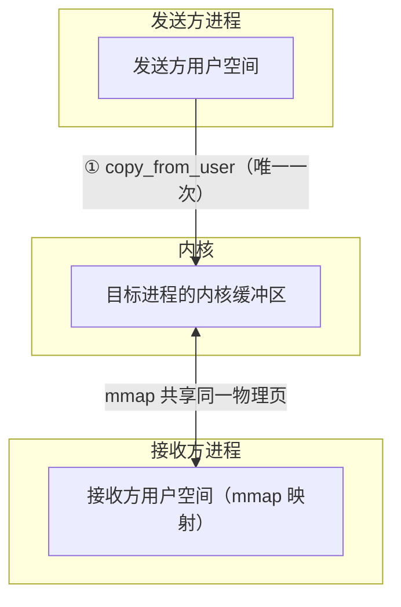
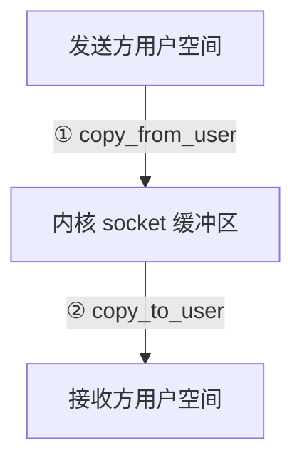

# Binder mmap 一次拷贝的完整源码

> 系列：Framework-Source-Note · binder
> 难度：⭐⭐⭐⭐⭐ 深入
> 更新：2026-08-27
> 前置知识：《Binder 驱动层深入》

---

## 一、本文要回答的问题

前面多篇文章都提到 Binder「一次拷贝」的性能优势，但都是一句话带过。这一篇**深入到源码**，彻底讲清楚：

1. mmap 到底映射了什么？
2. 为什么能省掉「内核 → 接收方」那次拷贝？
3. 数据在内核里到底怎么流动？

## 二、传统 IPC 的两次拷贝

先回顾传统 IPC（如 Socket）的问题：



**两次拷贝**：发送方→内核，内核→接收方。多一次拷贝就多一次内存复制，性能下降。

## 三、Binder 的 mmap 是什么

Binder 驱动在进程初始化时，通过 `mmap` 在内核和**接收方进程**之间建立内存映射：

```c
// binder 驱动初始化时，进程调用 mmap
// 内核侧：为这个进程分配一块内核缓冲区，映射到用户空间
static int binder_mmap(struct file *filp, struct vm_area_struct *vma)
{
    struct binder_proc *proc = filp->private_data;
    struct binder_buffer *buffer;

    // 1. 分配物理页
    area = get_vm_area(vma->vm_end - vma->vm_start, VM_IOREMAP);
    proc->buffer = area->addr;
    proc->user_buffer_offset = vma->vm_start;

    // 2. 分配一个 binder_buffer 描述这块区域
    buffer = kzalloc(sizeof(*buffer), GFP_KERNEL);
    buffer->data = proc->buffer;

    // 3. 加入空闲缓冲区列表
    list_add(&buffer->entry, &proc->buffers);

    return 0;
}
```

**关键理解**：mmap 之后，**接收方进程的用户空间**和**内核缓冲区**指向同一块物理内存。这就是「省一次拷贝」的基础。

## 四、一次拷贝的关键：binder_transaction

数据传递的核心在 `binder_transaction` 函数：

```c
static void binder_transaction(struct binder_proc *proc,
                               struct binder_thread *thread,
                               struct binder_transaction_data *tr, int reply)
{
    struct binder_proc *target_proc;
    struct binder_buffer *tbuffer;

    // 找到目标进程
    target_proc = binder_get_proc(tr->target.handle);

    // 分配目标进程的内核缓冲区（这块已经 mmap 到目标进程）
    tbuffer = binder_alloc_buf(target_proc, tr->data_size);

    // ★ 关键：只做一次拷贝
    // 从发送方用户空间 copy 到目标进程的内核缓冲区
    if (copy_from_user(tbuffer->data, tr->data.ptr.buffer, tr->data_size)) {
        goto err;
    }

    // 数据已经在目标进程 mmap 的缓冲区里了！
    // 目标进程直接读这块内存，无需第二次拷贝
}
```

**核心理解**：
1. `copy_from_user` 把数据从发送方用户空间拷到「目标进程的内核缓冲区」。
2. 这块内核缓冲区，在目标进程 mmap 时已经映射到目标进程用户空间。
3. 所以目标进程**直接读自己用户空间的这块内存**，不需要第二次拷贝。

## 五、为什么目标进程能直接读

关键在 mmap 建立的关系：



**关键点**：接收方用户空间 C 和内核缓冲区 B 是**同一块物理内存**（mmap 建立映射）。所以数据拷到 B，就等于「已经在 C 里了」。

## 六、对比：Socket 为什么需要两次

Socket 的内核缓冲区**没有 mmap 到接收方用户空间**，所以：



Socket 的接收方必须用 `recv()` 把数据从内核缓冲区**再拷贝一次**到用户空间，因为内核缓冲区和接收方用户空间是**两块不同的内存**。

## 七、mmap 的代价

mmap 不是免费的：

| 代价 | 说明 |
|------|------|
| 建立映射开销 | 初始化时要 mmap |
| 内存占用 | 每个进程预留一块内核缓冲区 |
| 同步开销 | 共享内存需要同步机制 |

但相比「每次通信省一次拷贝」，这些代价是值得的。

## 八、一个完整的调用链

从 Java 层到 mmap 拷贝的完整链路：

```
Client.transact()
  → native 层 BpBinder::transact()
  → ioctl(BINDER_WRITE_READ)
  → 内核 binder_ioctl
  → binder_thread_write
  → binder_transaction
  → copy_from_user（唯一一次拷贝）
  → 数据进入目标进程 mmap 缓冲区
```

## 九、总结

| 要点 | 结论 |
|------|------|
| mmap | 接收方用户空间 ↔ 内核缓冲区共享物理页 |
| 一次拷贝 | copy_from_user 到目标缓冲区 |
| 为什么省 | 数据到内核缓冲区=已到接收方 |
| 对比 Socket | Socket 无 mmap，需两次拷贝 |

---

**下一篇预告**：《Handler native 层唤醒机制》

> 配套仓库：[Framework-Source-Note](https://github.com/jason5200/Framework-Source-Note)
