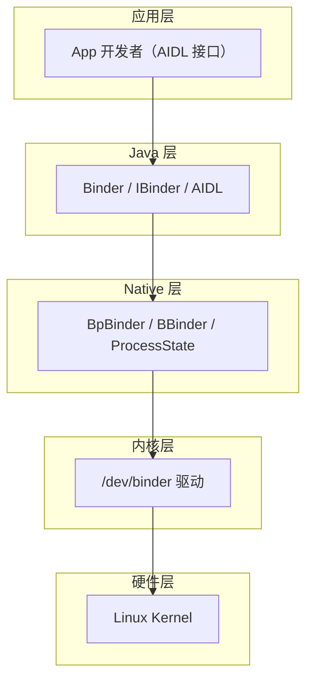
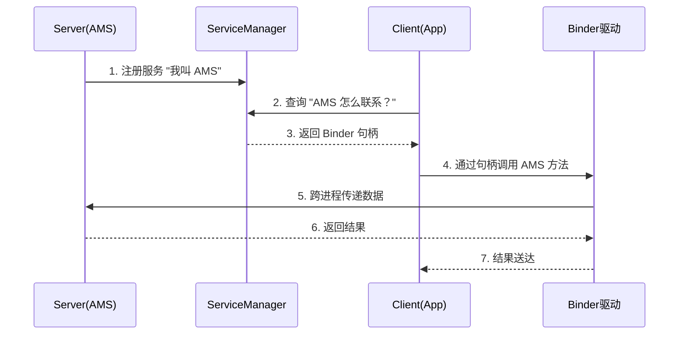

# Binder 机制总览：为什么 Android 用它做 IPC

> 系列：Framework-Source-Note · binder
> 难度：⭐⭐⭐ 进阶
> 更新：2026-08-16
> 前置知识：Linux 进程基础、Android 四大组件

---

## 一、先回答一个问题：什么是 IPC

**IPC（Inter-Process Communication，进程间通信）**：两个进程之间传递数据、调用方法的机制。

Android 里为什么需要 IPC？因为系统是**多进程**架构：

- 每个 App 跑在自己的进程里
- 系统服务（AMS、WMS、CarService）跑在 `system_server` 进程里
- App 要启动 Activity、要读车辆属性，就必须跨进程调用系统服务

所以 IPC 是 Android 的**地基**，而 Android 选择的 IPC 方案就是 **Binder**。

## 二、Binder 相比其他 IPC 的优势

Linux 本身就有多种 IPC：管道、信号、Socket、共享内存、消息队列。Android 为什么不用它们，反而自研 Binder？

| 维度 | Binder | Socket / 共享内存等 |
|------|--------|---------------------|
| **性能** | 一次拷贝（`copy_from_user` 到内核缓冲） | 共享内存需 2 次拷贝，Socket 更慢 |
| **安全** | 内核校验调用方 UID/PID，天然支持身份认证 | 需自行做安全校验 |
| **易用性** | 面向对象，像本地方法调用一样 | 需手动封装数据格式 |
| **稳定性** | 基于内核驱动，稳定 | 共享内存易出并发问题 |

**一句话总结**：Binder 在**性能、安全、易用性**三者间取得了最佳平衡。

## 三、Binder 的四层架构



**关键点**：
- App 开发者通常只接触 **Java 层**（AIDL 生成的 Proxy / Stub）。
- 真正干活的是**内核层的 binder 驱动**，它负责数据拷贝与跨进程传递。
- 一次跨进程调用，数据**只需一次拷贝**：从发送方用户空间 → 内核缓冲 → 接收方用户空间。

## 四、核心角色：Client / Server / ServiceManager / 驱动

| 角色 | 作用 | 类比 |
|------|------|------|
| **Client** | 发起调用的进程 | 打电话的人 |
| **Server** | 提供服务（方法）的进程 | 接电话的人 |
| **ServiceManager** | 服务注册与查找中心 | 114 查号台 |
| **Binder 驱动** | 真正的通信通道 | 电话线路 |

一个典型的调用流程：



## 五、AIDL 与 Proxy/Stub 模式

开发者用 **AIDL（Android Interface Definition Language）** 定义接口，编译时自动生成两个类：

- **Proxy（代理）**：运行在 Client 进程，把方法调用「打包」成跨进程请求。
- **Stub（桩）**：运行在 Server 进程，接收请求并「拆包」，调用真正的方法实现。

```
Client 进程                    Server 进程
┌──────────┐                ┌──────────┐
│ 调用方法  │   Proxy        │   Stub   │
│   ↓      │ ──打包发送──→  │   ↓      │
│  Proxy   │                │ 真正实现  │
└──────────┘                └──────────┘
```

这就是为什么「跨进程调用看起来像本地调用」—— Proxy 帮你屏蔽了所有通信细节。

## 六、一次 Binder 通信会发生什么

以「App 调用 AMS 启动 Activity」为例：

1. App 拿到 AMS 的 Proxy 对象。
2. 调用 `startActivity()` → 参数被打包进 `Parcel`。
3. Proxy 通过 `transact()` 发起系统调用，进入 binder 驱动。
4. 驱动把数据从 App 进程拷贝到内核缓冲。
5. AMS（在 system_server 进程）被唤醒，从内核缓冲读取数据。
6. AMS 执行真正的 `startActivity` 逻辑。
7. 结果原路返回给 App。

> 下一篇《一次 Binder 通信的完整流程》会深入每一步的源码。

## 七、总结

| 要点 | 结论 |
|------|------|
| Binder 是什么 | Android 的 IPC 机制，基于内核驱动 |
| 为什么用它 | 一次拷贝的性能 + 内核级安全 + 面向对象易用 |
| 四层架构 | Java / Native / 内核驱动 / Kernel |
| 核心角色 | Client / Server / ServiceManager / 驱动 |
| 开发视角 | AIDL 生成 Proxy（客户端）和 Stub（服务端） |

---

**下一篇预告**：《一次 Binder 通信的完整流程》

> 配套仓库：[Framework-Source-Note](https://github.com/jason5200/Framework-Source-Note) · [AAOS-Guide](https://github.com/jason5200/AAOS-Guide)
